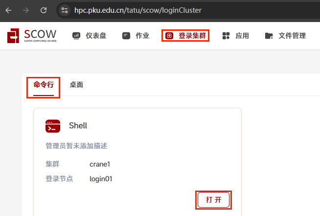
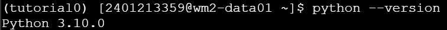
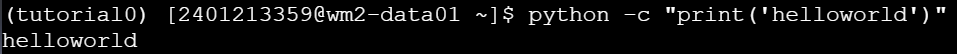
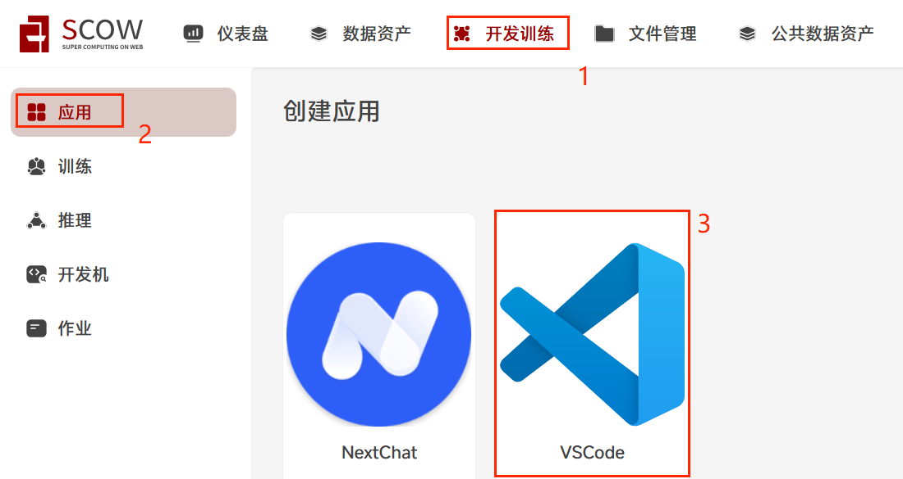
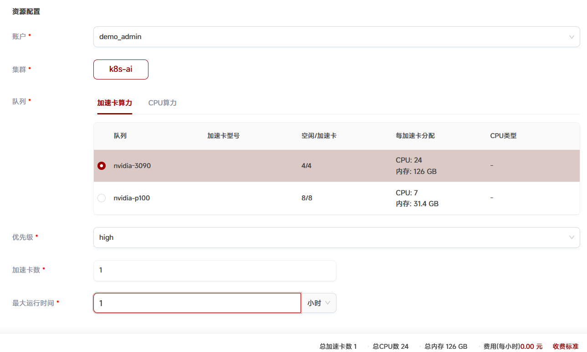
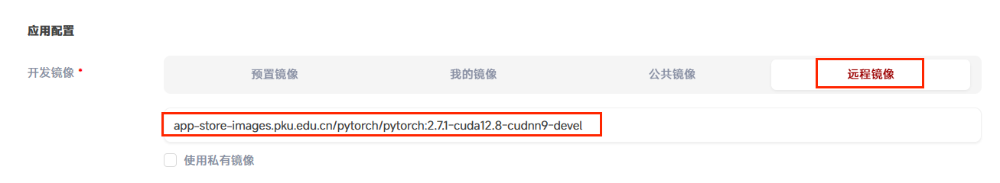
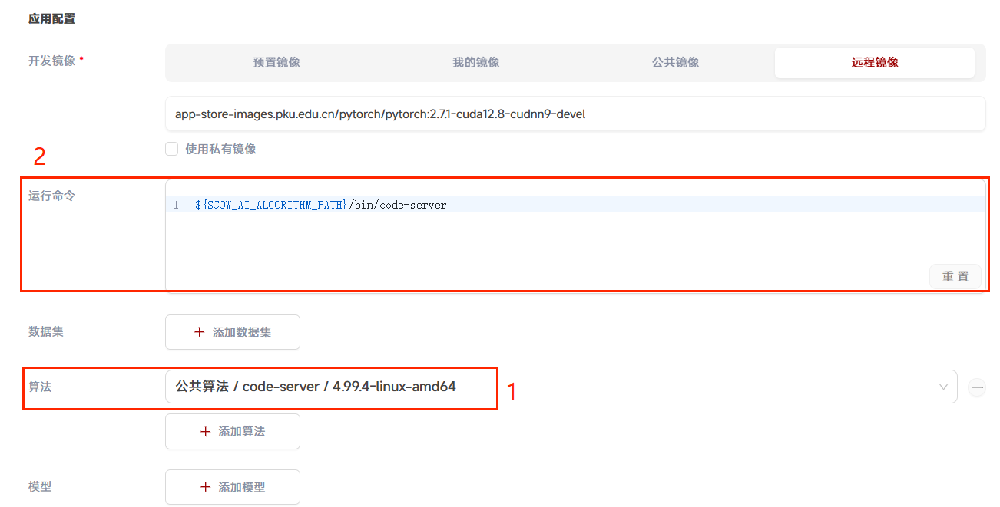
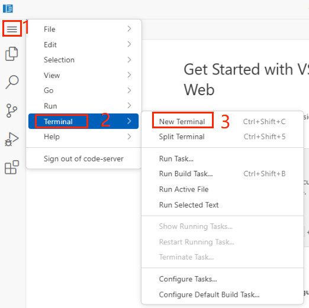
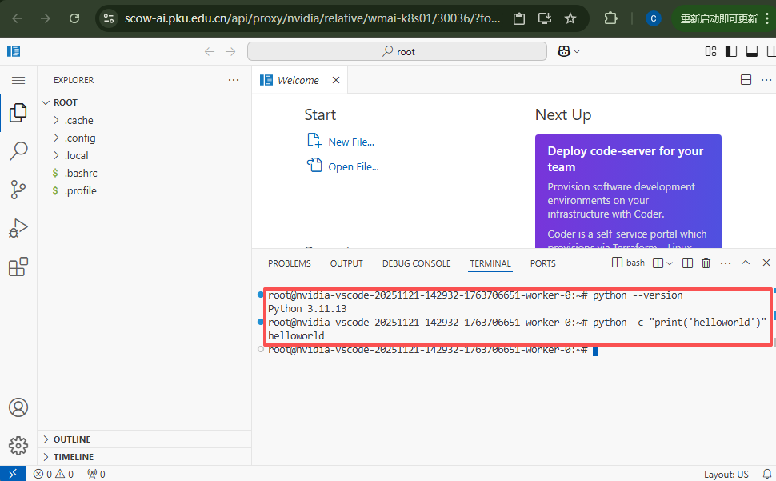

# Tutorial0: 在SCOW超算和智算平台配置Python环境

* 集群类型：超算平台和智算平台
* 所需镜像：app-store-images.pku.edu.cn/pytorch/pytorch:2.7.1-cuda12.8-cudnn9-devel
* 所需模型：无
* 所需数据集：无
* 所需资源：根据需求申请单机单卡，或单机多卡，或多机多卡
* 目标：本节旨在向用户演示如何分别在SCOW各平台配置Python环境，这是后续教程的基础环境，具体来说在SCOW超算平台中，我们安装miniconda以创建隔离的Python环境；在SCOW智算平台中，我们提供的基础镜像一般已经包含Python环境，只需验证Python环境即可

## 1、SCOW超算平台
### 1.1、打开shell
首先进入超算平台


点击"登录集群"->对应集群名->"打开"按钮进入shell



会进入以下界面，后续安装conda以及创建环境都在此页面完成


### 1.2、安装conda
Conda 是一个开源的包管理和环境管理系统。它用于安装和管理软件包及其依赖项，同时允许用户创建独立的环境，以便在一个系统上运行多个项目。在命令行终端中运行如下命令以安装 conda：
```shell
# 1. 获得最新的miniconda安装包；
wget https://repo.anaconda.com/miniconda/Miniconda3-py313_25.9.1-1-Linux-x86_64.sh
如果当前环境没有wget命令，请自行在浏览器上输入上面的地址直接下载miniconda安装包到自己电脑上，再从页面[超算平台]-[文件管理]中上传至家目录

# 2. 安装
chmod +x Miniconda3-py313_25.9.1-1-Linux-x86_64.sh
./Miniconda3-py313_25.9.1-1-Linux-x86_64.sh  #最后选项要填yes

# 3. 安装成功后可以删除安装包，节省存储空间
rm -f Miniconda3-py313_25.9.1-1-Linux-x86_64.sh

# 4. 执行以下命令，即可导入 conda 环境
source ~/.bashrc

# 5. 检查是否安装成功
conda --version

```

### 1.3、创建环境
运行下面的命令创建conda环境
```shell
# python版本可按需填写
conda create -n tutorial0 python==3.10
Do you accept the Terms of Service (ToS) for https://repo.anaconda.com/pkgs/main? [(a)ccept/(r)eject/(v)iew]: a
Do you accept the Terms of Service (ToS) for https://repo.anaconda.com/pkgs/r? [(a)ccept/(r)eject/(v)iew]: a
Proceed ([y]/n)? y

conda activate tutorial0
```

运行命令`python --version`，可以看到python版本，已经具备python环境



运行命令`python -c "print('helloworld')"`，能够成功打印




## 2、SCOW智算平台
### 2.1、创建应用
首先进入智算平台


点击"开发训练"
选择集群（若只有一个集群则无需用户选择）
点击"应用"，选择"VSCode"




在创建应用页面-资源配置：按需选择"账户","集群","队列：加速卡算力","优先级","加速卡数：1",以及"最大运行时间：1小时"，本教程仅为示例其它保留默认值即可



在创建应用页面-应用配置：选择"远程镜像"，填写教程开头给出的镜像地址：app-store-images.pku.edu.cn/pytorch/pytorch:2.7.1-cuda12.8-cudnn9-devel



在创建应用页面-应用配置：点击"添加算法"，选择公共算法->code-server->4.99.4-linux-amd64，在运行命令中，填入`/${SCOW_AI_ALGORITHM_PATH}/bin/code-server` 
，最后点击"提交作业"完成应用的创建  



操作解释：算法code-server是vscode网页版工具的执行文件（管理员提前添加的），在应用设置中指定了远程镜像（容器环境），将算法（code-server）作为了容器启动命令，并在资源设置中指定了容器中应挂载的cpu、内存与加速卡数。最终应用作业运行起来，我们将得到一个pytorch2.7.1+指定gpu数量的容器环境，并能通过网页vscode来方便地使用它。

进入应用：在跳转的页面中（未跳转请手动 开发训练->作业-未结束的作业）点击"进入"图标，即可进入应用


### 2.2、环境验证
进入应用后，打开终端。点击"菜单-Terminal-New Terminal"



* 运行命令`python --version`，可以看到python版本，已经具备python环境
* 运行命令`python -c "print('helloworld')"`，能够成功打印



---
> 作者：褚苙扬；龙汀汀*
>
> 联系方式：l.tingting@pku.edu.cn