# Tutorial12: 在SCOW-AI集群的训练模块中使用LLaMA-Factory进行单机单卡/多卡模型微调

* 集群类型：智算平台
* 所需镜像：app-store-images.pku.edu.cn/hiyouga/llamafactory:0.9.4
* 所需模型：Qwen2.5-1.5B-Instruct
* 所需数据集：教程内提供
* 所需资源：单机多卡
* 目标：本节以Qwen2.5-1.5B-Instruct模型为例，在SCOW-AI集群的训练模块中使用LLaMA-Factory框架对这个Qwen大模型完成单机单卡/多卡微调、推理的步骤。未经过微调的Qwen大模型认为自己是Qwen大模型；经过微调后，Qwen大模型认为自己是北大人工智能助手。


## 1、数据集准备
根据[Tutorial5_添加和管理数据集](../Tutorial5_添加和管理数据集/tutorial5_添加和管理数据集.md) 准备数据集

这里简单介绍数据集，部分数据如下所示，目的是希望微调后的模型自我认同为北京大学开发的AI助手，可与最终的推理验证进行对照

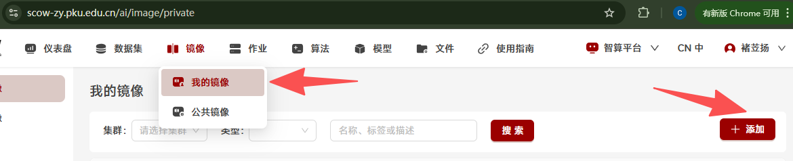

## 2、训练模块单机单卡/多卡训练
在页面中进入智算平台->开发训练->训练

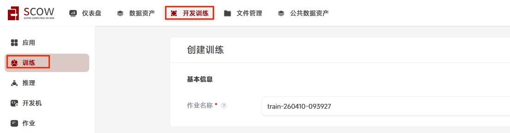

填写训练所需字段：
* 镜像来源选择远程镜像
* 远程镜像地址填写教程开头给出的地址：app-store-images.pku.edu.cn/hiyouga/llamafactory:0.9.4
* 运行命令填写：
```
echo "model_name_or_path: $SCOW_AI_MODEL_PATH

stage: sft  # Supervised Fine-Tuning 有监督的微调
do_train: true
finetuning_type: lora # 微调类型,例如lora
lora_target: all  # LoRA微调的目标模块
dataset: identity #新模型的数据集名称
template: qwen # 数据模板，例如qwen,llama3
cutoff_len: 1024 # 序列截断长度。
max_samples: 1000 # 最大样本数 
output_dir: ${WORK_DIR}/llama-factory-output
num_train_epochs: 20.0
learning_rate: 1.0e-4
lr_scheduler_type: cosine

# 配置文件中的TensorBoard设置
logging_dir: ./logs/tensorboard
# report_to: tensorboard" > /app/config.yaml && echo "{\"identity\":{\"file_name\":\"${SCOW_AI_DATASET_PATH}/identity-pku-assistant.json\"}}" > /app/data/dataset_info.json && cd /app && llamafactory-cli train /app/config.yaml >> ${WORK_DIR}/llamafactory-cli-train.log 2>&1 && echo "### model
model_name_or_path: $SCOW_AI_MODEL_PATH
adapter_name_or_path: ${WORK_DIR}/llama-factory-output
template: qwen
trust_remote_code: true

### export
export_dir: ${WORK_DIR}/llama-factory-merged
export_size: 5
export_device: auto  # choices: [cpu, auto]
export_legacy_format: false
" > /app/lora_merge.yaml && llamafactory-cli export /app/lora_merge.yaml >> ${WORK_DIR}/llamafactory-cli-export.log 2>&1
```
备注：先生成 AI 模型微调所需的训练配置文件与数据集路径配置文件，接着切换工作目录调用 llamafactory-cli 工具依据配置对指定模型开展有监督微调训练，训练完成后再生成模型合并配置文件，继续使用该工具将训练出的权重与原模型合并导出为完整新模型，同时把整个训练和导出过程的标准输出与错误输出全部重定向到指定$WORK_DIR路径日志文件中
* 数据集选择 我的数据集->identity-pku-assistant.json->选取适合版本(在tutorial5中添加，请确保数据集内文件名identity-pku-assistant.json，因为这个文件的名字在启动命令中以硬编码方式写明）
* 模型选择 公共模型->Qwen2.5-1.5B-Instruct(如果您使用的集群没有该模型，请参考[Tutorial4](../Tutorial4_下载模型/tutorial4_下载模型.md)进行下载

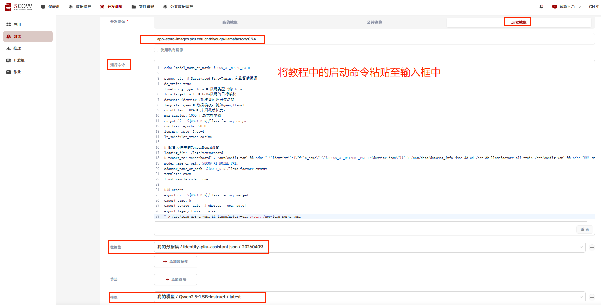

填写加速卡卡数，卡数与模型大小有关，并且卡数越多，相同模型大小情况下，训练速度越快。这里填写2，点击提交

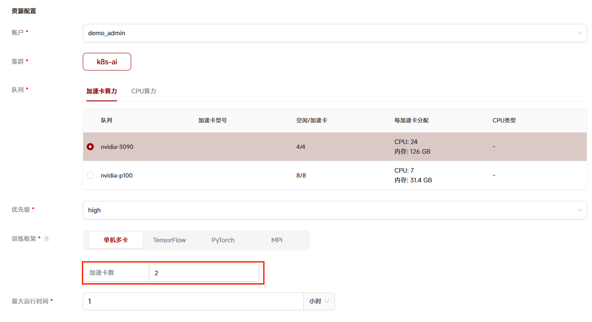


在启动命令中，使用`llamafactory-cli export /app/lora_merge.yaml >> ${WORK_DIR}/llamafactory-cli-export.log 2>&1` 将关注命令的输出内容重定向到作业${WORK_DIR}目录中，方便我们查看命令的执行状态。

可以通过点击作业操作中的"文件夹"图标进入作业目录（WORK_DIR变量指向的路径）
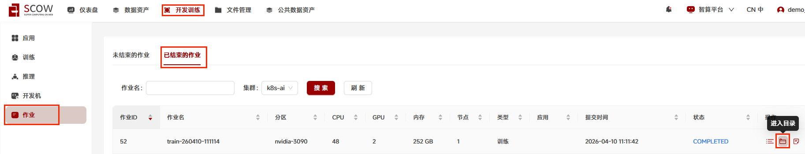
在这里可以看到命令输出的内容被重定向了日志文件里，方便我们检查作业完成状态和调试。
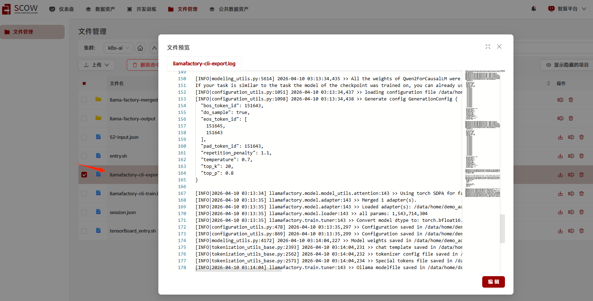

训练完成之后进入作业目录可以看到训练完成的新模型在目录中，微调后的模型完整路径一般为`[家目录]/scow/ai/appData/[作业名]/llama-factory-merged`，注意最后的`llama-factory-merged`，复制该路径便于后续测试

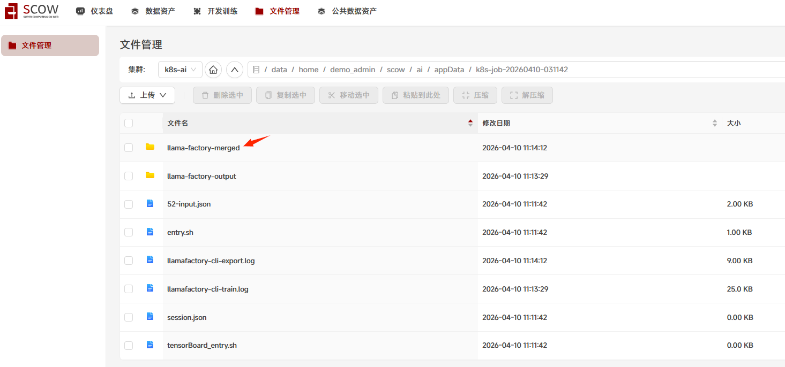
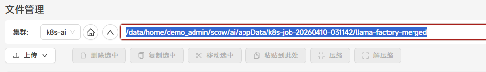

## 3、推理验证
得到微调后的模型完整路径，进行推理验证微调是否成功，使用nextchat应用

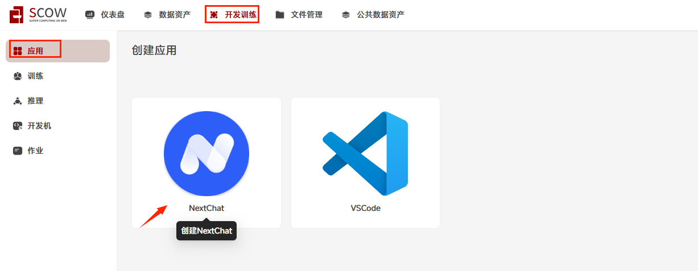

* 开发镜像-预置镜像(默认镜像):`app-store-images.pku.edu.cn/pkuhpc/nextchat-vllm-service-20250823:v0.10.1.1`
* 添加自定义挂载点:源目录填写"上个训练作业微调后的模型完整路径" ，挂载点路径填"/mnt/data" (指定源目录挂载到容器内的路径)  

* 添加环境变量`SCOW_AI_MODEL_PATH`，填写"/mnt/data" (源目录挂载到容器内的路径)

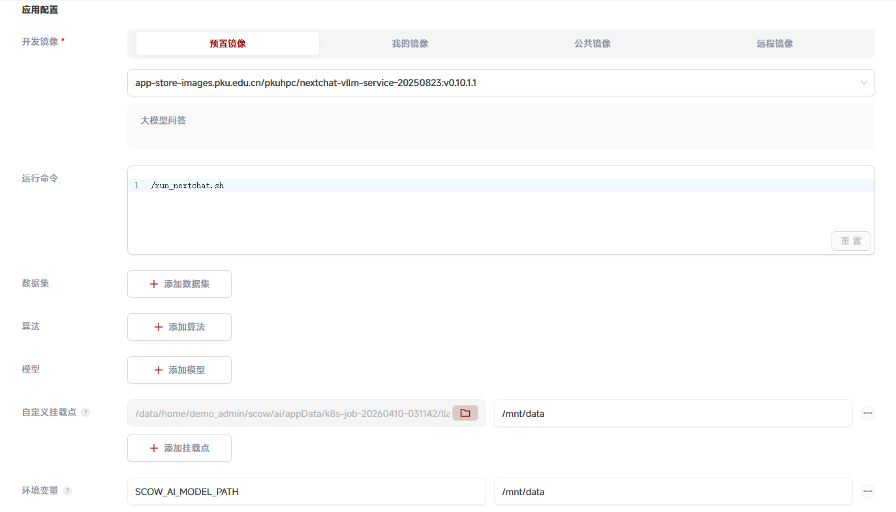

* 资源配置-加速卡数:1 , 最大运行时间:1小时,点击"提交"

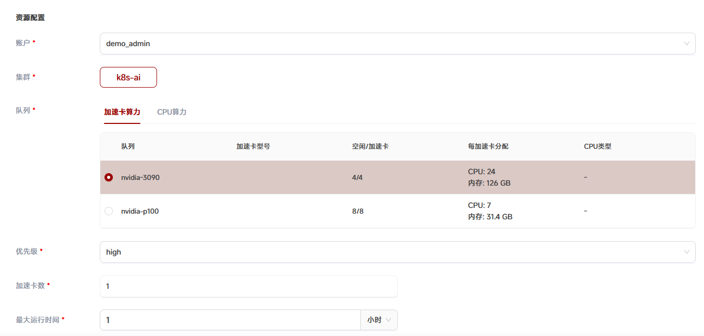

点击作业操作中的"进入"图标

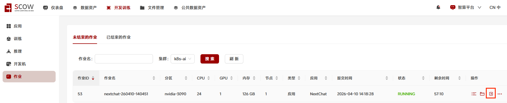

在聊天框进行对话，可以发现模型回答达到预期效果

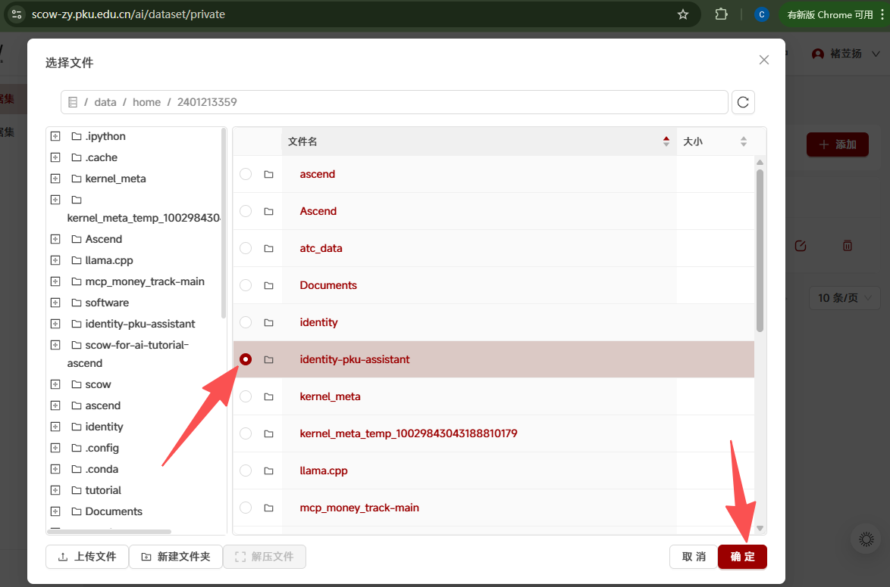

## *4、使用tensorboard可视化训练
使用本教程的训练框架llamafactory时，可将训练日志输出到指定文件夹中，并使用tensorboard将训练过程可视化

本部分需要使用者对集群的文件系统、训练模块和llamafactory框架的使用方法都有较好的掌握

### 4.1、创建日志文件夹
进入智算平台的文件管理系统中
在用户家目录下创建文件夹logs
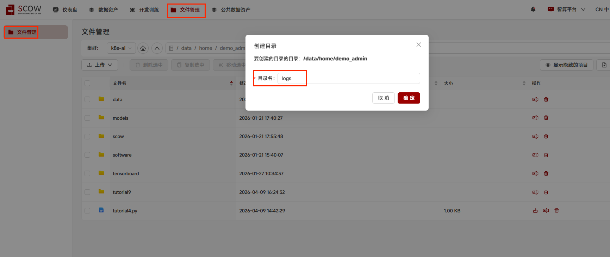
进入到刚创建的logs目录，进一步创建tensorboard目录
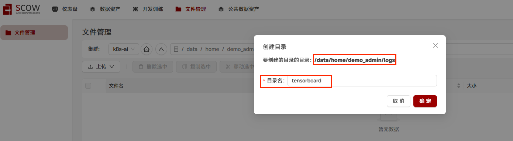
记住tensorboard文件夹的绝对路径，每个用户的路径不同，基本格式是`/data/home/用户名/logs/tensorboard`，这里是`/data/home/2401213359/logs/tensorboard`

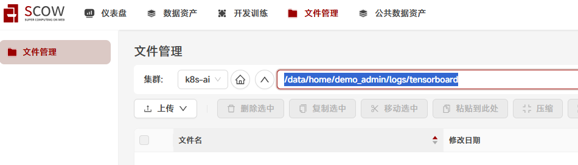

### 4.2、修改运行命令

将章节2中启动训练时填写的运行命令中的
```
logging_dir: ./logs/tensorboard
# report_to: tensorboard
```
改为
```
logging_dir: /mnt/tensorboard 
#此路径指的是容器内tensorboard数据输出路径，创建训练时我们要将家目录下的logs/tersorboard路径挂载到容器内的/mnt/tensorboard
report_to: tensorboard
```
其中`logging_dir`是在指定容器中的路径，所以在提交作业时，我们要将家目录下的logs/tensorboard挂载到容器的一样路径下，如何挂载在下一章训练任务中有介绍

其次在运行命令开头加上`pip install tensorboardX && `，用来安装必要环境

得到的完整运行命令会在下一章节创建训练任务填启动命令时使用

### 4.3、创建训练任务

创建训练任务与原先只有三点不同：  
第一是运行命令改为4.2中修改后的运行命令，日志路径需要填写当前用户创建的路径）  
第二是需要添加挂载点，填写你创建的tensorboard文件夹路径  
第三是需要开启可视化训练，并挂载数据源，即你创建的日志文件夹路径

* 加速卡：1
* 最大运行时间：1 小时
* 镜像来源选择远程镜像
远程镜像地址：app-store-images.pku.edu.cn/hiyouga/llamafactory:0.9.4
* 添加数据集: 我的数据集->identity-pku-assistant.json->选取适合版本
* 添加模型：公共模型->Qwen2.5-1.5B-Instruct
* 添加自定义挂载点： /data/home/demo_admin/logs/tensorboard 挂载到容器 /mnt/tensorboard
* TensorBoard: 开启 ，源数据路径：/data/home/demo_admin/logs/tensorboard
* 启动命令：
```
pip install tensorboardX && echo "model_name_or_path: $SCOW_AI_MODEL_PATH

stage: sft  # Supervised Fine-Tuning 有监督的微调
do_train: true
finetuning_type: lora # 微调类型,例如lora
lora_target: all  # LoRA微调的目标模块
dataset: identity #新模型的数据集名称
template: qwen # 数据模板，例如qwen,llama3
cutoff_len: 1024 # 序列截断长度。
max_samples: 1000 # 最大样本数 
output_dir: ${WORK_DIR}/llama-factory-output
num_train_epochs: 20.0
learning_rate: 1.0e-4
lr_scheduler_type: cosine

# 配置文件中的TensorBoard设置
logging_dir: /mnt/tensorboard
report_to: tensorboard" > /app/config.yaml && echo "{\"identity\":{\"file_name\":\"${SCOW_AI_DATASET_PATH}/identity-pku-assistant.json\"}}" > /app/data/dataset_info.json && cd /app && llamafactory-cli train /app/config.yaml >> ${WORK_DIR}/llamafactory-cli-train.log 2>&1 && echo "### model
model_name_or_path: $SCOW_AI_MODEL_PATH
adapter_name_or_path: ${WORK_DIR}/llama-factory-output
template: qwen
trust_remote_code: true

### export
export_dir: ${WORK_DIR}/llama-factory-merged
export_size: 5
export_device: auto  # choices: [cpu, auto]
export_legacy_format: false
" > /app/lora_merge.yaml && llamafactory-cli export /app/lora_merge.yaml >> ${WORK_DIR}/llamafactory-cli-export.log 2>&1
```
训练配置：
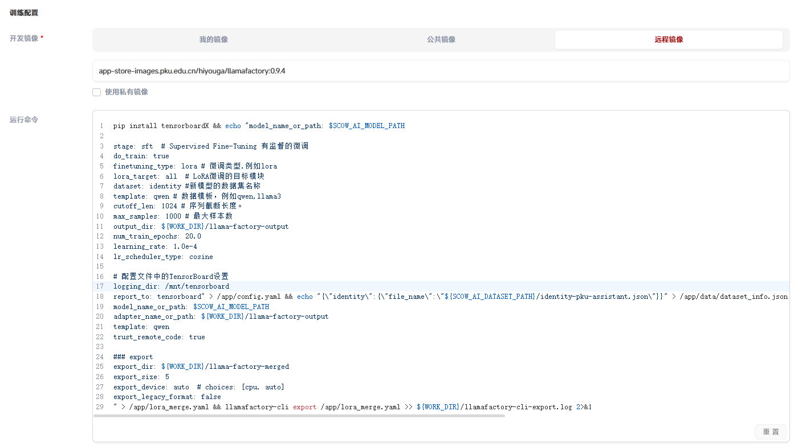
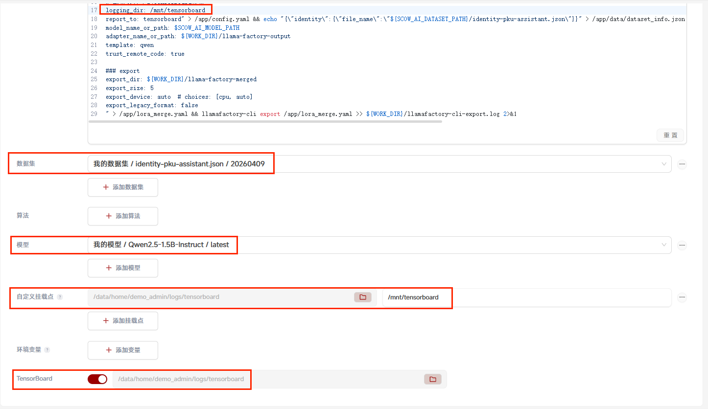
资源配置：
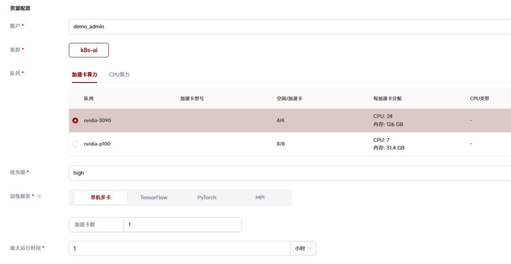
确认信息无误后点击"提交"
### 4.4、查看可视化训练过程
进入任务详情点击查看tensorboard

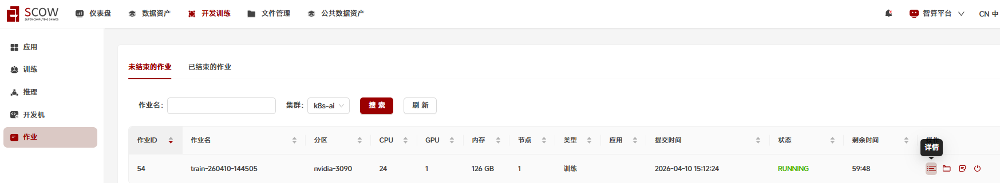
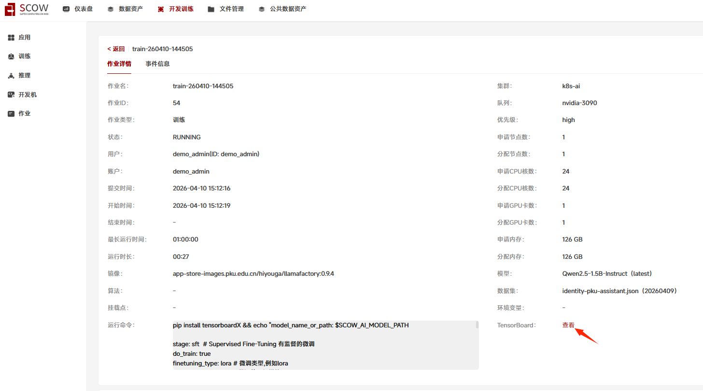
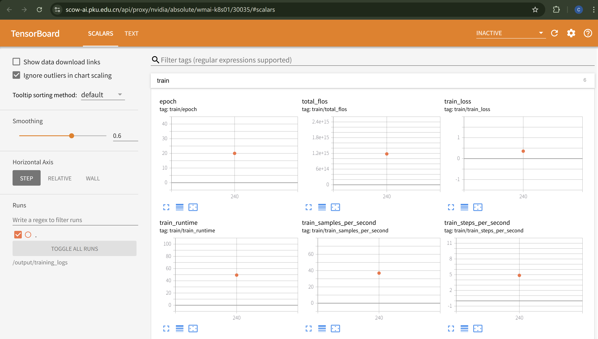

第一次运行训练任务得到的tensorboard参考价值较低，如上图，里面每张图都只有一个点，没有体现变化趋势

因此可以修改运行命令中的`num_train_epochs`值，教程中给出的值是20，可以换成15和10再重新跑一遍训练任务，这样得到的tensorboard就能够体现变化趋势

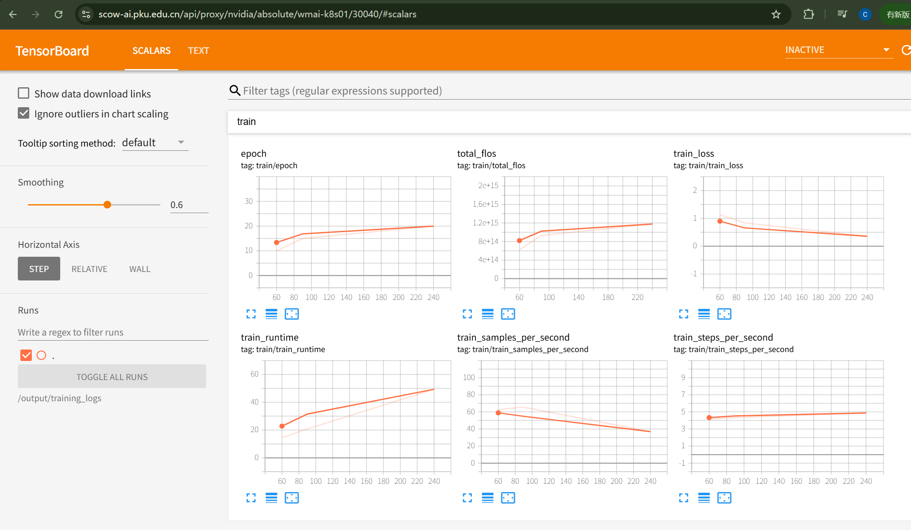

---
> 作者：褚苙扬；龙汀汀*
>
> 联系方式：l.tingting@pku.edu.cn