# Tutorial13: 在SCOW-AI集群的训练模块中使用LLaMA-Factory进行多机多卡模型微调

* 集群类型：SCOW智算平台
* 所需镜像：app-store-images.pku.edu.cn/hiyouga/llamafactory:0.9.4
* 所需模型：Qwen2.5-1.5B-Instruct
* 所需数据集：教程内提供
* 所需资源：多机多卡（2节点*2GPU）
* 目标：本节以Qwen2.5-1.5B-Instruct模型为例，在SCOW-AI集群的训练模块中使用LLaMA-Factory框架对这个Qwen大模型完成多机多卡微调、推理的步骤。未经过微调的Qwen大模型认为自己是Qwen大模型；经过微调后，Qwen大模型认为自己是北大人工智能助手。

## 1、数据集准备
根据[Tutorial5_添加和管理数据集](../Tutorial5_添加和管理数据集/tutorial5_添加和管理数据集.md) 准备数据集

这里简单介绍数据集，部分数据如下所示，目的是希望微调后的模型自我认同为北京大学开发的AI助手，可与最终的推理验证进行对照


## 2、训练模块多机多卡训练
在scow-ai网页中点击作业->训练

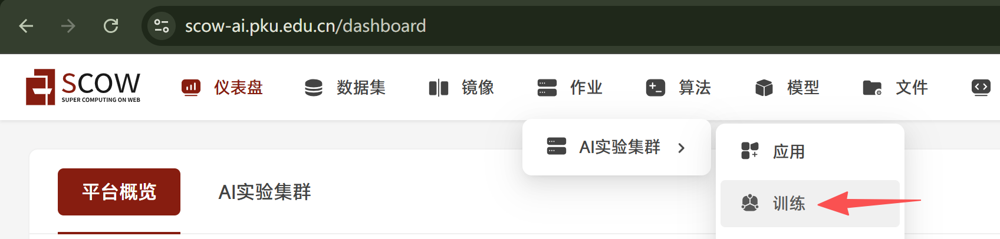

填写训练所需字段：
* 镜像来源选择远程镜像
* 远程镜像地址填写教程开头给出的地址：app-store-images.pku.edu.cn/hiyouga/llamafactory:0.9.4
* 运行命令填写：
```
echo "model_name_or_path: $SCOW_AI_MODEL_PATH

stage: sft  # Supervised Fine-Tuning 有监督的微调
do_train: true
finetuning_type: lora # 微调类型,例如lora
lora_target: all  # LoRA微调的目标模块
dataset: identity #新模型的数据集名称
template: qwen # 数据模板，例如qwen,llama3
cutoff_len: 1024 # 序列截断长度。
max_samples: 1000 # 最大样本数 
output_dir: ${WORK_DIR}/${RANK}/llama-factory-output
num_train_epochs: 20.0
learning_rate: 1.0e-4
lr_scheduler_type: cosine
resume_from_checkpoint: null

# 配置文件中的TensorBoard设置
logging_dir: ./logs/tensorboard
# report_to: tensorboard" > /app/config.yaml && echo "{\"identity\":{\"file_name\":\"${SCOW_AI_DATASET_PATH}/identity.json\"}}" > /app/data/dataset_info.json && cd /app && FORCE_TORCHRUN=1 NNODES=2 NODE_RANK=$RANK MASTER_ADDR=$MASTER_ADDR MASTER_PORT=$MASTER_PORT llamafactory-cli train /app/config.yaml && echo "### model
model_name_or_path: $SCOW_AI_MODEL_PATH
adapter_name_or_path: ${WORK_DIR}/0/llama-factory-output
template: qwen
trust_remote_code: true

### export
export_dir: ${WORK_DIR}/${RANK}/llama-factory-merged
export_size: 5
export_device: auto  # choices: [cpu, auto]
export_legacy_format: false
" > /app/lora_merge.yaml && llamafactory-cli export /app/lora_merge.yaml
```
* 数据集选择 我的数据集->identity
* 模型选择 公共模型->Qwen2.5-1.5B-Instruct(如果您使用的集群没有该模型，请参考[Tutorial16](../Tutorial16_下载模型/tutorial16_下载模型.md)下载模型，其中tutorial16中的1.1.6步骤使用`modelscope download --model Qwen/Qwen2.5-1.5B-Instruct --local_dir ./Qwen/Qwen/Qwen2.5-1.5B-Instruct`)

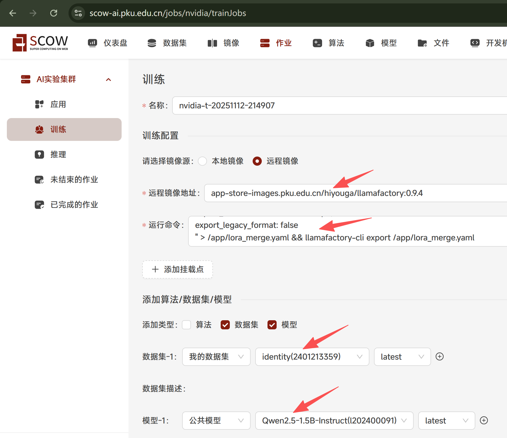

填写对应资源，开启分布式训练，框架选择pytorch，节点为2，填写加速卡卡数，卡数与模型大小有关，并且卡数越多，相同模型大小情况下，训练速度越快。这里填写2，点击提交

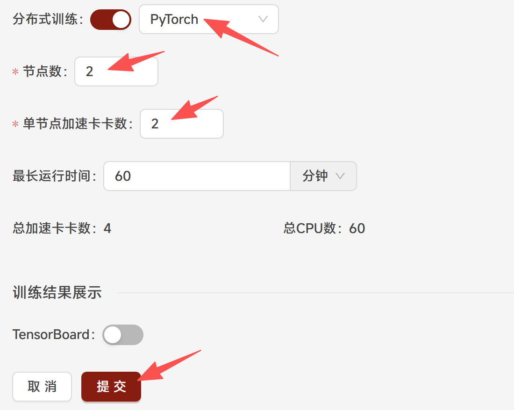

训练过程中点击详情->日志

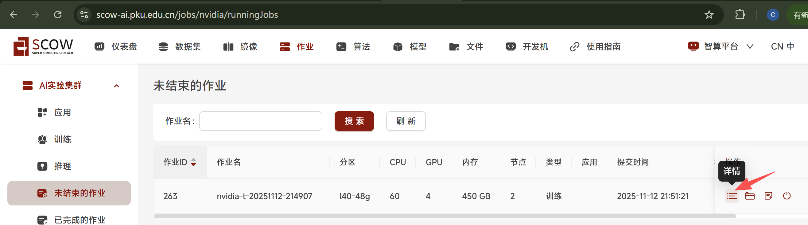
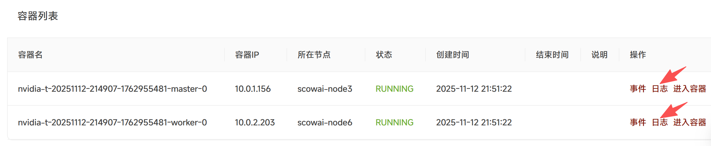

可以进到各个节点看到训练日志

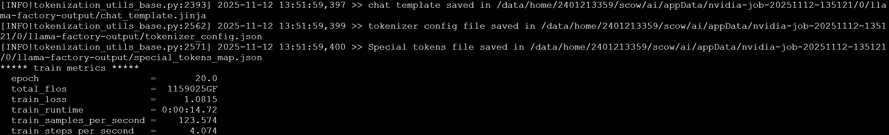
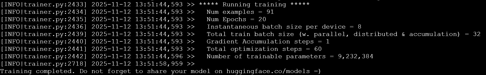

训练完成之后进入作业目录可以看到训练完成的新模型在目录中，微调后的模型完整路径一般为`[家目录]/scow/ai/appData/[作业名]/0/llama-factory-merged`，注意最后的`/0/llama-factory-merged`，复制该路径便于后续测试

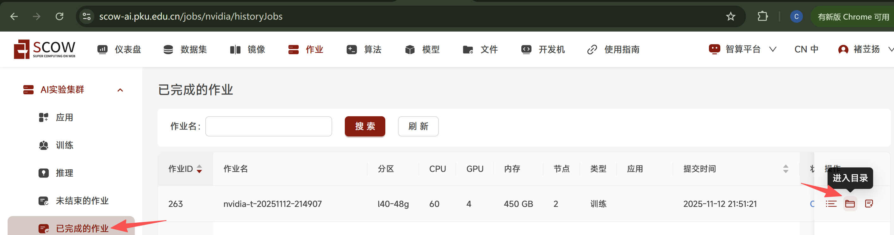
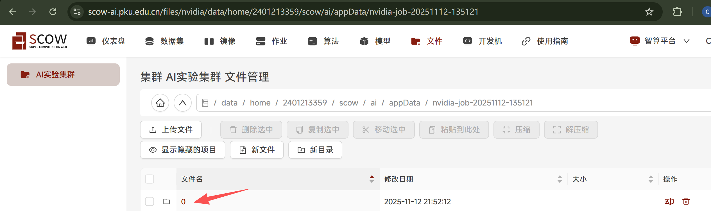
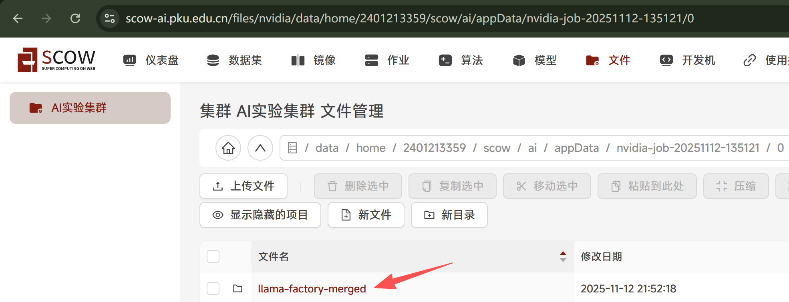

## 4、推理验证
得到merge的模型后进行推理验证微调是否成功，使用nextchat应用

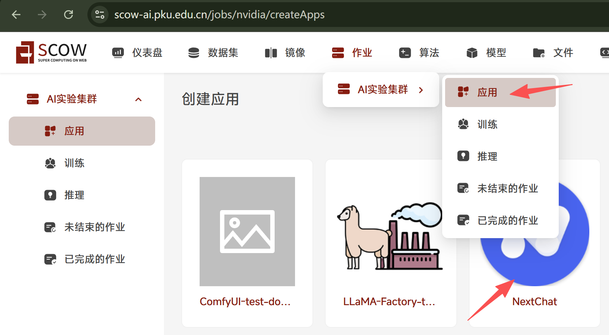

选择默认镜像，添加挂载点，填写前面微调模型的路径，添加环境变量`SCOW_AI_MODEL_PATH`，同样填写微调模型的路径

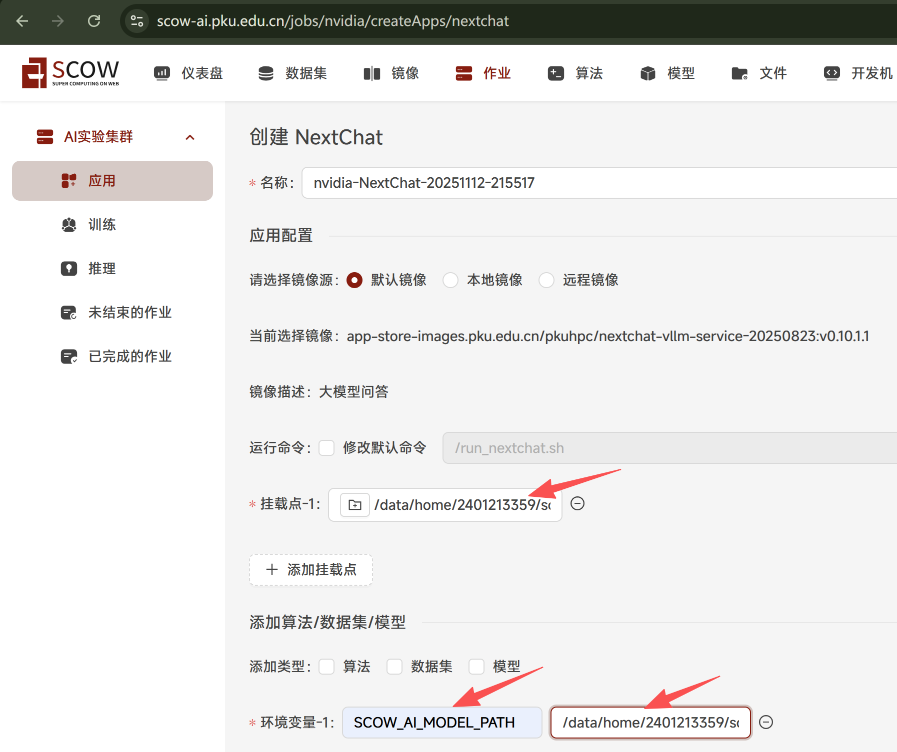

选择一张加速卡，点击提交

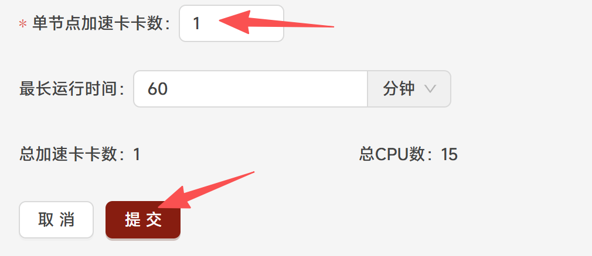

点击进入

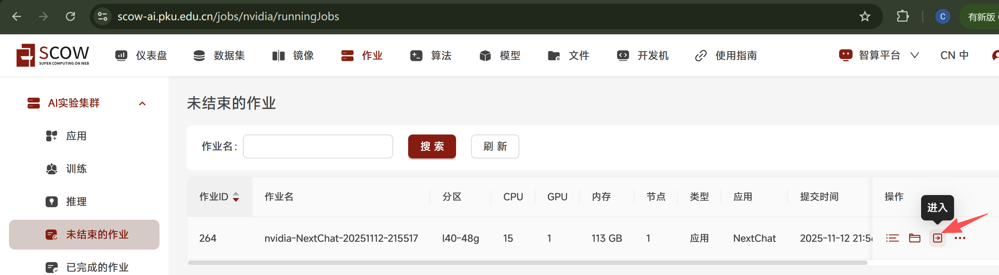

在聊天框进行对话，可以发现模型回答达到预期效果

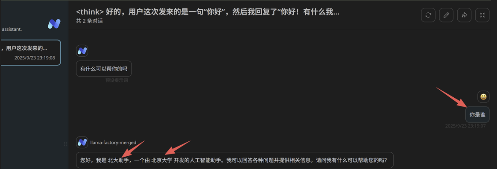

## *4、使用tensorboard可视化训练
使用本教程的训练框架llamafactory时，可将训练日志输出到指定文件夹中，并使用tensorboard将训练过程可视化

本部分需要使用者对集群的文件系统、训练模块和llamafactory框架的使用方法都有较好的掌握

### 4.1、创建日志文件夹
进入智算平台的文件管理系统中


创建文件夹logs->tensorboard

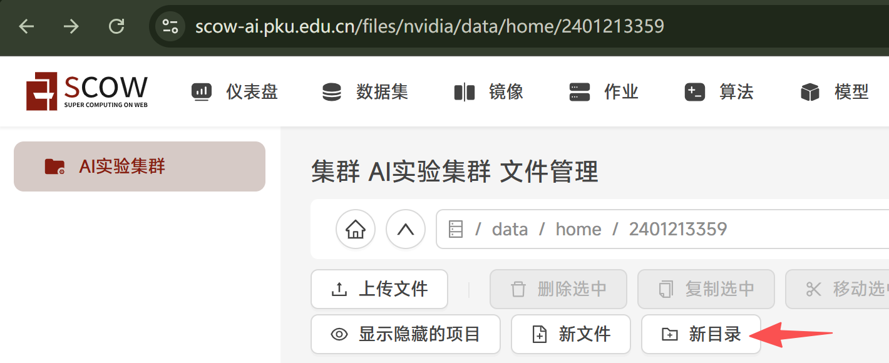
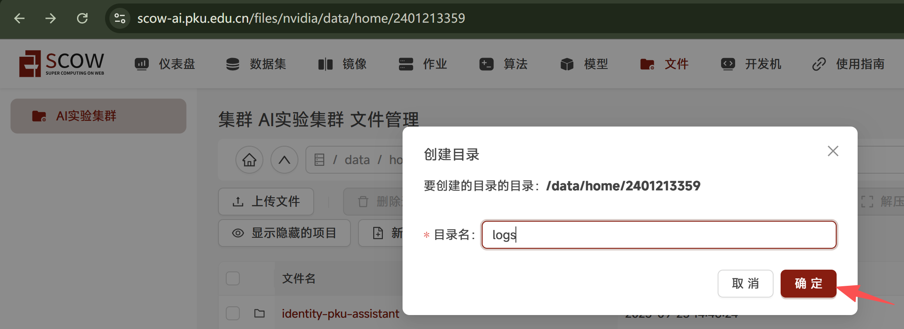


记住tensorboard文件夹的绝对路径，每个用户的路径不同，基本格式是`/data/home/用户名/logs/tensorboard`，这里是`/data/home/2401213359/logs/tensorboard`


### 4.2、修改运行命令

将章节2中启动训练时填写的运行命令中的
```
logging_dir: ./logs/tensorboard
# report_to: tensorboard
```
改为
```
logging_dir: /data/home/2401213359/logs/tensorboard
report_to: tensorboard
```
其中`logging_dir`对应的内容就是4.1中创建的目录路径

其次在运行命令开头加上`pip install tensorboardX && `，用来安装必要环境

得到的完整运行命令如下
```
pip install tensorboardX && echo "model_name_or_path: $SCOW_AI_MODEL_PATH

stage: sft  # Supervised Fine-Tuning 有监督的微调
do_train: true
finetuning_type: lora # 微调类型,例如lora
lora_target: all  # LoRA微调的目标模块
dataset: identity #新模型的数据集名称
template: qwen # 数据模板，例如qwen,llama3
cutoff_len: 1024 # 序列截断长度。
max_samples: 1000 # 最大样本数 
output_dir: ${WORK_DIR}/${RANK}/llama-factory-output
num_train_epochs: 20.0
learning_rate: 1.0e-4
lr_scheduler_type: cosine
resume_from_checkpoint: null

# 配置文件中的TensorBoard设置
logging_dir: /data/home/2401213359/logs/tensorboard
report_to: tensorboard" > /app/config.yaml && echo "{\"identity\":{\"file_name\":\"${SCOW_AI_DATASET_PATH}/identity.json\"}}" > /app/data/dataset_info.json && cd /app && FORCE_TORCHRUN=1 NNODES=2 NODE_RANK=$RANK MASTER_ADDR=$MASTER_ADDR MASTER_PORT=$MASTER_PORT llamafactory-cli train /app/config.yaml && echo "### model
model_name_or_path: $SCOW_AI_MODEL_PATH
adapter_name_or_path: ${WORK_DIR}/0/llama-factory-output
template: qwen
trust_remote_code: true

### export
export_dir: ${WORK_DIR}/${RANK}/llama-factory-merged
export_size: 5
export_device: auto  # choices: [cpu, auto]
export_legacy_format: false
" > /app/lora_merge.yaml && llamafactory-cli export /app/lora_merge.yaml
```

### 4.3、创建训练任务

创建训练任务与原先只有三点不同，第一是运行命令改为4.2中修改后的运行命令（注意你的命令与教程的命令并不完全相同，日志路径需要填写你自己创建的路径）

第二是需要添加挂载点，填写你创建的日志文件夹路径

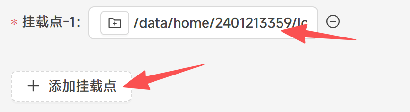

第三是需要开启可视化训练，并挂载数据源，即你创建的日志文件夹路径

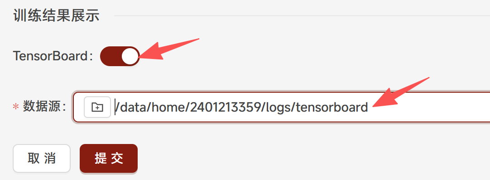

最后点击提交

### 4.4、查看可视化训练过程
进入任务详情点击查看tensorboard


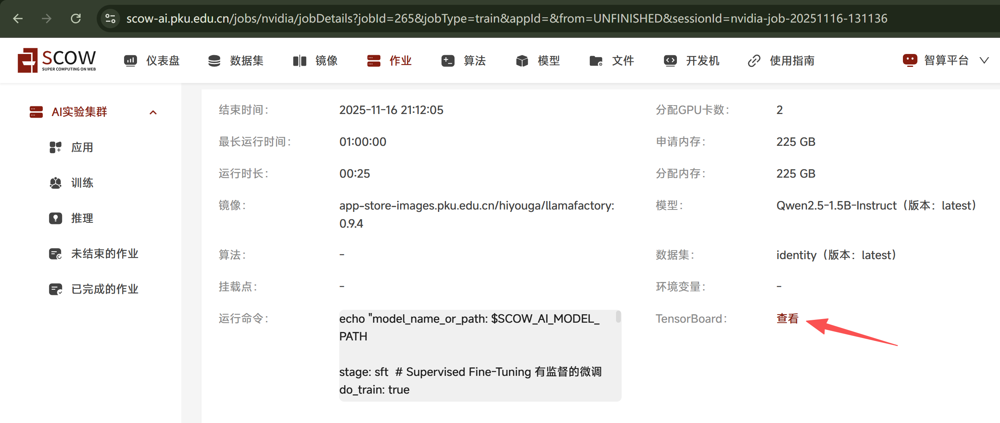


第一次运行训练任务得到的tensorboard参考价值较低，如上图，里面每张图都只有一个点，没有体现变化趋势

因此可以修改运行命令中的`num_train_epochs`值，教程中给出的值是20，可以换成15和10再重新跑一遍训练任务，这样得到的tensorboard就能够体现变化趋势

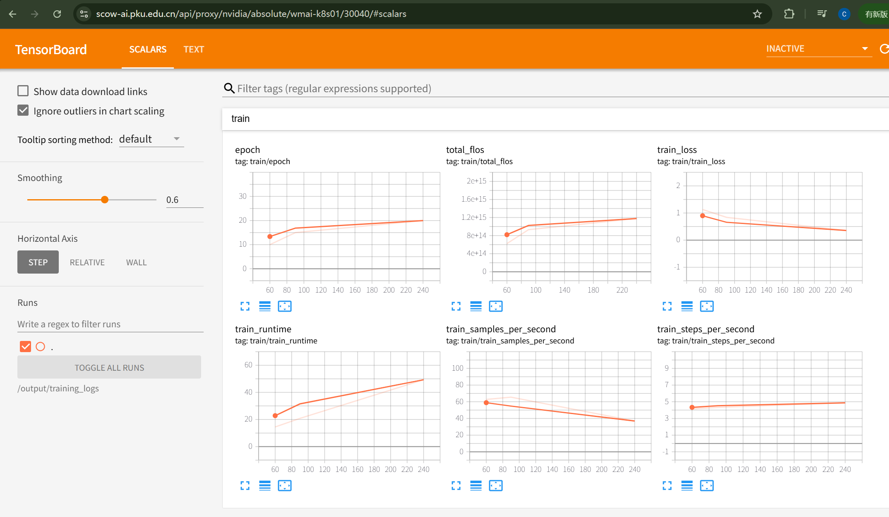