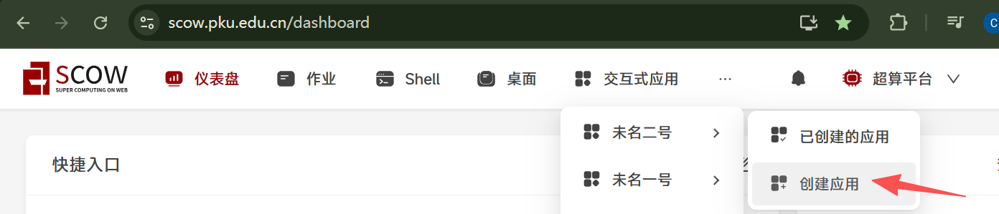
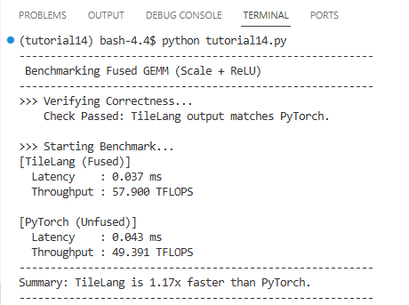

# Tutorial14: 使用TileLang语言编写attention算子

* 集群类型：超算平台
* 所需镜像：无
* 所需模型：无
* 所需数据集：教程内提供
* 所需资源：单机单卡
* 目标：本节旨在演示如何使用TileLang语言编写一个简单的算子，并与直接使用torch计算进行性能比较

[参考文档](https://tilelang.com/)

此教程运行在SCOW超算平台中，请确保运行过[Tutorial0 搭建Python环境](../Tutorial0_python_env/tutorial0.md)中1.2安装conda的步骤，再来尝试运行本教程

## 1、前置准备
### 1.1、安装环境
切换到超算平台中


点击登录集群->未名二号 wm2-data01->打开，打开shell


运行下面的命令创建文件夹、配置环境、下载数据集
```shell
mkdir tutorial14
source ~/.bashrc
conda create -n tutorial14 python==3.12
conda activate tutorial14
pip install tilelang==0.1.6.post2
```

### 1.2、创建应用
点击交互式应用->未名二号->创建应用进入创建界面，选择vscode应用




节点数填写1，单节点加速卡卡数填写1，最长运行时间适当填写，最后点击提交


在跳转到的页面中点击进入


进到vscode应用中打开terminal


## 2、编写算子
在tutorial14下创建Python脚本
```shell
cd tutorial14
echo "" > tutorial14.py
```

在tutorial14.py中放入下面的代码
```python
import tilelang
import tilelang.language as T
import torch

def benchmark_op(func, name, m, n, k, steps=100):
    """
    一个通用的性能测试辅助函数，用于计算 Latency 和 TFLOPS。
    """
    # 预热
    for _ in range(10):
        func()
    torch.cuda.synchronize()

    # 计时
    start_event = torch.cuda.Event(enable_timing=True)
    end_event = torch.cuda.Event(enable_timing=True)

    start_event.record()
    for _ in range(steps):
        func()
    end_event.record()
    torch.cuda.synchronize()

    # 指标计算
    avg_latency_ms = start_event.elapsed_time(end_event) / steps
    # GEMM FLOPs = 2 * M * N * K
    tflops = (2 * m * n * k) / (avg_latency_ms * 1e-3) / 1e12

    print(f"[{name}]")
    print(f"  Latency    : {avg_latency_ms:.3f} ms")
    print(f"  Throughput : {tflops:.3f} TFLOPS")
    return avg_latency_ms


@tilelang.jit(out_idx=[2])
def matmul_scale_relu(M, N, K, block_M, block_N, block_K, dtype="float16", accum_dtype="float"):
    @T.prim_func
    def gemm_fused(
            A: T.Tensor((M, K), dtype),
            B: T.Tensor((K, N), dtype),
            C: T.Tensor((M, N), dtype),
            scale: T.float32, 
    ):
        with T.Kernel(T.ceildiv(N, block_N), T.ceildiv(M, block_M), threads=128) as (bx, by):
            A_shared = T.alloc_shared((block_M, block_K), dtype)
            B_shared = T.alloc_shared((block_K, block_N), dtype)
            
            C_local = T.alloc_fragment((block_M, block_N), accum_dtype)
            T.clear(C_local)
            
            for k in T.Pipelined(T.ceildiv(K, block_K), num_stages=3):
                T.copy(A[by * block_M, k * block_K], A_shared)
                T.copy(B[k * block_K, bx * block_N], B_shared)

                T.gemm(A_shared, B_shared, C_local)

            for i, j in T.Parallel(block_M, block_N):
                v_acc = C_local[i, j]
                v_scaled = v_acc * scale
                v_relu = T.max(v_scaled, T.float32(0.0))
                C_local[i, j] = v_relu

            T.copy(C_local, C[by * block_M, bx * block_N])

    return gemm_fused

def main():
    print("---------------------------------------------------------")
    print(" Benchmarking Fused GEMM (Scale + ReLU)")
    print("---------------------------------------------------------")
    
    M, N, K = 1024, 1024, 1024
    scale_val = 0.5
    
    torch.manual_seed(0)
    a = torch.randn(M, K).cuda().half()
    b = torch.randn(K, N).cuda().half()
    
    # Config: Block sizes [64, 64, 32]
    tl_kernel = matmul_scale_relu(M, N, K, 64, 64, 32)
    
    print(">>> Verifying Correctness...")
    
    c_tl = tl_kernel(a, b, scale_val)
    ref_c = torch.relu((a @ b) * scale_val)

    try:
        torch.testing.assert_close(c_tl, ref_c, rtol=1e-2, atol=1e-2)
        print("    Check Passed: TileLang output matches PyTorch.")
    except Exception as e:
        print("    Check Failed!")
        print(e)
        return

    print("\n>>> Starting Benchmark...")
    
    def run_tilelang():
        tl_kernel(a, b, scale_val)

    def run_pytorch():
        res = torch.relu((a @ b) * scale_val)
        return res

    lat_tl = benchmark_op(run_tilelang, "TileLang (Fused)", M, N, K)
    print("")
    lat_torch = benchmark_op(run_pytorch, "PyTorch (Unfused)", M, N, K)

    speedup = lat_torch / lat_tl
    print("---------------------------------------------------------")
    print(f"Summary: TileLang is {speedup:.2f}x faster than PyTorch.")
    print("---------------------------------------------------------")    

if __name__ == "__main__":
    main()
```

运行下面的命令开始训练
```shell
conda activate tutorial14
python tutorial14.py
```

最后可以看到如下日志输出，可以看到我们编写的算子性能是比使用torch直接计算优秀的，且计算结果是一致的



## 3、算子介绍

该算子实现了一个高性能的 通用矩阵乘法 (GEMM)，并融合了 Epilogue（后处理） 操作。具体来说，它在完成矩阵乘法 $A \times B$ 后，立即在片上寄存器（On-chip Registers）中执行缩放（Scale）和激活（ReLU）操作，最后才将结果写回全局显存。

这种算子融合 (Kernel Fusion) 技术通过减少全局显存的读写次数（Memory Access），显著提升了计算密度和推理性能。

该算子计算公式如下：

$$C_{m,n} = \text{ReLU}\left( \left( \sum_{k=0}^{K-1} A_{m,k} \times B_{k,n} \right) \cdot \alpha \right)$$

其中：

* $A$: 输入矩阵，形状为 $(M, K)$

* $B$: 输入矩阵，形状为 $(K, N)$

* $\alpha$: 标量缩放因子 (scale)

* $\text{ReLU}(x) = \max(x, 0)$

该算子利用了 NVIDIA GPU 的存储层次结构进行极致优化。

### 分块与流水线 (Tiling & Pipelining)
* 分块 (Blocking): 矩阵被划分为大小为 $64 \times 64$ 的块（Block），每个 Thread Block 负责计算结果矩阵 $C$ 的一个子块。
* 流水线 (Pipelining): 使用 3 级软件流水线（3-stage software pipeline）。在计算当前 Tile 的同时，预取下一个 Tile 的数据到共享内存（Shared Memory），从而掩盖全局内存的访问延迟。

### 融合 Epilogue (The Fused Epilogue)
传统的 PyTorch 实现需要启动三个内核（Matmul, Mul, Relu），产生三次显存读写。而本算子将其合并为一个内核：
* Accumulation: 矩阵乘法的中间结果存储在 Fragment 寄存器 (C_local) 中。
* In-Register Processing: 在写回显存之前，直接利用 T.Parallel 指令在寄存器上并发执行 $x \times \alpha$ 和 $\max(x, 0)$。Write Back: 只有处理后的最终结果才会被写入 Global Memory。