# Tutorial15: 在xscow平台申请资源部署大模型

* 集群类型：超算平台
* 所需镜像：无
* 所需模型：Qwen2.5-7B-Instruct
* 所需数据集：无
* 所需资源：单机单卡
* 目标：本节旨在演示如何在[XSCOW平台](https://aigc.emic.edu.cn/)申请资源，并用vllm框架部署Qwen2.5-7B-Instruct大模型推理服务

## 1、申请算力资源
输入网址 `https://aigc.emic.edu.cn/` 进入教育大模型公共服务平台，点击北京大学高性能计算中心->北京大学


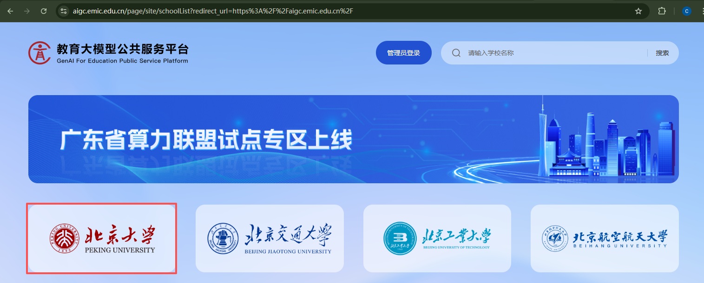

在跳转后的页面中使用北大账号登录，登录后再点击北京大学高性能计算中心

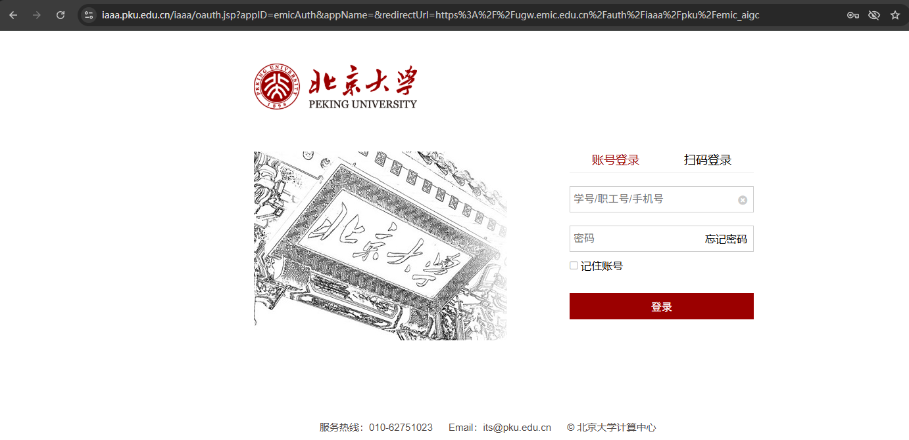
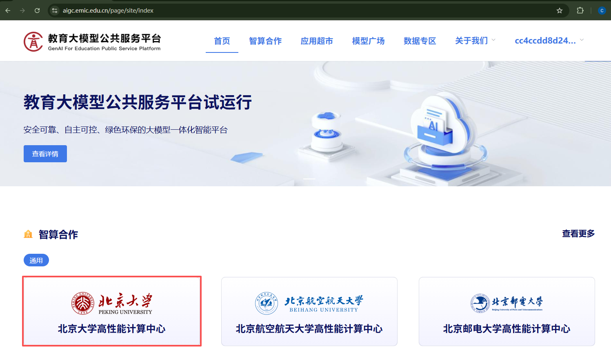

在算力资源目录中找到北大未名集群，点击最右边的申请/开启按钮（如果没申请过会显示申请，点击等待十分钟后可以确认是否成功；如果已经申请过资源并关闭，就会显示开启，点击开启后在最上方就会显示可访问的算力资源中有北大未名集群）

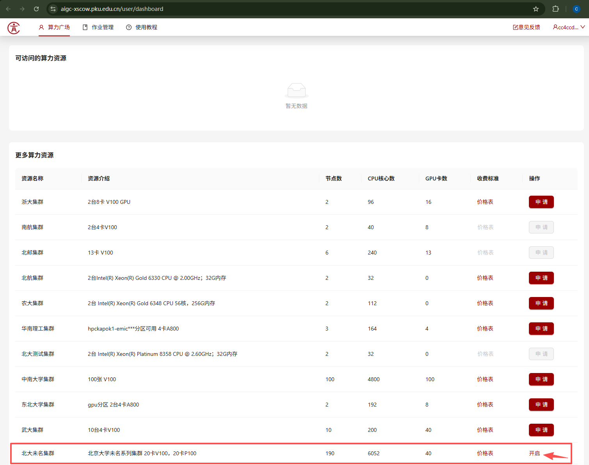

申请/开启成功后点击进入，就能够进到未名集群中的提交作业页面

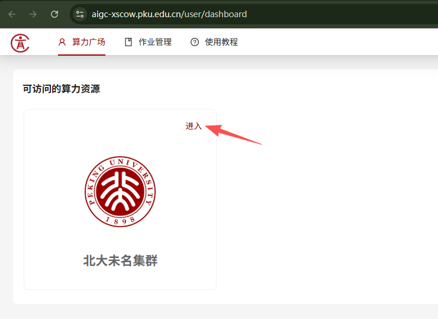
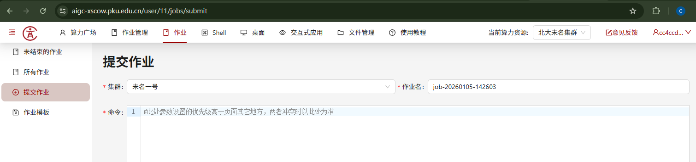

## 2、配置环境安装模型
点击Shell->未名一号->wm1-data01进入终端

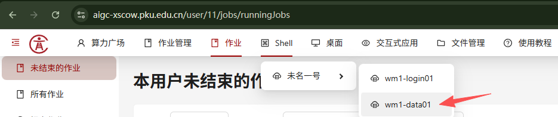
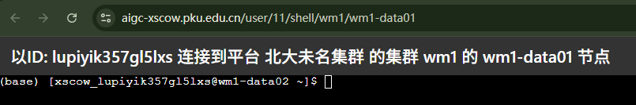

运行以下命令安装conda
```shell
wget https://repo.anaconda.com/miniconda/Miniconda3-py38_4.12.0-Linux-x86_64.sh
chmod +x Miniconda3-py38_4.12.0-Linux-x86_64.sh
./Miniconda3-py38_4.12.0-Linux-x86_64.sh
```

运行以下命令配置vllm环境
```shell
conda create -n tutorial15 python==3.10 -y
conda activate tutorial15
pip install sentencepiece==0.1.99
pip install https://github.com/vllm-project/vllm/releases/download/v0.4.1/vllm-0.4.1+cu118-cp310-cp310-manylinux1_x86_64.whl
pip install torch==2.2.1+cu118 torchvision==0.17.1+cu118 torchaudio==2.2.1+cu118 --index-url https://download.pytorch.org/whl/cu118
pip install xformers==0.0.25+cu118 --index-url https://download.pytorch.org/whl/cu118
pip install numpy==1.26.4 transformers==4.40.0
```

运行以下命令下载大模型 `Qwen2.5-7B-Instruct`
```shell
pip install modelscope==1.33.0
modelscope download --model Qwen/Qwen2.5-7B-Instruct --local_dir ./model/Qwen2.5-7B-Instruct
```

## 3、创建应用部署推理
点击交互式应用->未名一号->创建应用

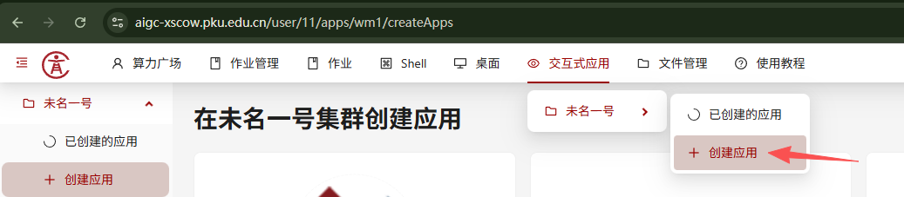

点击VSCode

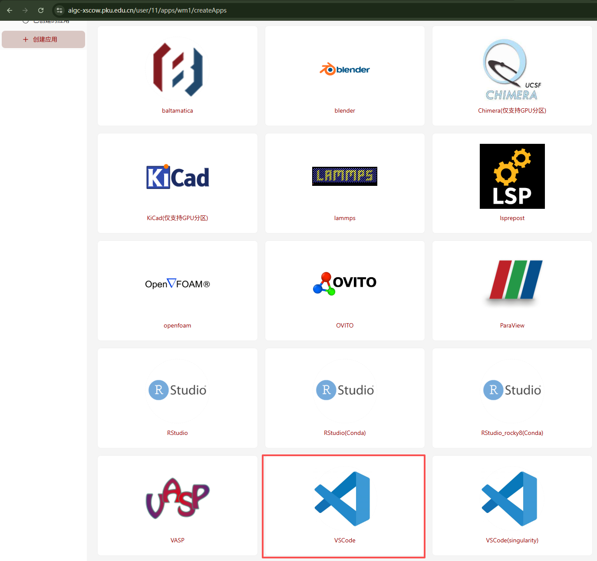

分区选择GPU36，单节点GPU卡数填写1，最长运行时间按需填写，最后点击提交

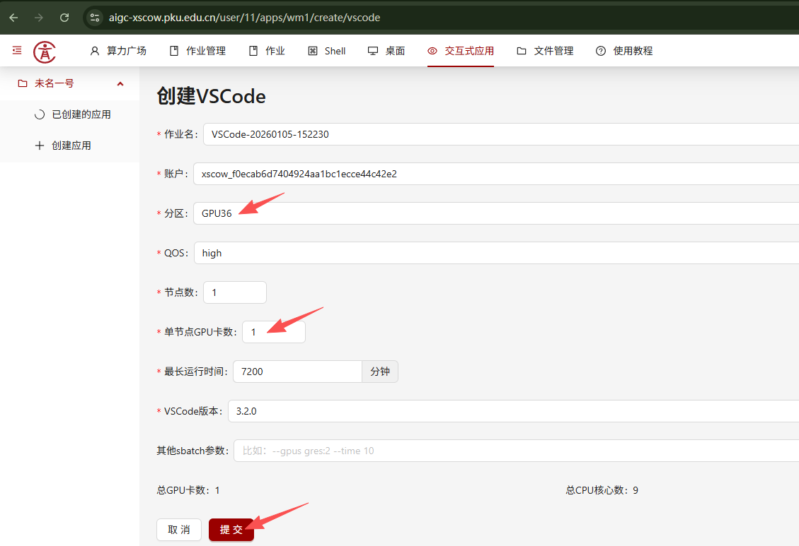

在跳转后的界面点击连接

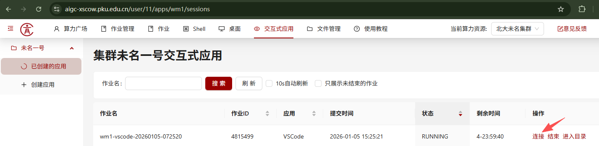

进到vscode应用中打开文件夹和终端

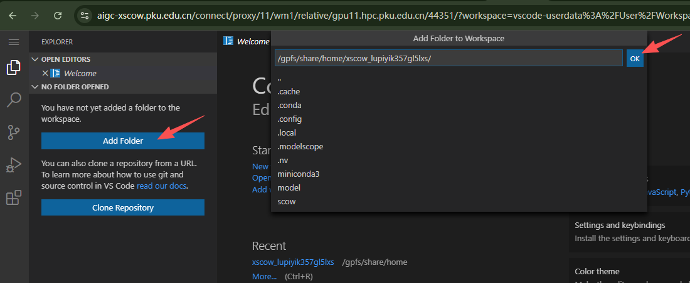
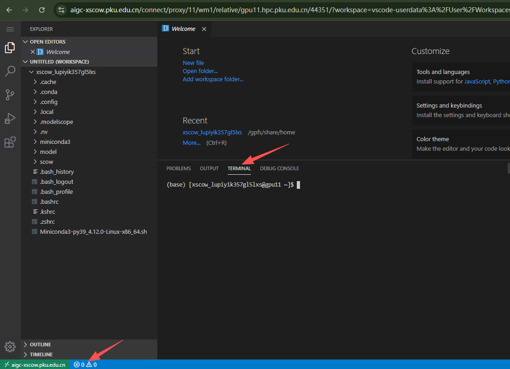

在终端中运行以下命令部署推理
```shell
conda activate tutorial15
LOG_LEVEL=INFO python -m vllm.entrypoints.openai.api_server \
    --model ./model/Qwen2.5-7B-Instruct \
    --trust-remote-code \
    --host 0.0.0.0 \
    --port 8000 \
    --dtype float16 \
    --max-model-len 4096 \
    --gpu-memory-utilization 0.9
```

看到终端有以下日志输出代表推理服务部署完成

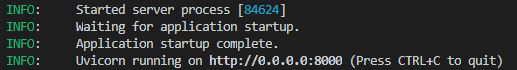

新开一个终端输入以下命令测试推理服务
```shell
curl http://localhost:8000/v1/chat/completions \
    -H "Content-Type: application/json" \
    -d '{
        "model": "./model/Qwen2.5-7B-Instruct",
        "messages": [
            {"role": "user", "content": "你好，介绍一下你自己"}
        ],
        "max_tokens": 512,
        "temperature": 0.7
    }'
```

正常会得到以下返回，代表推理服务部署成功

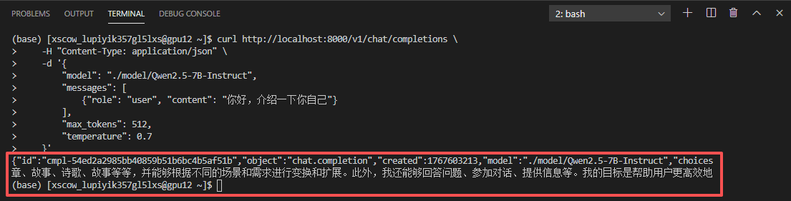

---
> 作者：褚苙扬；龙汀汀*
>
> 联系方式：l.tingting@pku.edu.cn