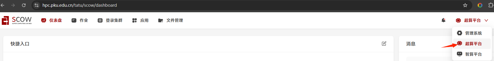
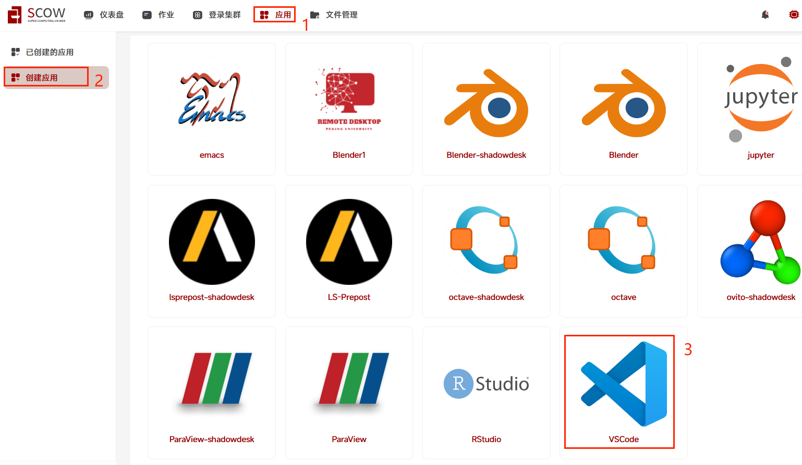
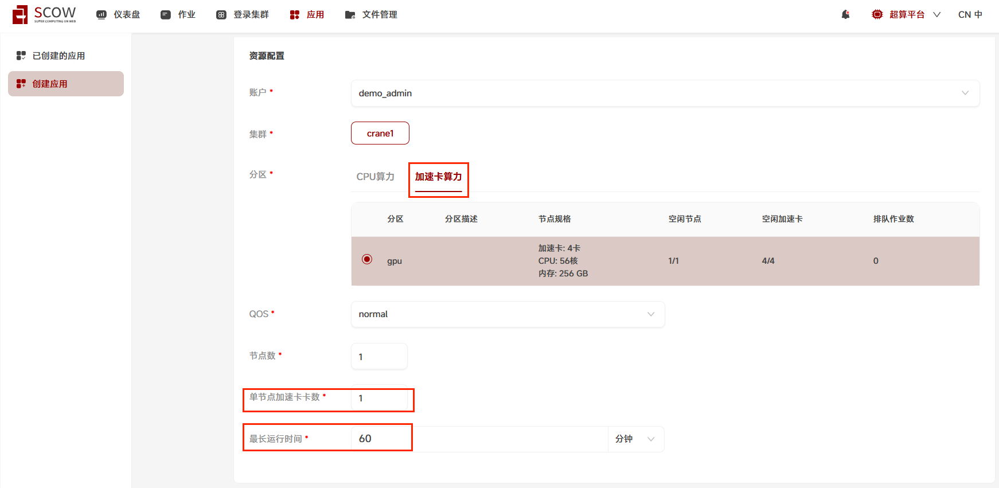
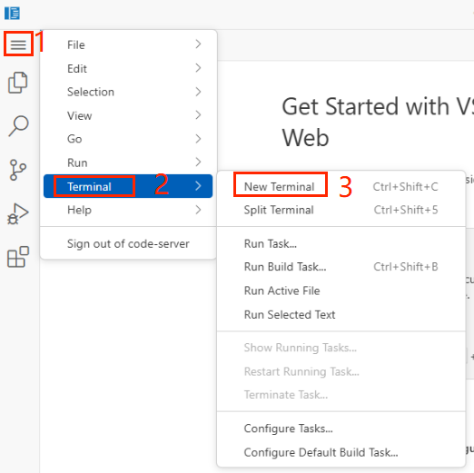
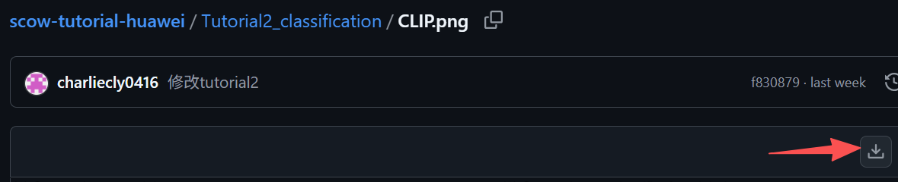
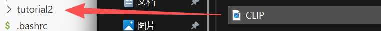
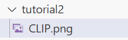
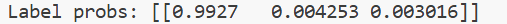
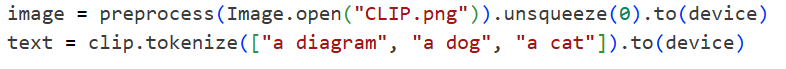

# Tutorial2: CLIP图像文本分类

* 集群类型：超算平台
* 所需镜像：无
* 所需模型：教程内提供
* 所需数据集：教程内提供
* 所需资源：单机单卡
* 目标：本节旨在展示使用‌CLIP模型进行图像文本分类的简单案例，使用OpenAI提供的CLIP库以及给出的示例图片。

‌CLIP模型（Contrastive Language-Image Pre-training）是一种由OpenAI在2021年发布的多模态预训练模型，旨在通过大量文本-图像对进行训练，以理解和匹配图像内容与相应的自然语言描述‌。‌

此教程运行在SCOW超算平台中，请确保运行过[Tutorial0 搭建Python环境](../Tutorial0_python_env/tutorial0.md)中1.2安装conda的步骤，再来尝试运行本教程

## 1、前置准备
### 1.1. 安装环境
切换到超算平台中



点击"登录集群"->对应集群名->"打开"按钮进入shell


在shell中运行以下命令创建文件夹、配置环境、加载模型
```shell
mkdir tutorial2
source ~/.bashrc
#准备python运行环境
conda create -n tutorial2 python==3.10
Proceed ([y]/n)? y

conda activate tutorial2
pip install ftfy==6.3.1 regex==2024.11.6 tqdm==4.67.1 pyyaml==6.0.2 traitlets==5.14.3 decorator==5.2.1 attrs==25.4.0 psutil==7.1.2

git clone https://github.com/openai/CLIP.git  
#如果当前环境没有git命令或当前环境无法访问github，请自行在浏览器上输入上面的地址直接下载CLIP-main.zip到自己电脑上，再从页面[超算平台]-[文件管理]中上传至家目录指定目录并解压缩

cd CLIP
pip install .
cd ..
#在login节点上执行下载模型所需数据资源
python -c "import clip; clip.load('ViT-B/32', device='cpu')"
```

### 1.2. 创建应用
点击"应用"->在应用列表中选择vscode应用



在创建应用页面-资源配置：选择"账户","集群","分区：加速卡算力","QOS(优先级)：normal","单节点加速卡数：1",以及"最大运行时间：60分钟"

应用配置：选择"选择版本*：4.105.1(默认)","其他sbatch参数:",最后点击"提交"



在跳转到的页面中点击进入


进入应用后，打开终端。点击"左上角"菜单"图标-Terminal-New Terminal"



## 2、数据准备
供模型调用的图像如下：


能够看出是CLIP模型的预训练和预测流程图，后面将调用CLIP对本图像进行分类

点击[图像链接](https://github.com/PKUHPC/scow-tutorial/blob/main/Tutorial2_classification/CLIP.png)进入，点击下载



记住图片下载的路径，通过拖动的方式将图片传到tutorial2文件夹下



最后得到的文件夹结构如下



## 3、模型推理
在tutorial2下创建Python脚本
```shell
cd tutorial2
touch  tutorial2.py
```
在tutorial2.py中放入下面的代码
```python
import torch
import clip
from PIL import Image

# 设置设备为 CUDA
device = "cuda" if torch.cuda.is_available() else "cpu"

# 加载 CLIP 模型
model, preprocess = clip.load("ViT-B/32", device=device)

# 加载图像和文本
image = preprocess(Image.open("CLIP.png")).unsqueeze(0).to(device)
text = clip.tokenize(["a diagram", "a dog", "a cat"]).to(device)

# 推理
with torch.no_grad():
    image_features = model.encode_image(image)
    text_features = model.encode_text(text)
    
    logits_per_image, logits_per_text = model(image, text)
    probs = logits_per_image.softmax(dim=-1).cpu().numpy()

print("Label probs:", probs)
```

运行下面的命令开始推理
```shell
conda activate tutorial2
python tutorial2.py
```

## 4、推理结果
推理结果如下：



可以看到a diagram对应的百分比最高，可知该图像最符合diagram的描述，与事实相符。



---
> 作者：褚苙扬；龙汀汀*
>
> 联系方式：l.tingting@pku.edu.cn