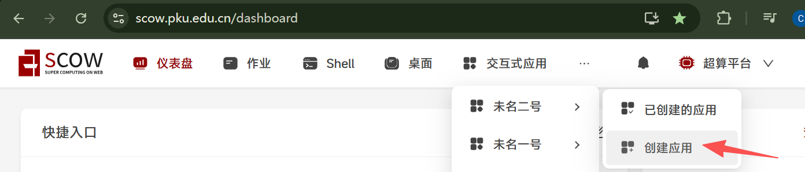
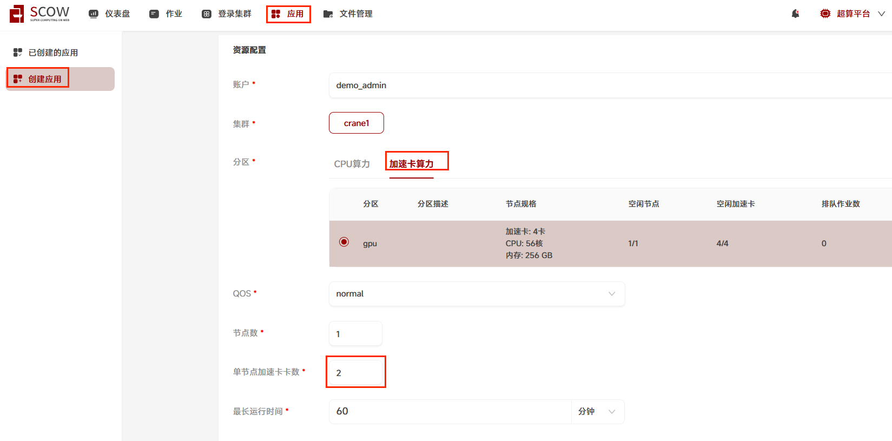
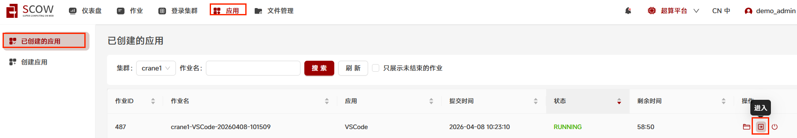
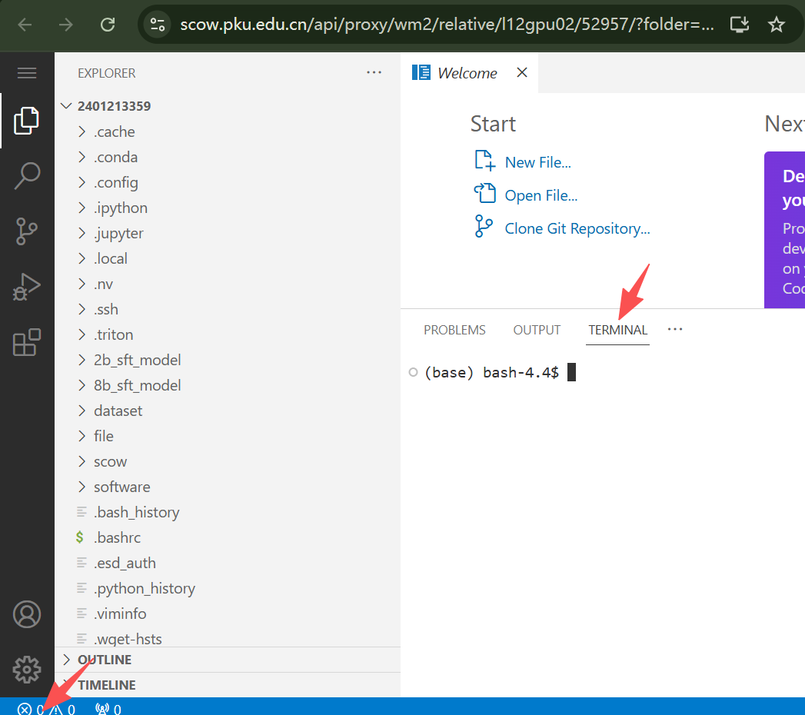
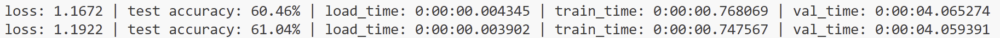

# Tutorial3: ResNet18训练cifar数据集

* 集群类型：超算平台
* 所需镜像：无
* 所需模型：教程内提供
* 所需数据集：教程内提供
* 所需资源：单机多卡，建议使用2张GPU运行本教程。
* 目标：本节旨在旨在展示更接近实际的训练场景，使用ResNet18训练cifar数据集，在多块加速卡上做并行。

此教程运行在SCOW超算平台中，请确保运行过[Tutorial0 搭建Python环境](../Tutorial0_python_env/tutorial0.md)中1.2安装conda的步骤，再来尝试运行本教程

## 1、前置准备
### 1.1、安装环境
切换到超算平台中


点击"登录集群"->对应集群名->"打开"按钮进入shell


运行下面的命令创建文件夹、配置环境、下载数据集
```shell
mkdir tutorial3
source ~/.bashrc
#准备python运行环境
conda create -n tutorial3 python==3.10
conda activate tutorial3
pip install torch==2.3.1 numpy==1.26.4 pandas==2.2.2 torchvision==0.18.1 pyyaml==6.0.2 traitlets==5.14.3 decorator==5.2.1 attrs==25.4.0 psutil==7.1.2 scipy==1.15.3
#在login节点上执行下载模型所需数据资源
python -c "from torchvision import datasets; datasets.CIFAR10(root='./cifar', train=True, download=True); datasets.CIFAR10(root='./cifar', train=False, download=True)"
#此步如果失败超时，则说明环境网络不可达，可本地浏览器下载https://www.cs.toronto.edu/~kriz/cifar-10-python.tar.gz，再从页面[超算平台]-[文件管理]中上传至家目录~/tutorial3/cifar/下,不用解压缩
```

### 1.2、创建应用
点击"应用"->在应用列表中选择vscode应用



在创建应用页面-资源配置：选择"账户","集群","分区：加速卡算力","QOS(优先级)：normal","单节点加速卡数：2",以及"最大运行时间：60分钟"

应用配置：选择"选择版本*：4.105.1(默认)","其他sbatch参数:",最后点击"提交"



在跳转到的页面中点击进入



进入应用后，打开终端。点击"左下角"调试"图标-找到Terminal



## 2、模型训练
在tutorial3下创建Python脚本
```shell
cd tutorial3
touch tutorial3.py
```
在tutorial3.py中放入下面的代码
```python
import torch
from torch import nn
import torch.distributed as dist
from torch.utils.data import DataLoader
import torchvision.transforms as transforms
import torchvision.datasets as datasets
from torchvision.models import resnet18
import time
import os
from datetime import timedelta
import torch.multiprocessing as mp

torch.manual_seed(0)
os.environ['MASTER_ADDR'] = '127.0.0.1'
os.environ['MASTER_PORT'] = '29500'

# 数据预处理
train_transforms = transforms.Compose([
    transforms.Resize(40),
    transforms.RandomResizedCrop(32, scale=(0.64, 1.0), ratio=(1.0, 1.0)),
    transforms.RandomHorizontalFlip(),
    transforms.RandomRotation(10),
    transforms.ToTensor(),
    transforms.Normalize(mean=[0.4914, 0.4822, 0.4465], std=[0.2023, 0.1994, 0.2010])
])

val_transforms = transforms.Compose([
    transforms.ToTensor(),
    transforms.Normalize(mean=[0.4914, 0.4822, 0.4465], std=[0.2023, 0.1994, 0.2010])
])

# 加载数据集
train_dataset = datasets.CIFAR10(root='./cifar', train=True, download=True, transform=train_transforms)
val_dataset = datasets.CIFAR10(root='./cifar', train=False, download=True, transform=val_transforms)

def ddp_setup(rank, world_size):
    dist.init_process_group(backend="nccl", rank=rank, world_size=world_size)

def main_worker(rank, world_size, batch_size, device_ids):
    """
    rank: 当前进程的 rank
    world_size: 总进程数
    batch_size: 全局 batch size
    device_ids: 可用的设备 ID 列表
    """
    ddp_setup(rank, world_size)

    # 设置设备
    device_id = device_ids[rank]  # 根据 rank 获取对应的设备 ID
    torch.cuda.set_device(device_id)
    print(f"Process {rank} is using device cuda:{device_id}")

    total_batch_size = batch_size
    total_workers = world_size

    batch_size = int(total_batch_size / world_size)
    workers = int((total_workers + world_size - 1) / world_size)

    # 使用 ResNet18 模型
    model = resnet18(weights=None, num_classes=10)

    loc = f'cuda:{device_id}'
    model = model.to(loc)
    criterion = nn.CrossEntropyLoss().to(loc)
    optimizer = torch.optim.SGD(model.parameters(), lr=0.1, momentum=0.9, weight_decay=1e-4)

    train_sampler = torch.utils.data.distributed.DistributedSampler(train_dataset, num_replicas=world_size, rank=rank)
    test_sampler = torch.utils.data.distributed.DistributedSampler(val_dataset, num_replicas=world_size, rank=rank)

    train_loader = DataLoader(
        train_dataset, batch_size=batch_size, shuffle=False,
        num_workers=workers, pin_memory=True, sampler=train_sampler, drop_last=True)

    val_loader = DataLoader(
        val_dataset, batch_size=batch_size, shuffle=False,
        num_workers=workers, pin_memory=True, sampler=test_sampler, drop_last=True)

    model = nn.parallel.DistributedDataParallel(model, device_ids=[device_id])

    for epoch in range(5):
        print(f"Epoch {epoch+1} start")
        train_sampler.set_epoch(epoch)
        average_loss, average_load_time, average_train_time = train(train_loader, model, criterion, optimizer, epoch, device_id)

        # 验证
        val_start_time = time.time()
        accuracy_dict = accuracy(model, val_loader, loc)
        val_end_time = time.time()
        average_val_time = timedelta(seconds=val_end_time - val_start_time)

        # 输出信息
        print(f"loss: {average_loss:.4f} | test accuracy: {accuracy_dict:.2f}% | load_time: {average_load_time} | train_time: {average_train_time} | val_time: {average_val_time}")

        # 保存模型
        if rank == 0:  # 只在主进程中保存模型
            os.makedirs('./models', exist_ok=True)
            torch.save(model.state_dict(), f'./models/resnet18_epoch_{epoch+1}.pth')


def train(train_loader, model, criterion, optimizer, epoch, gpu):
    model.train()
    train_ls = []
    load_time = []
    train_time = []

    for i, (images, target) in enumerate(train_loader):
        loc = f'cuda:{gpu}'
        
        # 加载数据
        start_load = time.time()
        images, target = images.to(loc, non_blocking=True), target.to(loc, non_blocking=True)
        end_load = time.time()
        load_time.append(end_load - start_load)

        # 前向传播和反向传播
        start_train = time.time()
        optimizer.zero_grad()
        output = model(images)
        loss = criterion(output, target)
        loss.backward()
        optimizer.step()
        end_train = time.time()
        train_time.append(end_train - start_train)

        train_ls.append(loss.item())

    average_loss = sum(train_ls) / len(train_ls)
    average_load_time = timedelta(seconds=sum(load_time))
    average_train_time = timedelta(seconds=sum(train_time))

    return average_loss, average_load_time, average_train_time

def accuracy(model, data_loader, device):
    model.eval()
    correct, total = 0, 0
    with torch.no_grad():
        for X, y in data_loader:
            X, y = X.to(device), y.to(device)
            outputs = model(X)
            _, predicted = outputs.max(1)
            total += y.size(0)
            correct += (predicted == y).sum().item()
    return 100 * correct / total

def main():
    world_size = torch.cuda.device_count()
    batch_size = 512
    device_ids = list(range(world_size))  # 自动获取所有可用GPU编号
    mp.spawn(main_worker, args=(world_size, batch_size, device_ids), nprocs=world_size, join=True)

if __name__ == "__main__":
    main()
```

运行下面的命令开始训练
```shell
conda activate tutorial3
python tutorial3.py
```

最后可以看到如下日志输出，可以知道经过简单的训练后，分类成功率能够到达61%左右



---
> 作者：黎颖；褚苙扬；龙汀汀*
>
> 联系方式：l.tingting@pku.edu.cn