# Tutorial4: 下载模型

* 集群类型：超算平台
* 所需镜像：无
* 所需模型：无
* 所需数据集：无
* 所需资源：无
* 目标：本节旨在使用超算平台展示如何下载大模型 [Qwen3-4B] (https://modelscope.cn/models/Qwen/Qwen3-4B-Instruct-2507) 。

## 1、使用超算平台下载模型

1.1 登录[SCOW平台](scow.pku.edu.cn)，选取超算平台

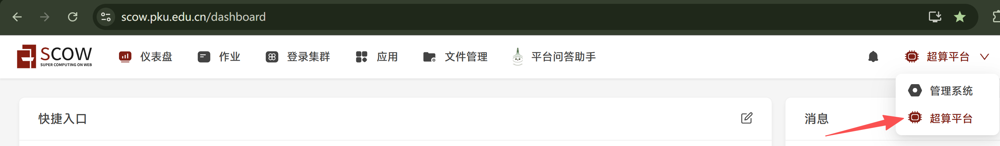

1.2 点击登录集群，选择你要使用的集群（未名二号、未名一号、未名生科一号），选择data节点，点击打开

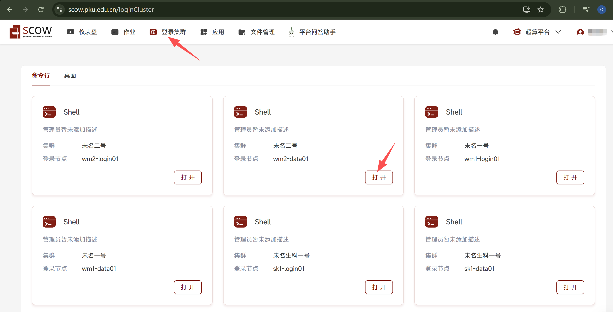
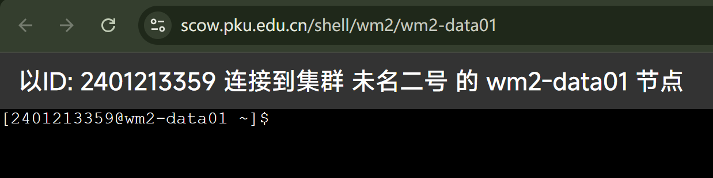

1.3 拷贝命令 `pwd` 粘贴到界面，并按 回车键，查看当前路径

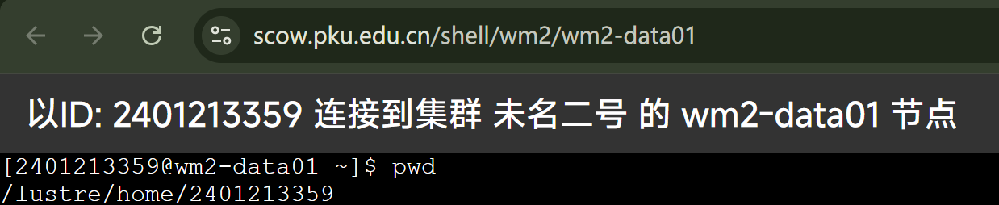

1.4 拷贝命令 `mkdir model` 粘贴到界面，并按 回车键，这样就在当前目录下新创建了一个名为 model 的目录，下载的模型都可以统一放在这个目录下面

1.5 拷贝命令 `cd model` 粘贴到界面，并按 回车键，这样就进入到刚新创建的名为 model 的目录里

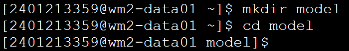

1.6 拷贝命令 `pip install modelscope` 粘贴到界面，并按 回车键。
这里是安装了modelscope工具，此工具由模型下载的镜像网站提供

1.7 拷贝命令 modelscope download --model Qwen/Qwen3-4B-Instruct-2507 --local_dir ./Qwen/Qwen/Qwen3-4B-Instruct-2507 粘贴到界面，并按 回车键。
这里是通过刚安装的modelscope这个工具去镜像网站下载模型 Qwen3-4B-Instruct-2507

```bash
pip install modelscope
modelscope download --model Qwen/Qwen3-4B-Instruct-2507 --local_dir ./Qwen/Qwen3-4B-Instruct-2507
```

## 2、在智算集群中创建模型

进入智算平台，点击模型->我的模型

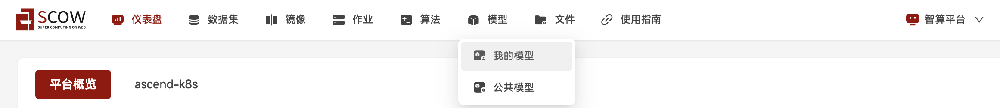

点击添加模型

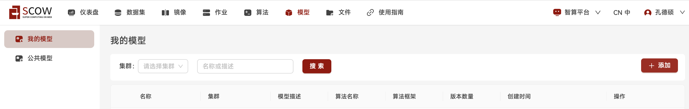

填写模型相关信息，选择集群

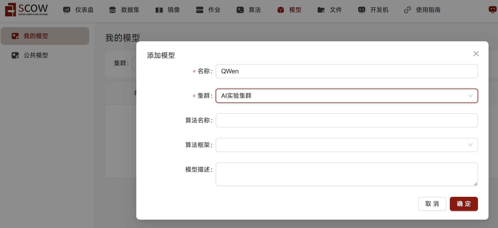

给模型添加版本 点击 + 号，给刚下载的模型创建版本号

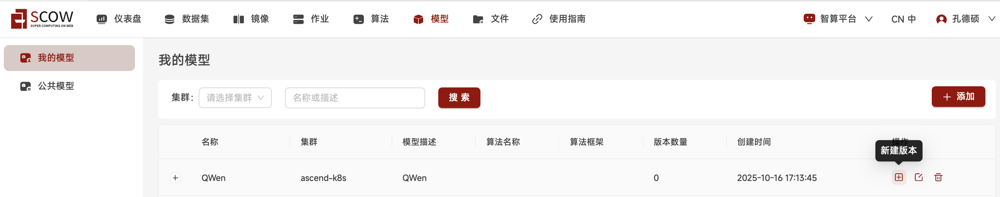

因为刚下载模型的是 Qwen3-4B-Instruct-2507，这里的版本名称取为 Qwen3-4B，在选择模型这里点击右边的图标

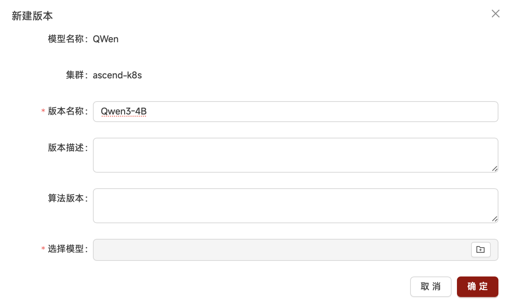

进入文件选择页面，在左侧找到刚创建的 model 目录，点击打开 QWen，在右边文件名中找到并选中 Qwen3-4B-Instruct-2507，点击右下角的 确认

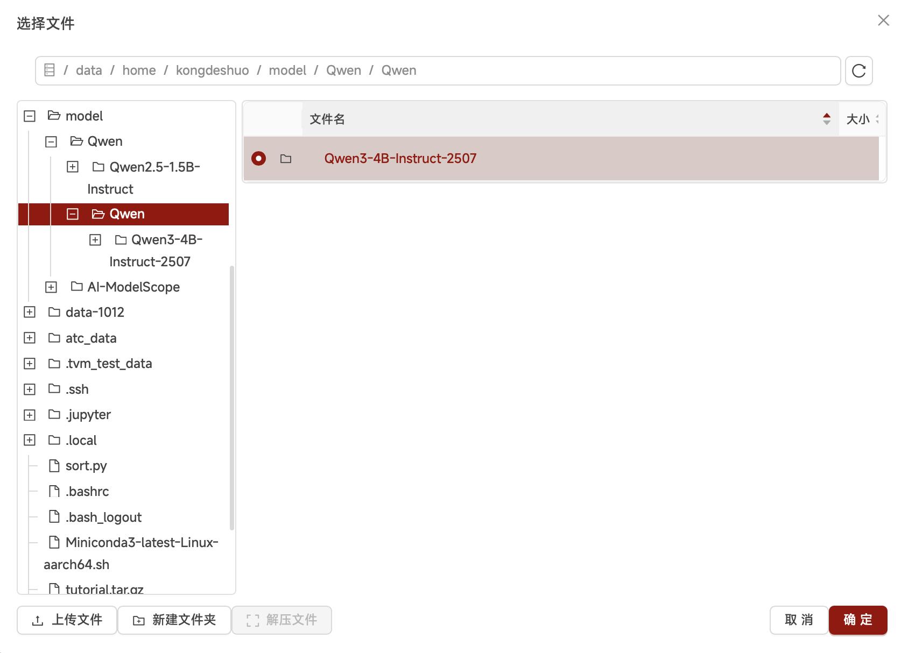

回到新建版本页面，此时可以看到 选择模型 中已经选好 Qwen3-4B-Instruct-2507模型，点击右下角的 确认

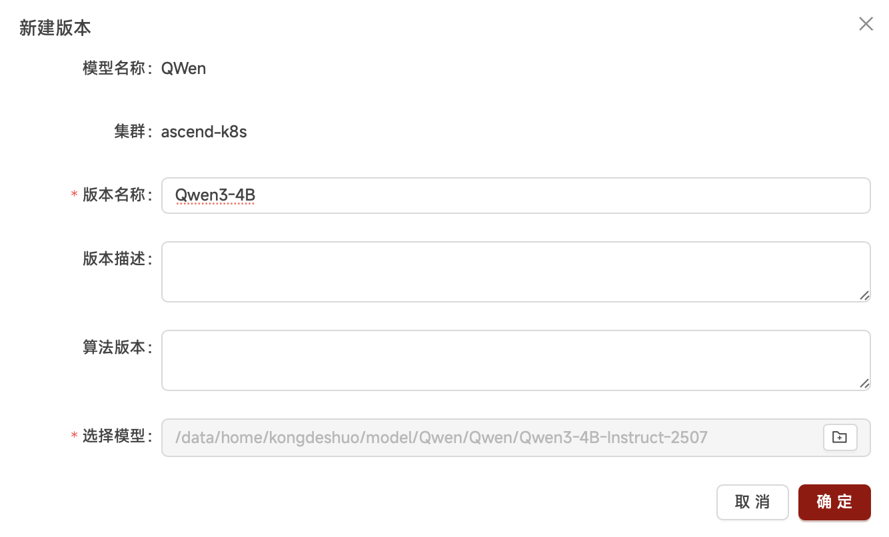

回到我的模型页面，点击 QWen 前面的 +号，可以看到模型的新版本 Qwen3-4B 已经创建成功，在后续创建任务时即可挂载此模型

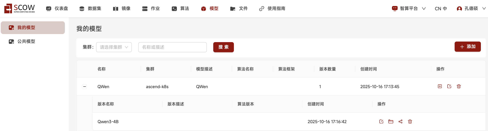

---
> 作者：孔德硕；褚苙扬；龙汀汀*
>
> 联系方式：l.tingting@pku.edu.cn