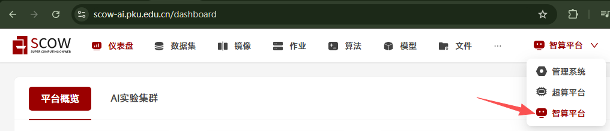
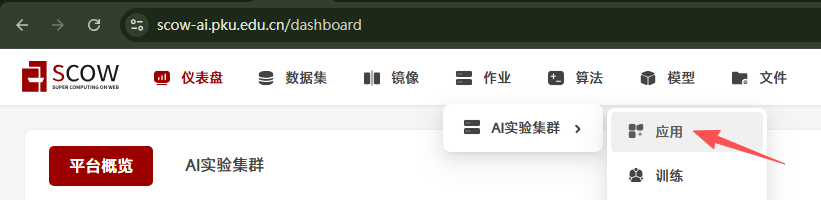
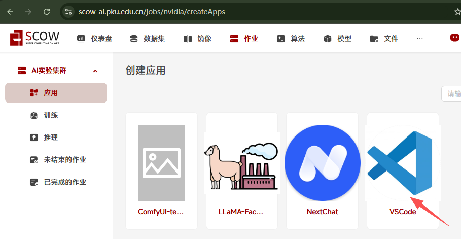
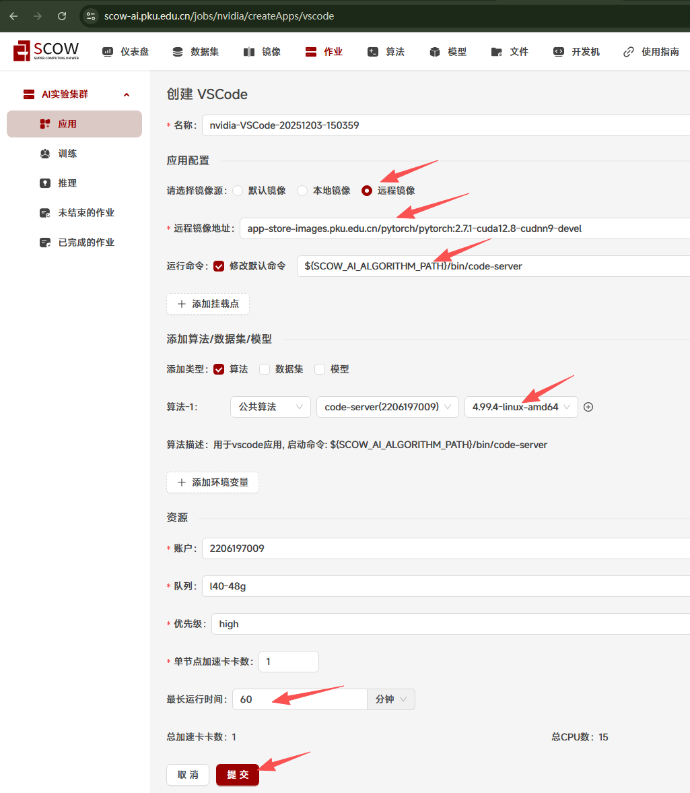
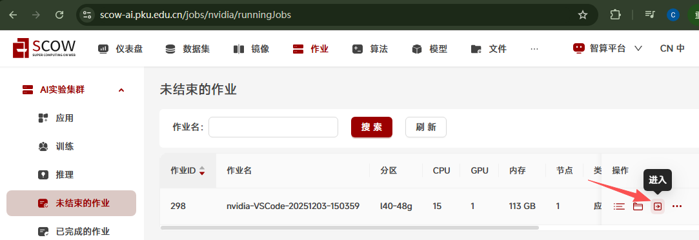
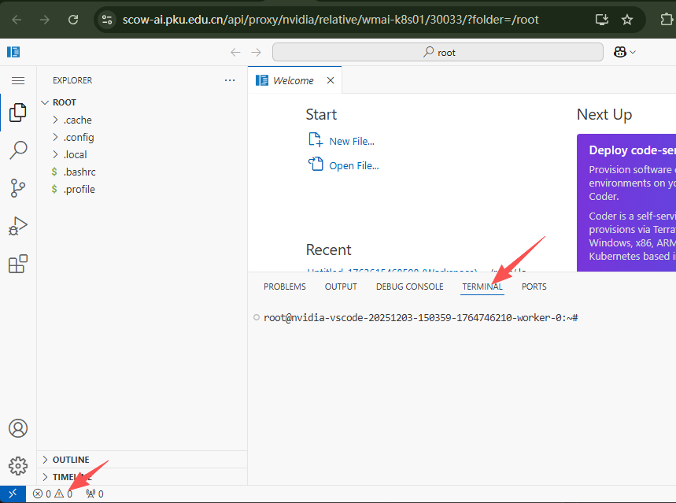
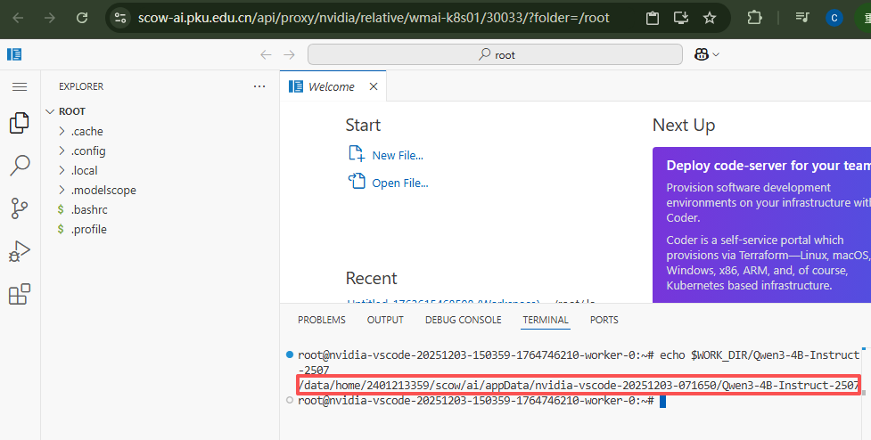
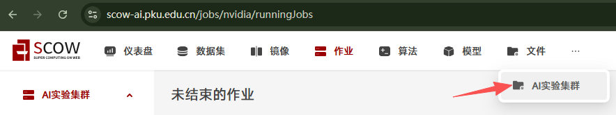
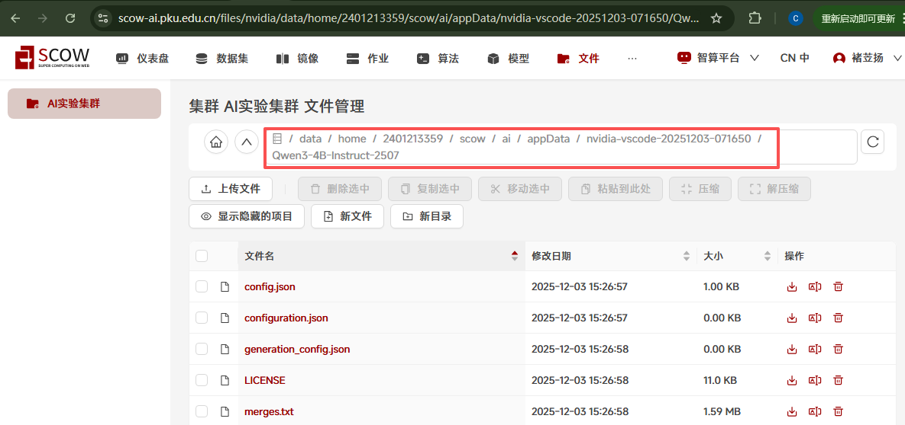

# Tutorial4: 下载模型

* 集群类型：超算平台
* 所需镜像：无
* 所需模型：无
* 所需数据集：无
* 所需资源：无
* 目标：本节旨在使用超算平台展示如何下载大模型 [Qwen3-4B] (https://modelscope.cn/models/Qwen/Qwen3-4B-Instruct-2507) 。

使用本教程前请确保超算集群与智算集群的文件管理系统是互通的，如果不是互通的那么`章节2`中智算集群创建模型时就无法用到在`章节1`中超算集群的shell下载的模型，此时你请参考`章节0`的方法在智算集群中下载模型并跳过`章节1`，如果是互通的则跳过`章节0`即可。

## 0、使用智算平台下载模型

登录SCOW平台，选取智算平台



点击作业->AI实验集群->应用进入创建应用界面，接着点击VSCode应用




进到创建VSCode中，分别填写以下内容：
* 镜像源选择远程镜像
* 远程镜像地址填写 `app-store-images.pku.edu.cn/pytorch/pytorch:2.7.1-cuda12.8-cudnn9-devel`
* 修改默认命令填写 `${SCOW_AI_ALGORITHM_PATH}/bin/code-server`
* 添加算法，选择公共算法->code-server->4.99.4-linux-amd64
* 最长运行时间按需填写，需要大于模型预估下载时间
其余维持不变，点击提交



在跳转后的页面点击进入进入vscode应用并打开终端




在终端中依次运行以下命令
```shell
pip install modelscope
tmux new -s tutorial4  # 建立tmux会话
modelscope download --model Qwen/Qwen3-4B-Instruct-2507 --local_dir $WORK_DIR/Qwen3-4B-Instruct-2507
# 按ctrl+d再单按b退出
tmux kill-session -t tutorial4  # 删除tmux会话
```

运行命令 `echo $WORK_DIR/Qwen3-4B-Instruct-2507` 查看安装模型的路径，其中红框框起来的部分就是模型的绝对路径



回到集群主页，点击文件->AI文件集群，进入文件系统



在地址栏中填写模型的绝对路径按回车，就能够看到模型文件



请记住模型的绝对路径，在章节2中选择模型文件时会使用到

## 1、使用超算平台下载模型

1.1 登录[SCOW平台](scow.pku.edu.cn)，选取超算平台


1.2 点击登录集群，选择你要使用的集群（未名二号、未名一号、未名生科一号），选择data节点，点击打开


1.3 拷贝命令 `pwd` 粘贴到界面，并按 回车键，查看当前路径


1.4 拷贝命令 `mkdir model` 粘贴到界面，并按 回车键，这样就在当前目录下新创建了一个名为 model 的目录，下载的模型都可以统一放在这个目录下面

1.5 拷贝命令 `cd model` 粘贴到界面，并按 回车键，这样就进入到刚新创建的名为 model 的目录里


1.6 拷贝命令 `pip install modelscope` 粘贴到界面，并按 回车键。
这里是安装了modelscope工具，此工具由模型下载的镜像网站提供

1.7 拷贝命令 modelscope download --model Qwen/Qwen3-4B-Instruct-2507 --local_dir ./Qwen/Qwen/Qwen3-4B-Instruct-2507 粘贴到界面，并按 回车键。
这里是通过刚安装的modelscope这个工具去镜像网站下载模型 Qwen3-4B-Instruct-2507

```bash
pip install modelscope
modelscope download --model Qwen/Qwen3-4B-Instruct-2507 --local_dir ./Qwen/Qwen3-4B-Instruct-2507
```

## 2、在智算集群中创建模型

进入智算平台，点击模型->我的模型


点击添加模型


填写模型相关信息，选择集群


给模型添加版本 点击 + 号，给刚下载的模型创建版本号


因为刚下载模型的是 Qwen3-4B-Instruct-2507，这里的版本名称取为 Qwen3-4B，在选择模型这里点击右边的图标


进入文件选择页面，在左侧找到刚创建的 model 目录，点击打开 QWen，在右边文件名中找到并选中 Qwen3-4B-Instruct-2507，点击右下角的 确认


回到新建版本页面，此时可以看到 选择模型 中已经选好 Qwen3-4B-Instruct-2507模型，点击右下角的 确认


回到我的模型页面，点击 QWen 前面的 +号，可以看到模型的新版本 Qwen3-4B 已经创建成功，在后续创建任务时即可挂载此模型


---
> 作者：孔德硕；褚苙扬；龙汀汀*
>
> 联系方式：l.tingting@pku.edu.cn