# Tutorial4: 下载模型

* 集群类型：超算平台
* 所需镜像：无
* 所需模型：无
* 所需数据集：无
* 所需资源：无
* 目标：本节旨在使用超算平台展示如何下载大模型 [Qwen3-4B] (https://modelscope.cn/models/Qwen/Qwen3-4B-Instruct-2507) 。

使用本教程前请确保超算集群与智算集群的文件管理系统是互通的，如果不是互通的那么`章节2`中智算集群创建模型时就无法用到在`章节1`中超算集群的shell下载的模型，此时你请参考`章节0`的方法在智算集群中下载模型并跳过`章节1`，如果是互通的则跳过`章节0`即可。

## 0、使用智算平台下载模型

登录SCOW平台，选取智算平台


点击"开发训练"
选择集群（若只有一个集群则无需用户选择）
点击"应用"，选择"VSCode"


进到创建VSCode中，分别填写以下内容：
* 队列：加速卡算力 
* 镜像源选择远程镜像
* 远程镜像地址填写 `app-store-images.pku.edu.cn/pytorch/pytorch:2.7.1-cuda12.8-cudnn9-devel`
* 启动命令填写 `${SCOW_AI_ALGORITHM_PATH}/bin/code-server`
* 添加算法，选择公共算法->code-server->4.99.4-linux-amd64
* 最长运行时间按需填写，需要大于模型预估下载时间
其余选择默认，点击提交


在跳转后的页面点击进入进入vscode应用并打开终端

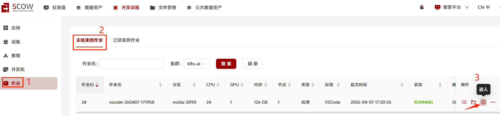
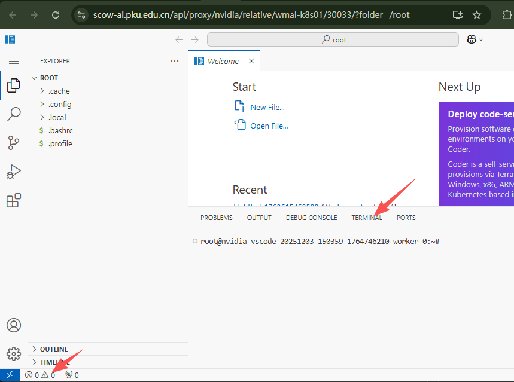

在终端中依次运行以下命令
```shell
apt update
apt install tmux
pip install modelscope

tmux new -s tutorial4  # 建立tmux会话，用于后台下载
modelscope download --model Qwen/Qwen3-4B-Instruct-2507 --local_dir $WORK_DIR/Qwen3-4B-Instruct-2507
# 在tmux会话中 按ctrl+b再单按d进入后台运行

#此模型在教程9中会使用到
modelscope download --model Qwen/Qwen2.5-1.5B-Instruct --local_dir $WORK_DIR/Qwen2.5-1.5B-Instruct

tmux相关命令
tmux attach -t tutorial4  # 重新连接到tmux会话
tmux kill-session -t tutorial4  # 删除tmux会话,确认下载完成后再做
```
备注：  
运行命令 `echo $WORK_DIR/Qwen3-4B-Instruct-2507` 查看安装模型的路径，其中红框框起来的部分就是模型的绝对路径  
备注：$WORK_DIR是什么？智算平台的作业会在运行前在用户家目录下创建一个工作目录，地址类似"~/scow/ai/appData/k8s-vscode-20260408-092332/",并被自动挂载到作业容器中相同路径上(在容器中此路径的读写就相当于用户家目录此路径的读写)。$WORK_DIR是用来存储此地址的绝对路径的，方便用户在容器中使用。

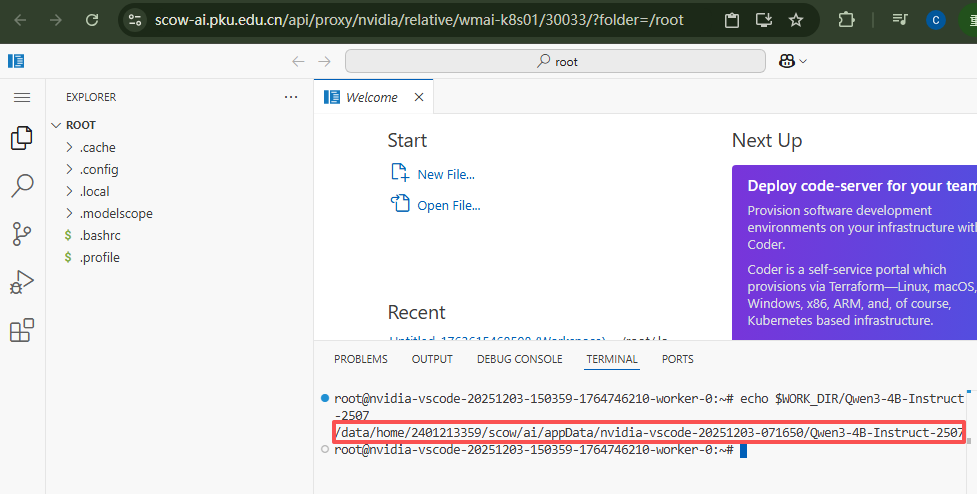

回到智算平台首页

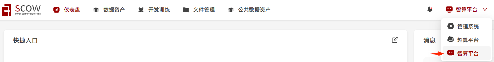

在地址栏中填写模型的绝对路径按回车，就能够看到模型文件

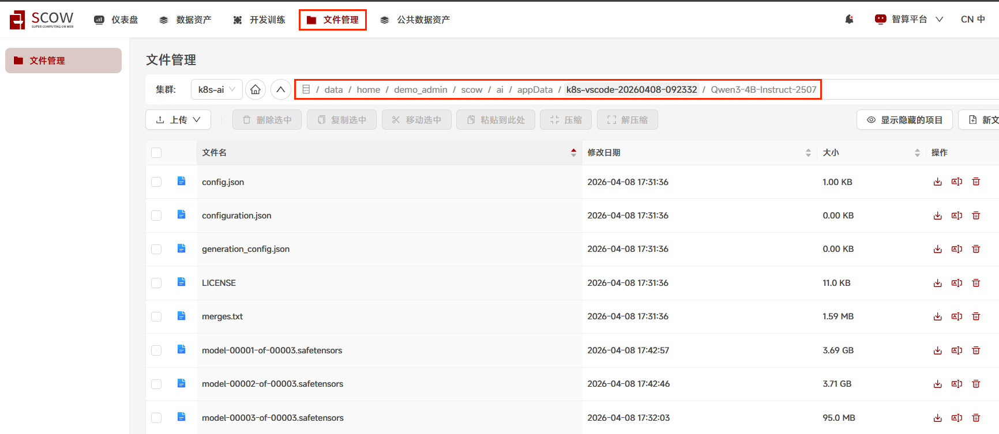

请保存此教程下载模型的绝对路径，在章节2中选择模型文件时会使用到  
备注：对作业自动创建挂载的路径不满意，您可以在应用创建页面尝试"自定义挂载点"功能  
（容器中挂载文件或目录到容器中是一种常见的需求，允许你将主机家目录的文件系统的一部分或整个目录映射到容器内部。这样，你可以在容器中访问这些文件，或者在容器中对这些文件进行修改，而这些修改会直接反映到宿主机家目录上）

## 1、使用超算平台下载模型

1.1 切换到超算平台


1.2 击"登录集群"->对应集群名->"打开"按钮进入shell


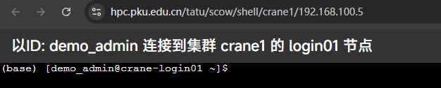


1.3 输入命令 `mkdir model` ，并按 回车键，这样就在当前目录下新创建了一个名为 model 的目录，下载的模型都可以统一放在这个目录下面

1.4 输入命令 `cd model` 粘贴到界面，并按 回车键，这样就进入到刚新创建的名为 model 的目录里

1.5 输入命令 `pwd` ，并按 回车键，查看当前路径

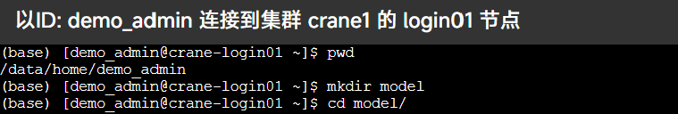

1.6 输入命令 `pip install modelscope` ，并按 回车键。
这里是安装了modelscope工具，此工具由模型下载的镜像网站提供

1.7 拷贝命令 `modelscope download --model Qwen/Qwen3-4B-Instruct-2507 --local_dir ./Qwen/Qwen/Qwen3-4B-Instruct-2507` 粘贴到界面，并按 回车键。
这里是通过刚安装的modelscope这个工具去镜像网站下载模型 Qwen3-4B-Instruct-2507

```bash
pip install modelscope
tmux new -s tutorial4  # 建立tmux会话
modelscope download --model Qwen/Qwen3-4B-Instruct-2507 --local_dir ./Qwen/Qwen3-4B-Instruct-2507
# 按ctrl+b再单按d退出

tmux相关命令
tmux attach -t tutorial4  # 重新连接到tmux会话
tmux kill-session -t tutorial4  # 删除tmux会话,确认下载完成后再做
```

## 2、在智算集群中创建模型

进入智算平台，点击数据资产->模型->我的模型

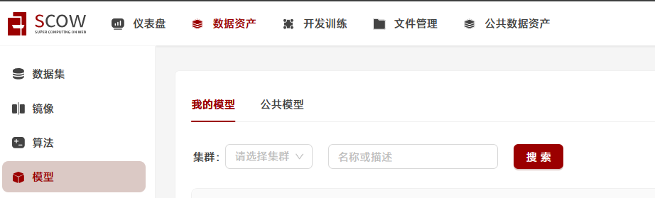

点击"+ 添加" 打开添加模型表单

填写模型相关信息，选择集群，点击"确定"创建一个模型资产

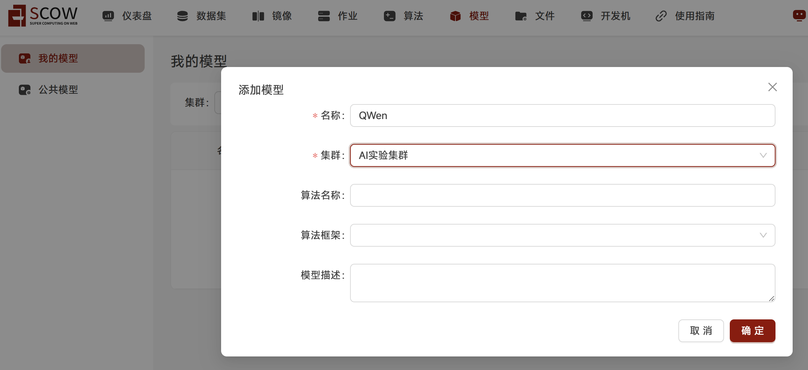

给模型添加版本 点击操作中的 "+" 图标，模型创建版本号与指定模型文件路径

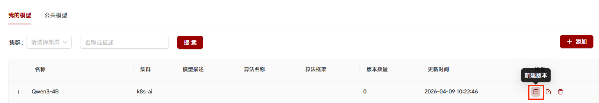

因为刚下载模型的是 Qwen3-4B-Instruct-2507，这里的版本名称取为 Qwen3-4B，在选择模型这里点击右边的图标

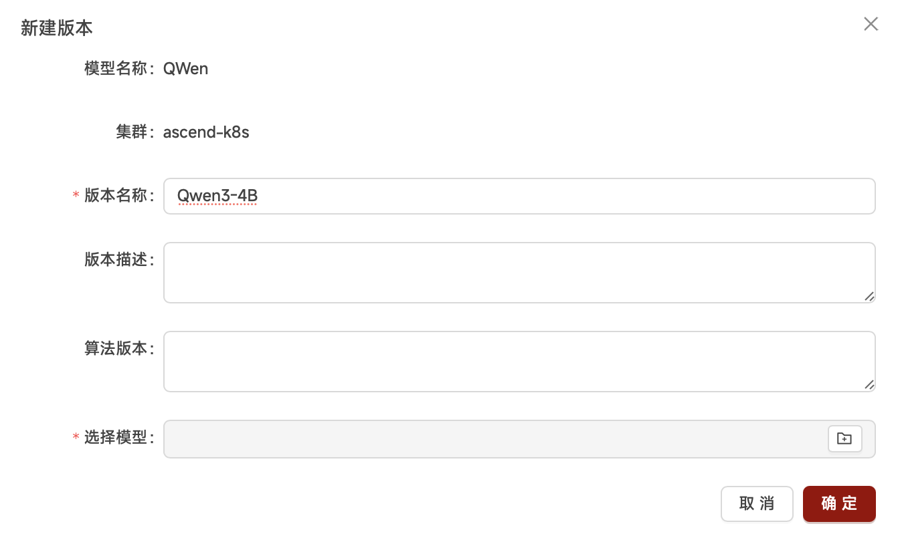

进入文件选择页面，在左侧找到刚创建的 model 目录，点击打开 QWen，在右边文件名中找到并选中 Qwen3-4B-Instruct-2507，点击右下角的 "确认"

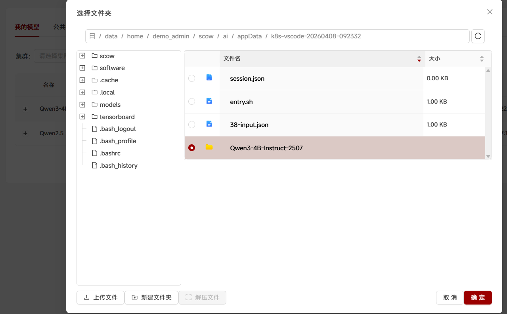

回到新建版本页面，此时可以看到 选择模型 中已经选好 Qwen3-4B-Instruct-2507模型，点击右下角的 "确认"

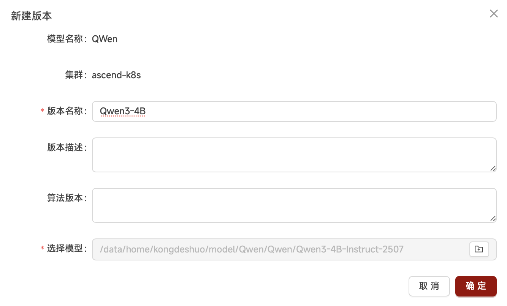

回到我的模型页面，点击 QWen 前面的 +号，可以看到模型的新版本 Qwen3-4B 已经创建成功，在后续创建任务时即可挂载此模型

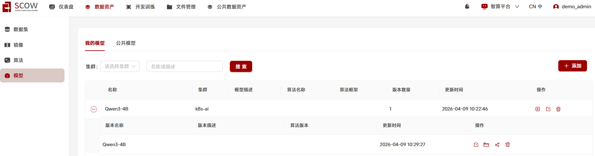

通过同样的方法我们添加模型Qwen2.5-1.5B-Instruct与latest版本，为tutorial9做模型准备。
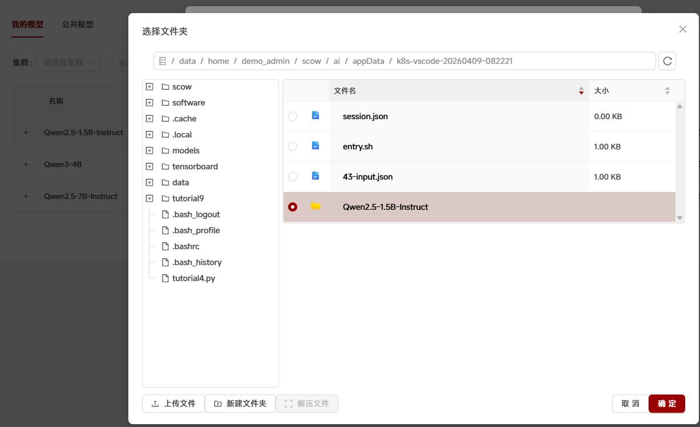
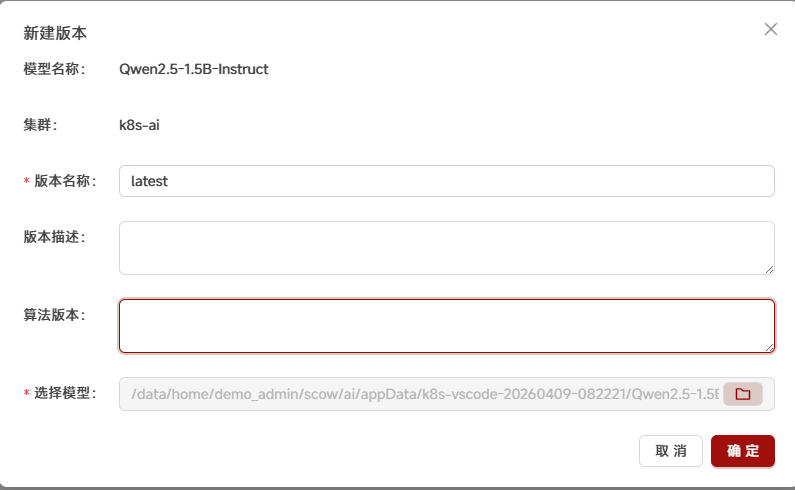
将用户个人添加的模型分享为公共模型，全平台用户可使用。
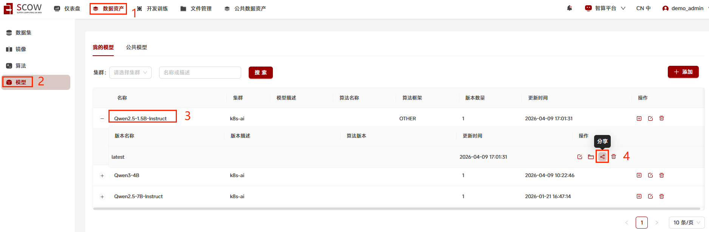

---
> 作者：孔德硕；褚苙扬；龙汀汀*
>
> 联系方式：l.tingting@pku.edu.cn