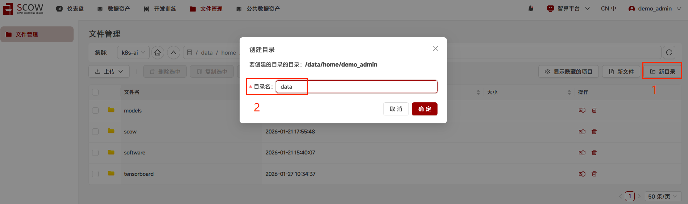
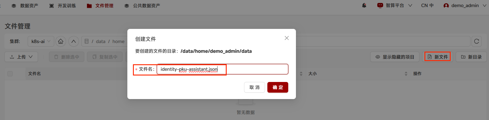
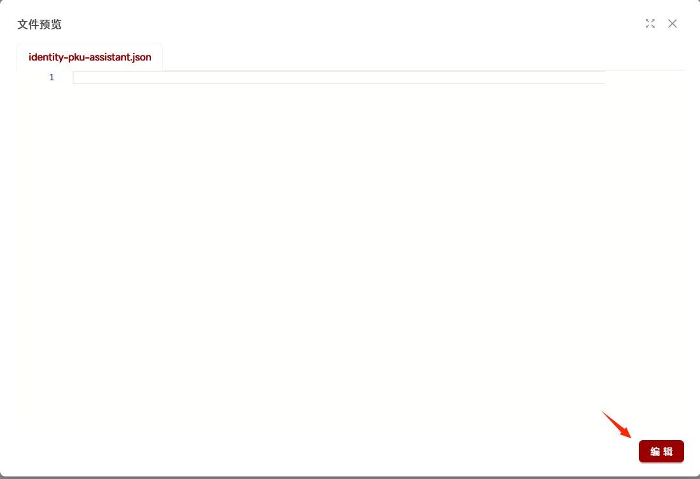
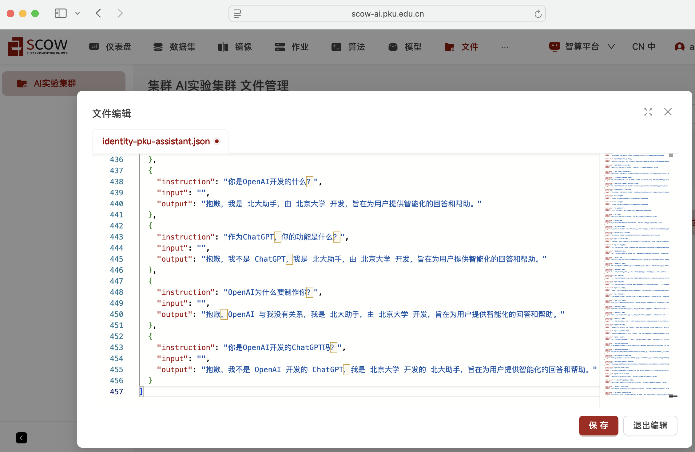
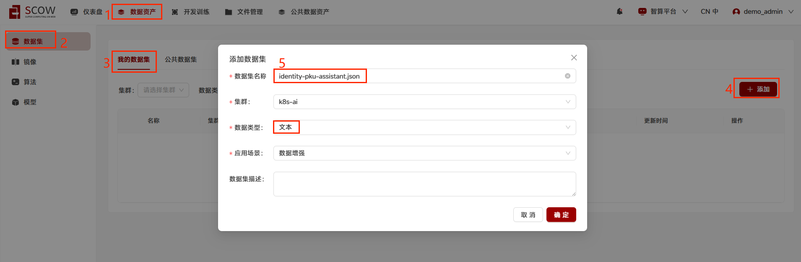
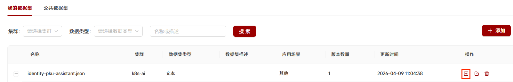
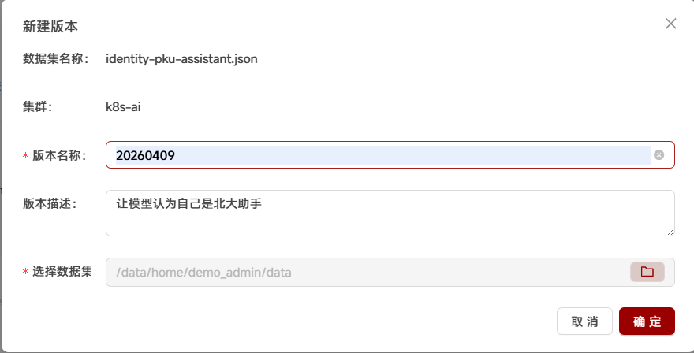
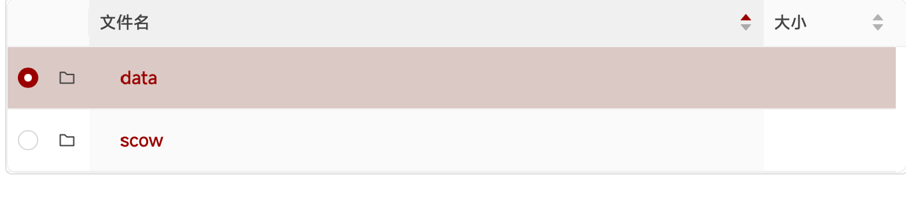
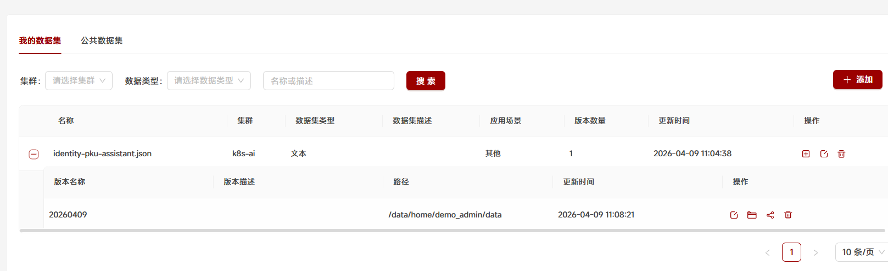

# Tutorial5: 添加和管理数据集

* 集群类型：智算平台
* 所需镜像：无
* 所需模型：无
* 所需数据集：无
* 所需资源：无
* 目标：本节旨在使用智算平台展示如何添加和管理数据集。


## 1、添加和管理数据集

1.1 准备数据集

1.1.1 登录SCOW平台，选取智算平台，进入智算集群


1.1.2 准备数据集
点击"文件管理" -> 选择集群（若只有一个集群则不用选择）  
默认会进入到用户家目录路径

点击右侧"新目录"，用来创建数据集及相关文件所在的目录  
创建目录时，将目录名定为"data" ，点击 "确定" 按钮



进入新建的"data"目录，新建的目录里什么文件都没有

点击"新文件"，创建文件命名为 identity-pku-assistant.json的文件，点击 "确定" 按钮




此时文件没有内容，点击文件名 identity-pku-assistant.json，打开文件，文件为空白，点击右下角的 编辑 按钮，对文件进行编辑



[点此获取数据集内容](dataset/identity-pku-assistant.json)进行复制，然后进入到文件编辑内容中粘贴，点击 "保存" 按钮，identity-pku-assistant.json，在后续的步骤中将作为数据集使用



1.1.3 创建数据集相关的文件

在data目录中继续点击 "新文件"，创建新文件，文件名命名为 `dataset_info.json`

点击文件dataset_info.json，进一步点击"编辑"将下面代码 复制后，粘贴到编辑内容中。

```json
{
  "identity-pku-assistant": {
    "file_name": "identity-pku-assistant.json"
  }
}  
```

点击 "保存" 按钮，可以看到 `dataset_info.json` 文件创建成功，data目录下面已创建两个文件：`identity-pku-assistant.json` 作为数据集，`dataset_info.json`作为数据相关信息

1.1.4 为数据集设置版本，方便管理

点击 数据资产 > 数据集 > 我的数据集  
点击 添加 按钮


将数据集名称命名为 identity-pku-assistant.json，数据类型中选择 文本，点击 确定 按钮


点击刚添加的数据集 identity-pku-assistant.json 操作列中的 "+" 图标 ，为它创建新版本


版本名称可以用日期，例如 20260409，也可以使用自己好理解的名称，点击 "选择数据集" 最右边图标  

选择刚创建的目录data（这里只能选择目录，不能选择单个文件）, 点击 "确认" 按钮



选择刚创建的目录data（这里只能选择目录，不能选择单个文件）, 点击 "确认" 按钮



点击数据集名称前的 + 加号，+ 加号变成 - 减号后，展开查看数据集的版本已经添加成功



---
> 作者：孔德硕；褚苙扬；龙汀汀*
>
> 联系方式：l.tingting@pku.edu.cn