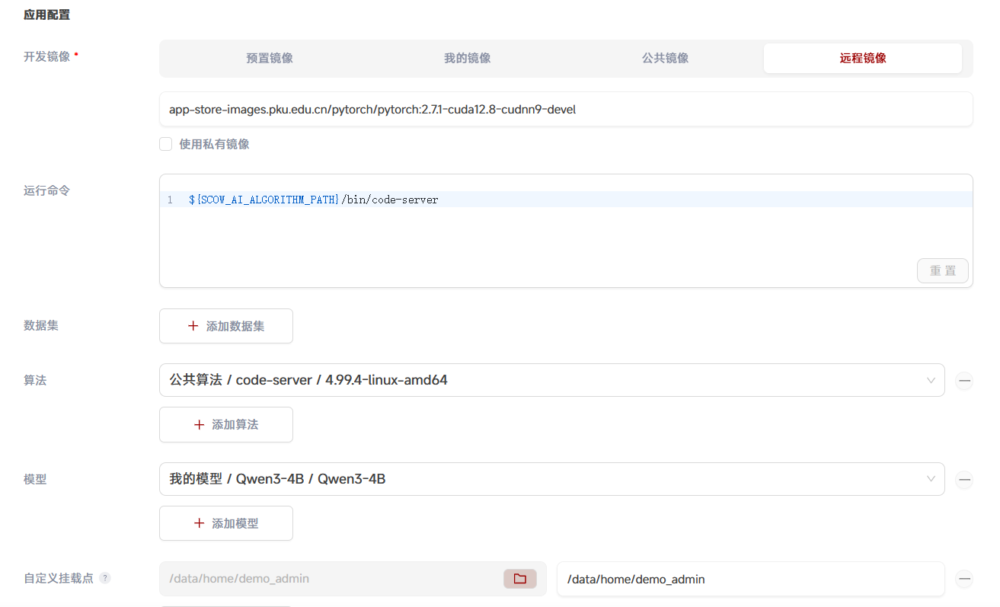
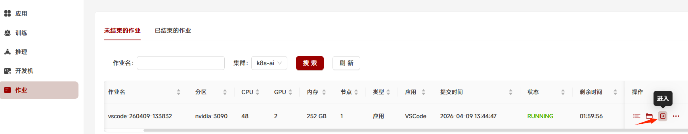
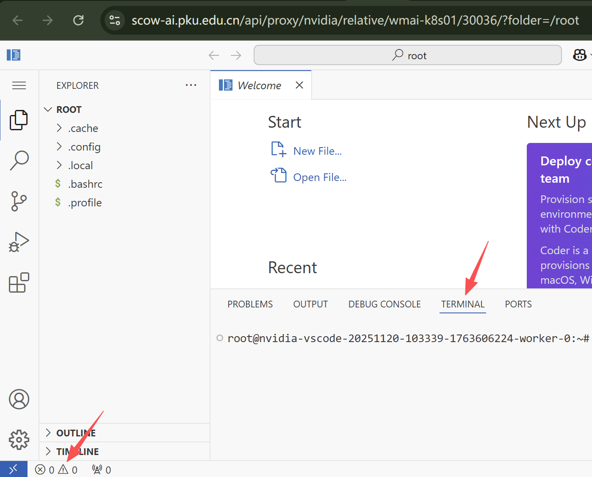
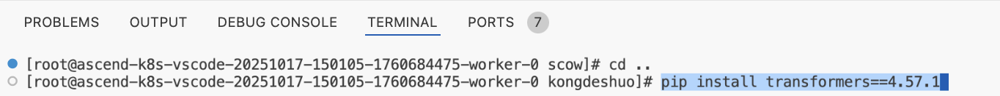
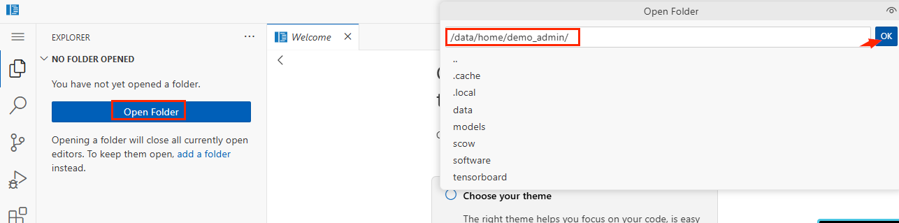
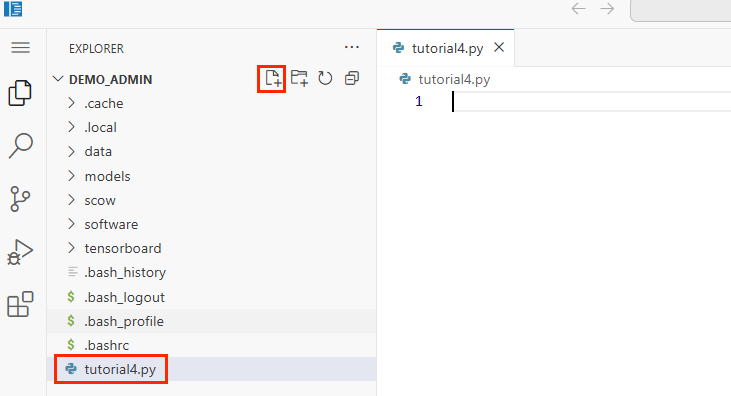
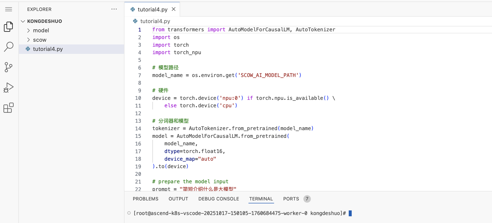
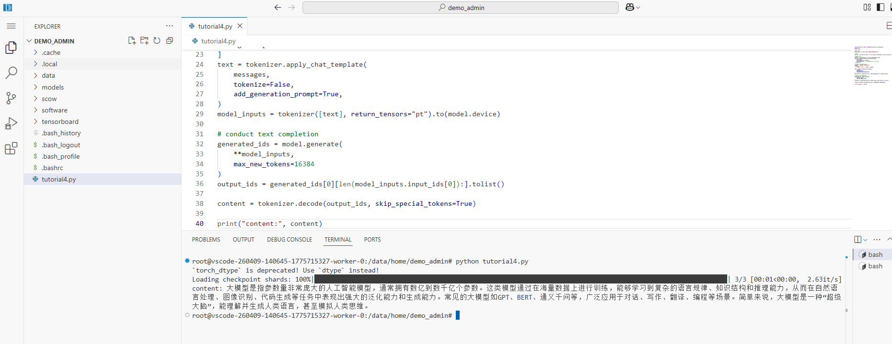
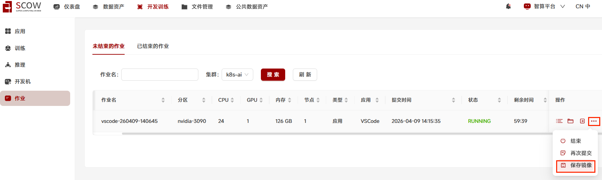

# Tutorial6: 大模型推理

* 集群类型：超算平台和智算平台
* 所需镜像：app-store-images.pku.edu.cn/pytorch/pytorch:2.7.1-cuda12.8-cudnn9-devel
* 所需模型：Qwen3-4B
* 所需数据集：无
* 所需资源：单机单卡
* 目标：本节旨在使用 [Qwen3-4B] (https://modelscope.cn/models/Qwen/Qwen3-4B-Instruct-2507) 模型展示大模型推理。

分以下几步来实现：
1. 在超算集群，通过shell的方式下载模型
2. 在智算集群，添加了下载的模型到 我的模型里面
3. 在智算集群，创建VSCode交互应用，使用下载的大模型进行推理

## 1、在集群中创建模型

根据[Tutorial4_下载模型](../Tutorial4_下载模型/tutorial4_下载模型.md) 创建和下载模型

## 2、使用大模型进行推理

创建VSCode交互式应用  
点击"开发训练"  
选择集群（若只有一个集群则无需用户选择） 
点击"应用"，选择"VSCode"  


在创建VSCode交互应用页面中，进行配置：

进到创建VSCode中，分别填写以下内容：
* 队列：加速卡算力 
* 加速卡数：1
* 最大运行时间：1小时
* 镜像源选择远程镜像
* 远程镜像地址填写 `app-store-images.pku.edu.cn/pytorch/pytorch:2.7.1-cuda12.8-cudnn9-devel`
* 启动命令填写 `${SCOW_AI_ALGORITHM_PATH}/bin/code-server`
* 添加算法，选择公共算法->code-server->4.99.4-linux-amd64
* 添加模型，选取 我的模型；版本下拉菜单中，选取 Qwen3-4B
* 自定义挂载点，选取用户家目录（路径选择窗口中默认就是家目录），挂载路径：填写用户家目录




进入新创建的VScode应用的浏览器界面
提交后，刚创建的作业在 未结束的作业 列表中，作业状态可能为PENDING。  
点击 "刷新" 按钮，手动进行刷新后，作业状态转为 RUNNING。
在这条作业的操作中，点击 进入 图标，浏览器将打开新的页面来展示新创建的VScode应用。


打开文件夹和终端



2.2 下载大模型推理所需要的工具
2.2.1 transformers
拷贝下面命令，在右侧下半部的终端terminal中，粘贴命令 
```bash
pip install transformers==4.57.1 -i https://mirrors.pku.edu.cn/pypi/web/simple
```
再按回车键，确保成功安装


2.2.2 accelerate
拷贝下面命令，在右侧下半部的终端terminal中，粘贴命令
```bash
pip install accelerate==1.10.1 -i https://mirrors.pku.edu.cn/pypi/web/simple
```
再按回车键，确保成功安装

2.2.3 torchvision
拷贝下面命令，在右侧下半部的终端terminal中，粘贴命令
```bash
pip install torchvision==0.21.0 -i https://mirrors.pku.edu.cn/pypi/web/simple
```
再按回车键，确保成功安装

2.3 创建推理程序文件  
vscode打开创建时的"用户家目录"为工作目录（家目录已通过自定义挂载点挂载到容器内），



2.3.1 创建目录与文件  
在用户家目录中，创建tutorial4.py文件，这是作为大模型推理的文件



2.3.2 右侧上半部的窗口打开了这个新建的 tutorial4.py 空白文件

2.3.3 拷贝下面代码:
```python
from transformers import AutoModelForCausalLM, AutoTokenizer
import os
import torch

# 模型路径
model_name = os.environ.get('SCOW_AI_MODEL_PATH')

# 硬件
device = torch.device('cuda') if torch.cuda.is_available() else torch.device('cpu')

# 分词器和模型
tokenizer = AutoTokenizer.from_pretrained(model_name)
model = AutoModelForCausalLM.from_pretrained(
    model_name,
    torch_dtype=torch.float16,
    device_map="auto"   # 单卡可去掉，多卡建议保留
).to(device)

# prepare the model input
prompt = "简短介绍什么是大模型"
messages = [
    {"role": "user", "content": prompt}
]
text = tokenizer.apply_chat_template(
    messages,
    tokenize=False,
    add_generation_prompt=True,
)
model_inputs = tokenizer([text], return_tensors="pt").to(model.device)

# conduct text completion
generated_ids = model.generate(
    **model_inputs,
    max_new_tokens=16384
)
output_ids = generated_ids[0][len(model_inputs.input_ids[0]):].tolist() 

content = tokenizer.decode(output_ids, skip_special_tokens=True)

print("content:", content)
```
2.3.4 粘贴到已经打开的空白的 tutorial4.py 文件，这样就完成了文件创建


2.4 使用大模型进行推理  
2.4.1 运行python程序  
在右侧下半部的终端terminal中，粘贴命令 `python tutorial4.py` 再按回车键运行。（这里注意当前Terminal在用户家目录中，若没有请用cd命令切换）

提示词在 tutorial4.py 中，任务是要大模型：简短介绍什么是大模型。大模型推理的内容如上图所示，完成了推理任务。  


备注：
- 代码中的环境变量${SCOW_AI_MODEL_PATH}保存模型目录在容器中的路径，例如：/data/home/demo_admin/scow/ai/appData/k8s-vscode-20260408-092332/Qwen3-4B-Instruct-2507
- 如您在使用pip包时耗费过多时间，为了避免每次操作都重新下载一遍，建议您使用"镜像保存"功能,保存当前运行的容器环境为新镜像。保存条件：应用必须在运行，保存过程中不可停止应用，保存后的镜像在用户数据资产-镜像-我的镜像中。



---
> 作者：孔德硕；龙汀汀*
>
> 联系方式：l.tingting@pku.edu.cn