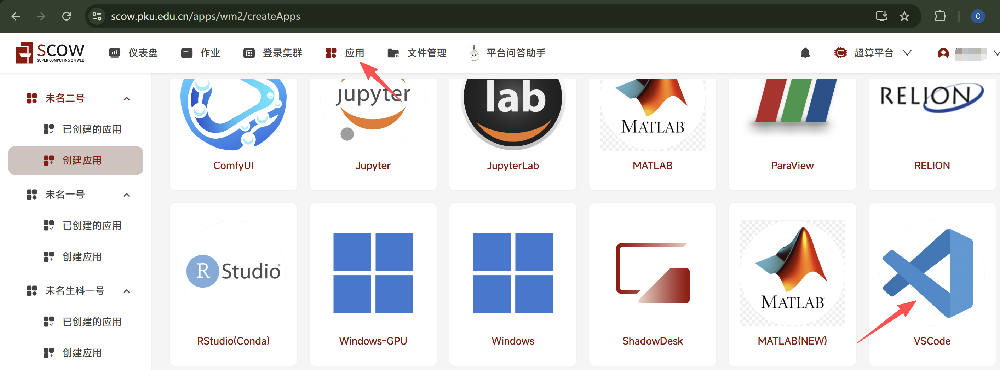
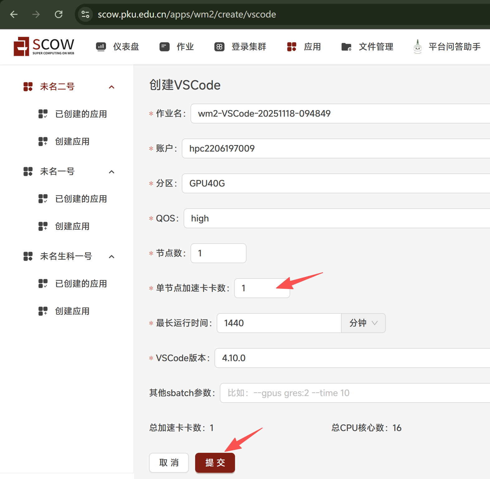
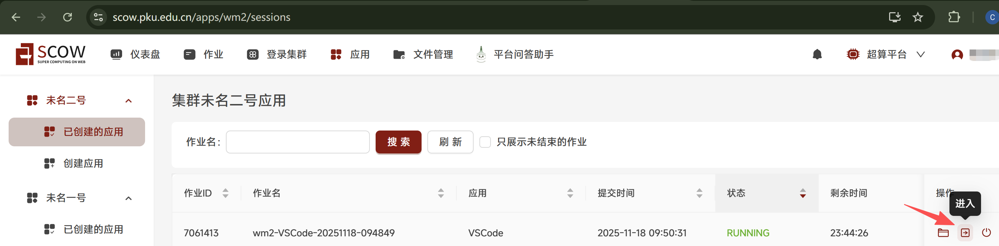
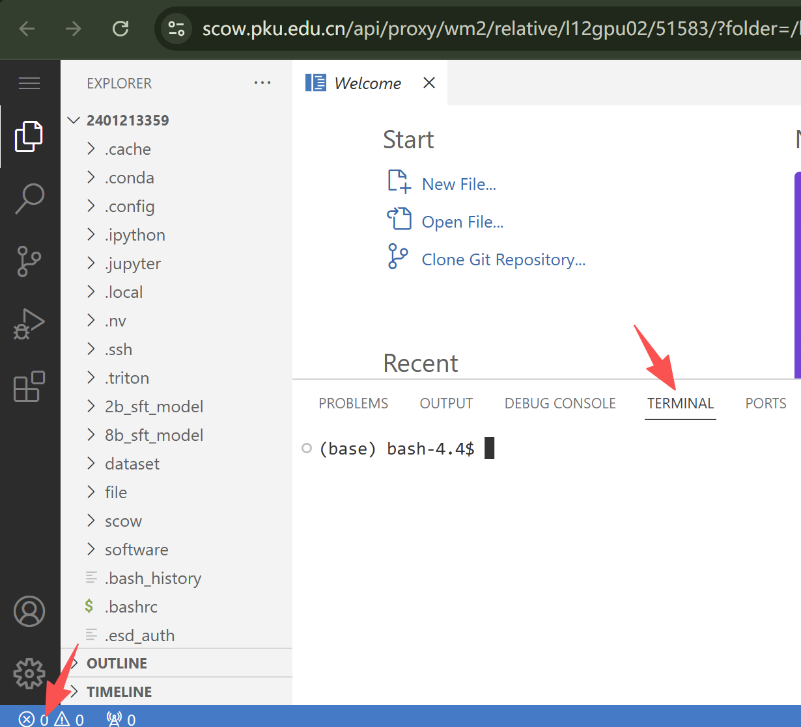
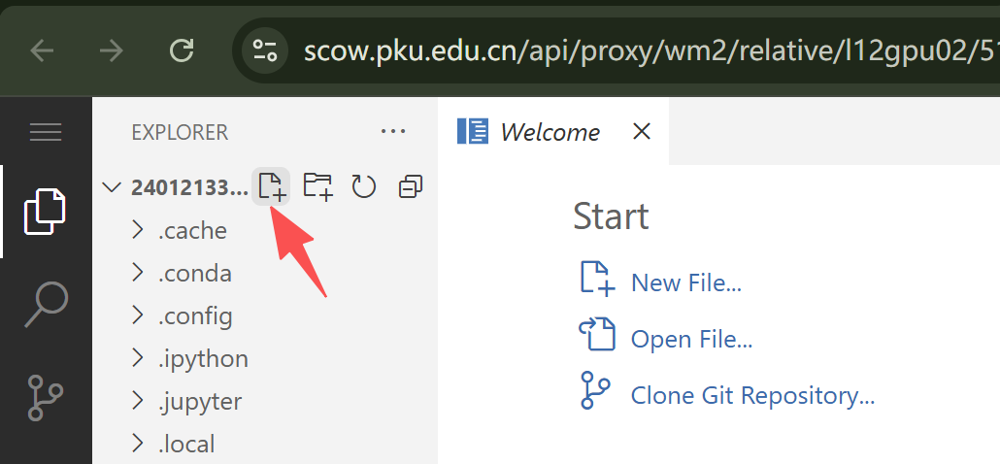
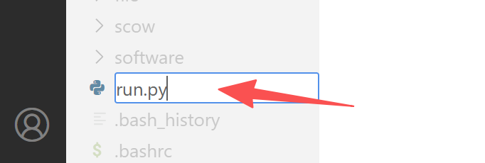
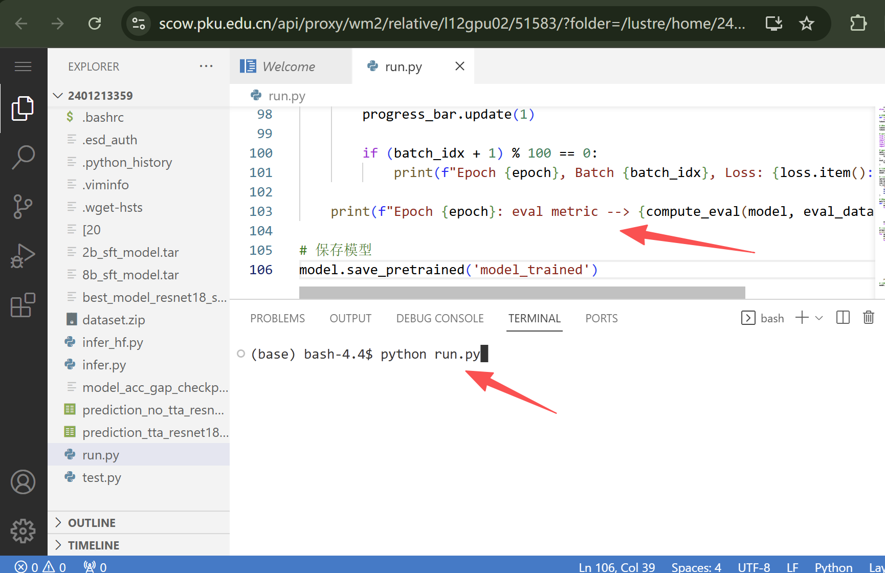
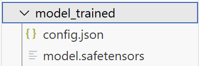

# Tutorial7: 通过在超算平台上上传模型、数据、镜像模型，展示模型微调

* 集群类型：超算平台
* 所需镜像：无
* 所需模型：教程内下载（bert-base-uncased）
* 所需数据集：教程内提供
* 所需硬件资源：单机单卡
* 目标：本节旨在使用 bert-base-uncased 模型展示Bert模型微调的过程。

分以下几步来实现：
1. 环境安装
2. 加载模型和数据
3. 运行模型微调

确保已经根据[tutorial0](../Tutorial0_python_env/tutorial0.md)安装conda环境

## 1. 环境安装
### 1.1 登录
我们可以通过如下网址访问 (校外访问需通过北大vpn)：

集群入口: https://scow.pku.edu.cn/

### 1.2 在shell中安装环境
点击登录集群->未名二号 wm2-data01->打开，打开shell


在shell中运行以下命令创建文件夹、配置环境
```
# 在Shell命令行中执行：
source ~/.bashrc
conda create -n tutorial7 python=3.9
conda activate tutorial7

# 安装依赖
pip install torch==2.3.1 numpy==1.26.4 matplotlib==3.8.4 pandas==2.2.2 \
scikit-learn==1.5.0 pyyaml==6.0.2 torchvision==0.18.1 torchaudio==2.3.1 accelerate==1.2.1 \
scipy==1.13.1 attrs==24.3.0 deepspeed==0.16.2 transformers==4.42.4 datasets==3.2.0 \
evaluate==0.4.3 diffusers==0.32.1 sentencepiece==0.2.0 protobuf==5.29.2 decorator==5.2.1 \
-i https://mirrors.pku.edu.cn/pypi/web/simple

pip install modelscope==1.22.3 
```

### 1.3 安装模型和数据
继续在shell中运行以下命令下载模型和数据
```
# 通过命令行下载模型和数据
export HF_ENDPOINT=https://hf-mirror.com
mkdir datasets_cache
python -c "from datasets import load_dataset; load_dataset('glue','mrpc', cache_dir='./datasets_cache')"
python -c "import evaluate; evaluate.load('glue','mrpc', cache_dir='./datasets_cache')"
modelscope download --model google-bert/bert-base-uncased --local_dir ./bert-base-uncased
```

## 2. 创建vscode应用
我们的教程使用 VSCode 运行，需要在 “交互式应用” 中创建应用。



在 VSCode 应用资源申请页面申请相应的资源，点击最下方的 “提交”，进行创建。



创建成功后，在“已创建的应用”中点击 “连接或进入” 进入应用：



进入 VSCode 后界面如下：


## 3. 运行模型微调

打开新的终端



创建新文件



输入文件名：run.py 



将以下代码复制粘贴到新文件内 



代码如下：
```
from transformers import AutoModelForSequenceClassification, AutoTokenizer
from datasets import load_dataset
import os

model = AutoModelForSequenceClassification.from_pretrained("bert-base-uncased", num_labels=2)
tokenizer = AutoTokenizer.from_pretrained("bert-base-uncased")

# 加载数据
cache_dir = os.path.join(os.getcwd(), "datasets_cache") # 当前文件夹下的缓存目录
raw_datasets = load_dataset("glue", "mrpc", cache_dir=cache_dir)

# 分词，使用 .map 方法为数据集添加 token 相关的 key
def tokenize_function(example):
    return tokenizer(example["sentence1"], example["sentence2"], truncation=True)
tokenized_datasets = raw_datasets.map(tokenize_function, batched=True)

# 数据处理，去除不相关的 key，重命名 label key
tokenized_datasets = tokenized_datasets.remove_columns(["sentence1", "sentence2", "idx"])
tokenized_datasets = tokenized_datasets.rename_column("label", "labels")

# 模型微调
from torch.utils.data import DataLoader
from transformers import AdamW, get_scheduler, DataCollatorWithPadding
import torch
from tqdm.auto import tqdm
import evaluate
import numpy as np

# 指定 batch_size
data_collator = DataCollatorWithPadding(tokenizer=tokenizer)
train_dataloader = DataLoader(
    tokenized_datasets["train"], shuffle=True, batch_size=8, collate_fn=data_collator
)
eval_dataloader = DataLoader(
    tokenized_datasets["validation"], batch_size=8, collate_fn=data_collator
)

# 硬件
device = torch.device("cuda") if torch.cuda.is_available() else torch.device("cpu")
model.to(device)

# 训练参数
optimizer = AdamW(model.parameters(), lr=5e-5)
num_epochs = 3
num_training_steps = num_epochs * len(train_dataloader)
lr_scheduler = get_scheduler(
    "linear",
    optimizer=optimizer,
    num_warmup_steps=0,
    num_training_steps=num_training_steps,
)

# 评估函数
metric = evaluate.load("glue", "mrpc", cache_dir=cache_dir)
def compute_eval(model, eval_dataloader, device, metric=metric):
    model.eval()
    for batch in eval_dataloader:
        batch = {k: v.to(device) for k, v in batch.items()}
        with torch.no_grad():
            outputs = model(**batch)
            logits = outputs.logits
            predictions = torch.argmax(logits, dim=-1)
            metric.add_batch(predictions=predictions, references=batch["labels"])
    eval_result = metric.compute()
    return eval_result

# 训练过程
progress_bar = tqdm(range(num_training_steps))
print('begin train', flush=True)
for epoch in range(num_epochs):
    model.train()
    print(f'begin epoch {epoch}', flush=True)
    for batch_idx, batch in enumerate(train_dataloader):
        # 前向传播
        batch = {k: v.to(device) for k, v in batch.items()}
        outputs = model(**batch)
        loss = outputs.loss
        
        # 反向传播
        optimizer.zero_grad()
        loss.backward()
        
        # 更新参数
        optimizer.step()
        lr_scheduler.step()
        
        progress_bar.update(1)
        
        if (batch_idx + 1) % 100 == 0:
            print(f"Epoch {epoch}, Batch {batch_idx}, Loss: {loss.item():.4f}", flush=True)
    
    print(f"Epoch {epoch}: eval metric --> {compute_eval(model, eval_dataloader, device)}")

# 保存模型
model.save_pretrained('model_trained')
```

执行命令
```
conda activate tutorial7
python run.py
```

日志可以看到训练结果，同路径下可以看到训练后的模型输出




---
> 作者：褚苙扬；张宇飞；龙汀汀*
>
> 联系方式：l.tingting@pku.edu.cn