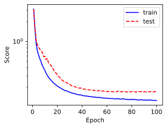

# 房价预测

> 作者: 黎颖; 龙汀汀
>
> 联系方式: yingliclaire@pku.edu.cn;   l.tingting@pku.edu.cn


Tutorial系列的这部分旨在通过预测房价这一简单案例展示如何使用全连接神经网络解决回归问题。

分以下几步来实现：

1. 数据加载和预处理
2. 构建网络
3. 训练与评估模型

使用的环境如下：

创建conda环境

```bash
conda create -n tutorial python=3.9
conda activate tutorial
pip install -r requirements.txt
```

其中， requirements.txt 的内容是：
```
torch==2.1.0
numpy==1.26.4
matplotlib==3.8.4
pandas==2.2.2
scikit-learn==1.5.0
ipykernel==6.29.5
```

## 1. 数据预处理

作为简化模型的案例，这里使用的是 [kaggle 房价预测竞赛中的训练数据集](https://www.kaggle.com/competitions/house-prices-advanced-regression-techniques/data)。在后面的处理中，我们只使用了数值部分的特征，并把全部数据分为训练集和测试集两部分。


```python
import pandas as pd
import numpy as np
from sklearn.model_selection import train_test_split
from sklearn.preprocessing import StandardScaler
import torch

# 读取数据
data = pd.read_csv('../data/Example1/train.csv')

# 去掉第一列编号
data = data.iloc[:, 1:]

# 只保留数值类型的数据
numeric_features = data.select_dtypes(include=[np.number])

# 处理缺失值
numeric_features.fillna(numeric_features.mean(), inplace=True)

# 分离特征和目标变量
X = numeric_features.drop('SalePrice', axis=1).values
y = numeric_features['SalePrice'].values

# 切分数据为训练集和测试集
X_train, X_test, y_train, y_test = train_test_split(X, y, test_size=0.2, random_state=42, shuffle=True)

# 标准化特征
scaler = StandardScaler()
X_train = scaler.fit_transform(X_train)
X_test = scaler.transform(X_test)

# 转换为torch张量
X_train = torch.tensor(X_train, dtype=torch.float32)
X_test = torch.tensor(X_test, dtype=torch.float32)
y_train = torch.tensor(y_train.reshape(-1, 1), dtype=torch.float32)
y_test = torch.tensor(y_test.reshape(-1, 1), dtype=torch.float32)
```

## 2. 构建模型

使用一个全连接层加 relu 激活层作为示例，更复杂的网络可以通过修改 Net 类来实现。


```python
import torch.nn as nn

class Net(nn.Module):
    def __init__(self, input_features):
        super(Net, self).__init__()
        self.fc1 = nn.Linear(input_features, 128)
        self.fc2 = nn.Linear(128, 1)
        self.relu = nn.ReLU()

    def forward(self, x):
        x = self.relu(self.fc1(x))
        x = self.fc2(x) # 回归任务不用激活函数
        return x
```

## 3. 训练与评估

由于房价之间的差异巨大，评估预测是否准确时应该考虑相对值的变化，所以使用下面的评估函数：

$$
\sqrt{
    \frac{1}{n} \sum_{i=1}^{n} (\log y_i - \log \hat{y}_i)^2
}
$$

训练模型与评估模型都在这部分


```python
from torch.utils.data import DataLoader, TensorDataset

# 参数设置
learning_rate, weight_decay, epochs, batch_size = 0.1, 5, 100, 32

device = torch.device('cuda' if torch.cuda.is_available() else 'cpu')

# 实例化模型
model = Net(X_train.shape[1]).to(device)

# 损失函数
criterion = nn.MSELoss()

# 优化器
optimizer = torch.optim.Adam(model.parameters(), lr= learning_rate, weight_decay=weight_decay)

# loss 评估
def score(model, X, y):
    pred = torch.clamp(model(X), 1, float('inf'))
    score = torch.sqrt(criterion(torch.log(pred), torch.log(y)))
    
    return score.item()

# 训练模型
train_dataset = TensorDataset(X_train, y_train)
train_loader = DataLoader(train_dataset, batch_size=batch_size, shuffle=True)

train_ls, test_ls = [], []
for epoch in range(epochs):
    model.train()
    for inputs, targets in train_loader:
        inputs, targets = inputs.to(device), targets.to(device)
        
        # 前向传播
        outputs = model(inputs)
        loss = criterion(outputs, targets)
    
        # 反向传播和优化
        optimizer.zero_grad()
        loss.backward()
        optimizer.step()

    # 模型评估
    model.eval()
    with torch.no_grad():
        train_ls.append(score(model, X_train, y_train))
        test_ls.append(score(model, X_test, y_test))
```

结果可视化

```python
from matplotlib import pyplot as plt
from matplotlib_inline import backend_inline

backend_inline.set_matplotlib_formats('svg')

plt.rcParams['figure.figsize'] = (4, 3)

plt.plot(list(range(1, epochs + 1)), train_ls, 'b', label='train')
plt.plot(list(range(1, epochs + 1)), test_ls, 'r--', label='test')
plt.xlabel("Epoch")
plt.ylabel("Score")
plt.yscale('log')
plt.xlim([1, epochs])

plt.legend()
plt.grid()
```
    

