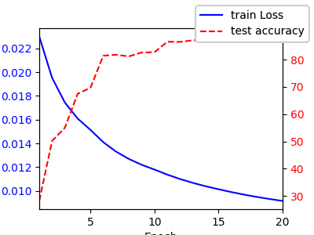

# 图像分类2

> 作者: 黎颖; 龙汀汀
>
> 联系方式: yingliclaire@pku.edu.cn;   l.tingting@pku.edu.cn

Tutorial系列的这部分旨在展示更接近实际的训练场景，使用ResNet50训练ImageNet数据集，在多块显卡上做并行。

分以下几步来实现：

1. 数据加载和预处理
2. 模型
3. 训练与评估

使用的环境如下：

创建conda环境

```bash
conda create -n tutorial python=3.9
conda activate tutorial
pip install -r requirements.txt
conda install pytorch torchvision torchaudio pytorch-cuda=12.1 -c pytorch -c nvidia
```

注：使用的 torch 版本需要与 cuda 版本匹配，请查询 cuda 版本。

其中， requirements.txt 的内容是：
```
numpy==1.26.4
matplotlib==3.8.4
ipykernel==6.29.5
```

## 1. 数据预处理

ImageNet 是一个大型的视觉数据库，由斯坦福大学的李飞飞（Fei-Fei Li）教授及其团队于2009年创建。ImageNet包含了1000个类别总计120万张训练图片，以及5万张验证图片。我们已经下载好了ImageNet数据集，只要从代码中对应的路径加载即可。


```python
import torchvision.transforms as transforms
import torchvision.datasets as datasets

# 数据预处理
train_transforms = transforms.Compose([
    transforms.RandomResizedCrop(224), # 随机裁剪并调整为 224x224
    transforms.RandomHorizontalFlip(), # 随机水平翻转
    transforms.RandomRotation(10),  # 随机旋转 10 度
    transforms.ColorJitter(brightness=0.2, contrast=0.2, saturation=0.2, hue=0.2),  # 颜色抖动
    transforms.ToTensor(),
    transforms.Normalize(mean=[0.485, 0.456, 0.406], std=[0.229, 0.224, 0.225]) # 标准化
])

val_transforms = transforms.Compose([
    transforms.Resize(256), # 缩放到 256 像素
    transforms.CenterCrop(224), # 中心裁剪到 224x224
    transforms.ToTensor(),
    transforms.Normalize(mean=[0.485, 0.456, 0.406], std=[0.229, 0.224, 0.225])
])

# 加载训练集和测试集
train_dataset = datasets.ImageFolder(root='../data/imagenet/train', transform=train_transforms)
val_dataset = datasets.ImageFolder(root='../data/imagenet/val', transform=val_transforms)
```

## 2. 模型

ResNet 是由何凯明于 2015 年提出的网络结构，ResNet结构使得网络的层数能够做得更深，对之后的工作有深远的影响。这里我们使用的是PyTorch自带的ResNet-50模型。


```python
import torch
import torchvision.models as models

# 加载未经过预训练的 ResNet-50 模型
model = models.resnet50() # 不使用预训练权重
```

## 3. 训练与评估

我们需要在多卡上并行训练，这里我们使用的是两张A100显卡。

在训练过程中我们增加了学习率调整策略，以加速收敛。

完成模型训练和评估需要约 13 h

下面版本的代码只能在 GPU 上跑，请申请相应的资源并指定使用的 GPU 数量。

这里还实现了一些常用的函数和类，可用于计时和绘图等。


```python
# 常用函数和类实现

# 评估函数
def accuracy(model, data_loader, devices, topk=(1, )):
    model.eval()
    total = 0
    correct = {k: 0 for k in topk}

    with torch.no_grad():
        for X, y in data_loader:
            X, y = X.to(devices[0]), y.to(devices[0])
            outputs = model(X)

            _, predicted = outputs.topk(max(topk), dim=1, largest=True, sorted=True)
            correct_k = (predicted == y.view(-1, 1).expand_as(predicted))

            total += y.size(0)
            for k in topk:
                correct[k] += correct_k[:, :k].float().sum().item()

    return  {f'top-{k}': 100 * correct[k] / total for k in topk}


# 训练函数
def train(model, train_loader, loss, optimizer, devices):
    model.train()

    loss_list = []
    time_load = log_time()
    time_train = log_time()

    data_iter = iter(train_loader)
    count = 0
    while True:
        # 加载数据
        try:
            time_load.start()
            X, y = next(data_iter)
            X, y = X.to(devices[0]), y.to(devices[0])
            time_load.stop()
            count += 1
        except StopIteration:
            break
       
        # 训练
        time_train.start()
        outputs = model(X)
        l = loss(outputs, y)
        optimizer.zero_grad()
        l.backward()
        optimizer.step()
        time_train.stop()

        # loss 记录
        loss_list.append(l.item())
        
        # 输出 注意：在 GPU 上使用逻辑语句非常耗时，如果不关心 epoch 中间的训练过程，请注释掉这部分
        if (count > 0) and (count % 1000 == 0):
            average_load_time = sum(time_load.times[-1000:]) / 1000
            average_train_time = sum(time_train.times[-1000:]) / 1000
            average_loss = sum(loss_list[-1000:]) / 1000
            print(f"batch: {count} | batch loss: {average_loss} | batch load time: {average_load_time} | batch train time: {average_train_time}")

    average_loss = sum(loss_list) / len(loss_list)

    return average_loss, time_load.sum(), time_train.sum()


# 计时器
import time
from datetime import timedelta

class log_time():
    """记录运行过程的时间片段"""
    def __init__(self):
        self.times = []
        self.beg = None
        self.end = None

    def start(self):
        # 开始计时
        self.beg = time.time()

    def stop(self):
        # 停止计时
        self.end = time.time()
        self.times.append(self.end - self.beg)

    def avg(self):
        # 平均时长
        return sum(self.times) / len(self.times)

    def sum(self):
        # 总时长
        return sum(self.times)

# 过程记录和绘图
import matplotlib.pyplot as plt
from matplotlib_inline import backend_inline
from IPython import display

class log_process:
    """在训练过程中动态绘制数据"""
    def __init__(self, epochs, figsize=(4, 3)):
        backend_inline.set_matplotlib_formats('svg')
        self.epochs = epochs
        self.fig, self.ax1 = plt.subplots(figsize=figsize)
        self.ax2 = self.ax1.twinx()
        self.epochs = epochs
        self.train_ls = []
        self.test_acc = []

    def update(self, epoch, average_loss, test_acc):
        """向图表中添加数据点并更新图表"""
        self.train_ls.append(average_loss)
        self.test_acc.append(test_acc)
        
        # 清除当前轴的内容

        self.ax1.cla()  
        self.ax2.cla()

        # 绘制损失
        self.ax1.plot(list(range(1, epoch + 2)), self.train_ls, 'b-', label='train Loss')
        self.ax1.set_xlabel('Epoch')
        self.ax1.set_ylabel('Train Loss', color='b')
        self.ax1.tick_params(axis='y', labelcolor='b')
        #self.ax1.set_yscale('log')
        self.ax1.set_xlim([1, self.epochs])

        # 绘制准确率
        self.ax2.plot(list(range(1, epoch + 2)), self.test_acc, 'r--', label='test accuracy')
        #self.ax2.set_ylabel('Test Accuracy (%)', color='r')
        self.ax2.tick_params(axis='y', labelcolor='r')
        self.fig.legend(loc='upper right')

        display.display(self.fig)
        display.clear_output(wait=True)
```

训练过程

```python
# 训练过程

from torch.utils.data import DataLoader
import torch.nn as nn
import os

# 参数设置
epochs, batch_size, gpu_n = 20, 256, 2
learning_rate, momentum, weight_decay = 0.1, 0.9, 1e-4
topk = (1, 5)
show_top_k = 5

# 查看 GPU 数量
gpu_total = torch.cuda.device_count()
if gpu_total < gpu_n or gpu_total < 1:
    raise ValueError(f"Value gpu_n should <= {gpu_total} and gpu_total should > 0.")

# 指定多GPU训练
model = models.resnet50()
devices = [torch.device(f'cuda:{i}') for i in range(gpu_total)]
model = nn.DataParallel(model, device_ids=devices)  # 指定使用计算使用的GPU
model.to(devices[0]) # 移动模型到主设备上

# 损失函数
loss = nn.CrossEntropyLoss().to(devices[0]) # 损失函数也要在主设备上

# 优化器
optimizer = torch.optim.SGD(model.parameters(), lr=learning_rate, momentum=momentum, weight_decay=weight_decay)

# 学习率调整策略
scheduler = torch.optim.lr_scheduler.StepLR(optimizer, step_size=5, gamma=0.2)

# 数据准备
train_loader = DataLoader(train_dataset, batch_size=batch_size, shuffle=True, num_workers=8, pin_memory=True)
val_loader = DataLoader(val_dataset, batch_size=batch_size, shuffle=False, num_workers=8, pin_memory=True)

# 主训练循环
train_ls = []
train_time = []
load_time = []
val_time = log_time()
train_process = log_process(epochs, figsize=(4, 3))
for epoch in range(epochs):
    
    # 训练
    batch_average_loss, epoch_load_time, epoch_train_time = train(model, train_loader, loss, optimizer, devices)
    train_ls.append(batch_average_loss/batch_size)
    load_time.append(epoch_load_time)
    train_time.append(epoch_train_time)

    # 验证
    val_time.start()
    accuracy_dict = accuracy(model, val_loader, devices, topk=topk)
    val_time.stop()

    # 调整学习率
    scheduler.step()

    # 更新和输出
    average_loss = sum(train_ls)/len(train_ls)
    average_load_time = timedelta(seconds=sum(load_time)/len(load_time))
    average_train_time = timedelta(seconds=sum(train_time)/len(train_time))
    average_val_time = timedelta(seconds=val_time.avg())
    print(f"loss: {average_loss} | test accuracy: {accuracy_dict} | load_time: {average_load_time} | train_time: {average_train_time} |  val_time: {average_val_time}")
    
    train_process.update(epoch, average_loss, accuracy_dict[f'top-{show_top_k}'])

    # 保存模型
    os.makedirs('./modles', exist_ok=True)
    torch.save(model.state_dict(), f'./modles/resnet50_epoch_{epoch+1}.pth')
```

    batch: 1000 | batch loss: 3.147843108892441 | batch load time: 0.368323233127594 | batch train time: 0.09844980454444885
    batch: 2000 | batch loss: 3.112295998573303 | batch load time: 0.3661118292808533 | batch train time: 0.08506760716438294



## 4. 加载模型

之后可以加载模型参数重复使用模型训练的结果


```python
import torch
import torchvision.models as models

# 先确保有一个与之前保存权重相匹配的模型架构
model = models.resnet50(pretrained=False)

# 加载之前保存的权重
state_dict = torch.load(f'./modles/resnet50_epoch_{epoch+1}.pth')
model.load_state_dict({k.replace('module.',''):v for k,v in state_dict.items()})
```
