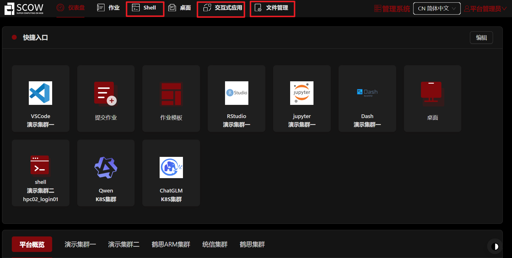
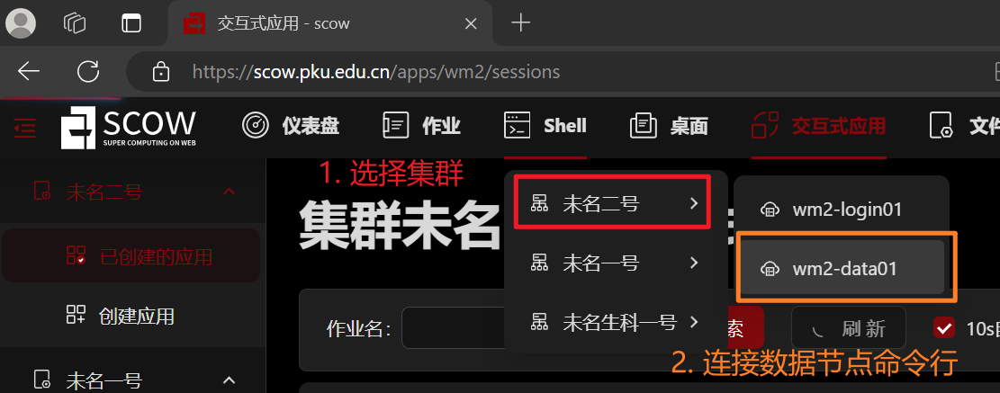
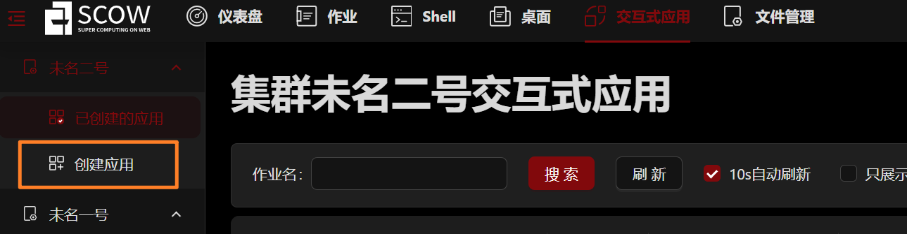
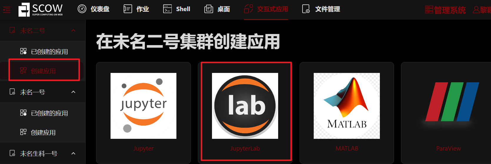
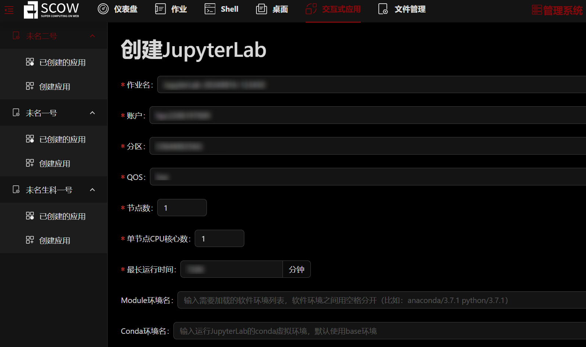
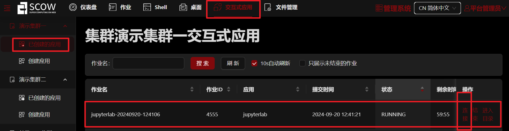
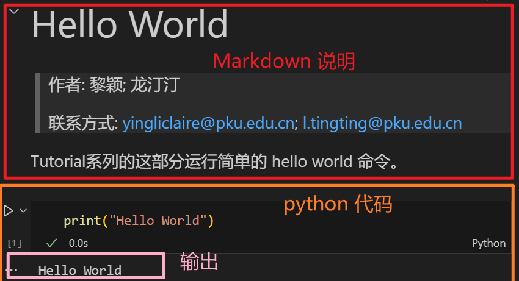
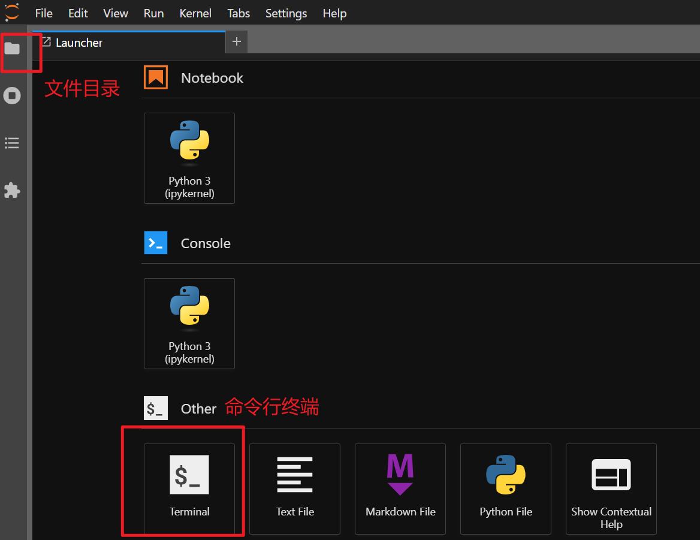

# Tutorial-SCOW

人工智能（AI）的迅猛发展正深刻影响着学术界和工业界。AI技术的进步依赖于处理海量数据和复杂模型的能力，因此，高性能计算（HPC）平台成为推动AI研究和应用的关键工具。尽管HPC在技术上提供了强大的支持，其使用的复杂性却给学术研究人员和工业从业者带来了挑战。许多研究人员和工程师面临着平台配置繁琐、资源调度复杂以及编程模型不友好的问题，这些因素可能延缓AI项目的开发进程。

SCOW（Super Computing On Web）是一个基于Web的超算门户和管理系统，旨在解决这些使用障碍。通过SCOW，超算用户无需安装任何软件，只需使用现代浏览器即可高效利用超算资源完成计算任务。用户可以通过网页界面进行作业提交、文件管理、终端调用、用户管理等多项操作，极大降低了使用门槛。

本教程通过一系列在SCOW上运行AI的案例，帮助用户快速掌握在HPC环境中进行AI学习和研究的方法，助力学术界和工业界更高效地利用高性能计算资源。

下面我们首先介绍如何在 SCOW 平台上申请计算资源，然后通过简单案例 Tutorial 0 介绍如何在 SCOW 平台上进行计算，最后是 AI 相关的教程介绍。 

## 北京大学 SCOW 平台申请计算资源

**1. 登陆**
   
   网址：
   https://scow.pku.edu.cn

   登陆后显示 dashboard 界面：

   

   其中 “shell” 可用于打开命令行窗口：在 login 节点的命令行窗口可用于直接通过队列系统提交任务；在 data 节点的命令行窗口可用于数据传输和连接网络。

   “交互式应用” 可以打开桌面窗口、Matlab、RStudio、Jupyter notebook、Jupter Lab 等交互式应用。

   “文件管理” 可用于管理、上传、下载文件。

   我们的教程是使用 Jupyter Lab 运行的，所以需要在 “交互式应用” 中创建 Jupter Lab 应用。但在创建 Jupter Lab 应用之前，需要先在 “shell” 中安装 jupyter，才能成功创建。

**2. 安装 Jupyter**
   
   在数据节点进行安装
   
   

   - 运行下面命令安装 conda，建议安装 anaconda
  
  ```bash
  # 下载Anaconda安装脚本：
  wget https://mirrors.tuna.tsinghua.edu.cn/anaconda/archive/Anaconda3-2023.03-Linux-x86_64.sh

  # 验证下载的安装脚本文件是否完整
  sha256sum Anaconda3-2023.03-Linux-x86_64.sh

  # 执行安装命令
  bash Anaconda3-2023.03-Linux-x86_64.sh
  ```

  - 安装 Jupyter
  ```bash
  conda install jupyter notebook
  ```
  
  更详细的安装指南参考：[[链接1]](https://icode.pku.edu.cn/SCOW/docs/deploy/config/portal/apps/apps/jupyter) [[链接2]](https://hpc.pku.edu.cn/_book/guide/ood/interactive_jupyter.html)

**3. 创建 Jupyter Lab 应用**
   
   
   点击 dashboard 上的 “交互式应用”，点击 “创建应用”, 点击 “JupyterLab”，填写相应的资源，点击最下方的 “提交”，进行创建。







创建成功后显示 “Running”，点击 “连接” 进入




## 在 SCOW 平台上运行 Tutorial 0

**1. 下载完整教程**

<!-- TODO 替换下载链接 -->

可以使用 git clone 或 wget 下载教程。

使用 git clone 下载教程：

```bash
git clone https://gitee.com/yingli-claire/tutorial.git
# 欢迎大家提 issues
```

使用 wget 命令下载教程

```bash
wget https://gitee.com/yingli-claire/tutorial/....
```

**2. 运行 Tutorial 0**

在下载教程中打开 Tutorial0_hello_world 文件夹下的 tutorial0_hello_world.ipynb 文件。可以看到文件中有 markdown 单元格和 python 代码单元格。用鼠标点击选中单元格后，“Ctrl + Enter” 可运行单元格，markdown 在运行后起到渲染的效果，python 会在下方输出结果。注意：苹果电脑使用的快捷键会有所不同。



**3. Jupyter Lab 中使用命令行**

除了在 SCOW 中使用 shell 外，还可以使用 Jupyter Lab 提供的命令行终端。




## 数据与模型路径

<!-- TODO 数据与模型路径 -->

数据和模型已经提前下载好在公用存储下：

- 数据

[[路径]](data)

- 模型

[[路径]](models)

## 教程内容

教程目前由 9 个独立的案例构成：

- Pytorch 基础
  - **Tutorial1**: 通过预测房价这一简单案例展示如何使用全连接神经网络解决回归问题，并在单机单显卡上运行案例。[[链接]](Tutorial1_regression/tutorial1_regression.ipynb)
- CV 相关
  - **Tutorial2**: 通过MNIST数据集和一个规模较小的简单CNN网络展示使用CNN进行图像分类的简单案例。[[链接]](Tutorial2_classification/tutorial2_classification.ipynb)
  - **Tutorial3**: 实际应用和研究中通常会使用大型数据集和多卡并行，这部分使用著名的ResNet50网络和ImageNet数据集，展示在多张显卡上并行的图像分类任务。[[链接]](Tutorial3_CV/tutorial3_CV.ipynb)
- 大模型相关
  - **Tutorial4**: 通过在 SCOW 平台上运行 bge-m3 模型，展示 embedding 模型的推理任务。[[链接]](Tutorial4_bge-m3/tutorial4_bge-m3.md)
  - **Tutorial5**: 通过在 SCOW 平台上运行 bge-reranker-v2-m3。[[链接]](Tutorial5_bge-reranker-v2-m3/tutorial5_bge-reranker-v2-m3.md)
 模型，展示 reranker 模型的推理任务。
   - **Tutorial6**: 通过 Qwen2-7B-Instruct 模型，展示大模型的推理、微调、合并。[[链接]](Tutorial6_Qwen2-7B-Instruct/tutorial6_qwen2-7b.md)
   - **Tutorial7**: Qwen2-72B-Instruct-GPTQ-Int4 模型的推理。[[链接]](Tutorial7_Qwen2-72B-Instruct-GPTQ-Int4/tutorial7_qwen2-72b-int4.md)
   - **Tutorial8**: 在多张显卡上运行 Qwen2-72B-Instruct 模型。[[链接]](Tutorial8_Qwen2-72B-Instruct/tutorial8_Qwen2-72B-Instruct.md)
   - **Tutorial9**: stable-diffusion-3-medium 文生图任务，通过 prompt 提示生成对应的图片。[[链接]](Tutorial9_stable-diffusion-3-medium/tutorial9_stable_diffusion.md)

---

> 作者: 黎颖; 龙汀汀
>
> 联系方式: yingliclaire@pku.edu.cn;   l.tingting@pku.edu.cn