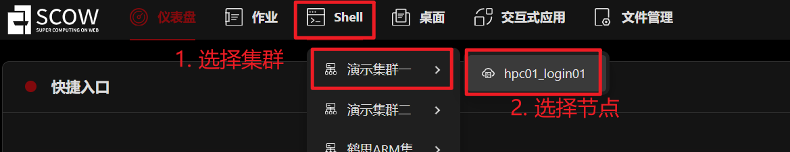
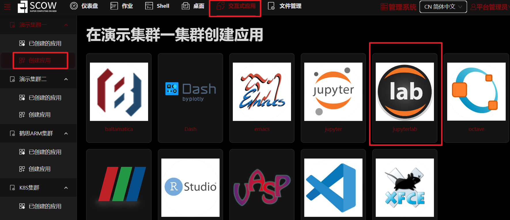
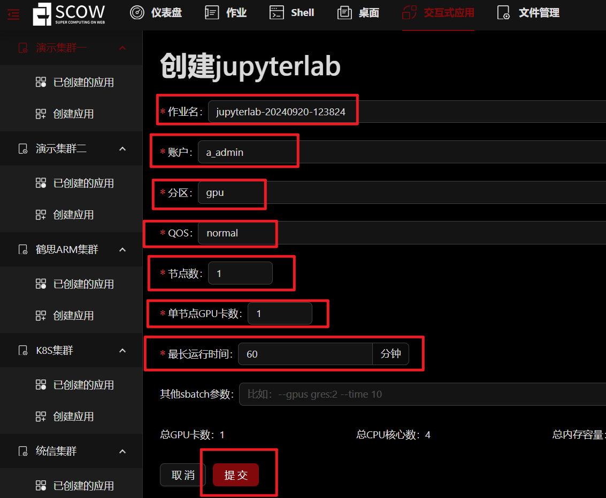

# Tutorial-SCOW

人工智能（AI）的迅猛发展正深刻影响着学术界和工业界。AI技术的进步依赖于处理海量数据和复杂模型的能力，因此，高性能计算（HPC）平台成为推动AI研究和应用的关键工具。尽管HPC在技术上提供了强大的支持，其使用的复杂性却给学术研究人员和工业从业者带来了挑战。许多研究人员和工程师面临着平台配置繁琐、资源调度复杂以及编程模型不友好的问题，这些因素可能延缓AI项目的开发进程。

SCOW（Super Computing On Web）是一个基于Web的超算门户和管理系统，旨在解决这些使用障碍。通过SCOW，超算用户无需安装任何软件，只需使用现代浏览器即可高效利用超算资源完成计算任务。用户可以通过网页界面进行作业提交、文件管理、终端调用、用户管理等多项操作，极大降低了使用门槛。

本教程通过一系列在SCOW上运行AI的案例，帮助用户快速掌握在HPC环境中进行AI学习和研究的方法，助力学术界和工业界更高效地利用高性能计算资源。

下面我们首先介绍如何在 SCOW 平台上申请计算资源，然后通过简单案例 Tutorial 0 介绍如何在 SCOW 平台上进行计算，最后是 AI 相关的教程介绍。 

# Tutorial SCOW
本教程介绍如何在基于 [SCOW](https://www.pkuscow.com/) 的集群上申请计算资源并运行各类计算任务。

平台分为智算平台（SCOW AI集群）和超算平台（SCOW HPC集群）。根据不同需求，某些单位部署的SCOW系统仅包含SCOW AI或SCOW HPC。其中SCOW AI是基于Kubernetes容器的算力集群，SCOW HPC是基于鹤思作业调度系统的裸金属服务器的算力集群。请根据自身情况选择使用。两个集群里，用户共享同一个HOME目录。


## 教程内容

教程目前由多个独立的案例构成：


### Python 环境
  - **[Tutorial0 搭建Python环境](Tutorial0_python_env/tutorial0.md)**: 在超算平台，通过安装miniconda工具来创建和管理隔离的Python环境；在智算平台中，基础镜像一般已经包含Python环境，只需要验证即可。


### Pytorch 基础
  - **[Tutorial1 回归类问题](Tutorial1_regression/tutorial1.md)**: 在超算平台，通过预测房价这一简单案例展示如何使用全连接神经网络解决回归问题，并在单机单显卡上运行案例。


### CV 相关
  - **[Tutorial2 图像文本分类问题-单机单卡](Tutorial2_classification/tutorial2.md)**: 在超算平台，通过OpenAI的多模态预训练模型‌CLIP对图像文本在单机单卡的资源下进行分类的简单案例。
  - **[Tutorial3 图像文本分类问题-单机多卡](Tutorial3_CV/tutorial3.md)**: 在超算平台，通过使用图像数据集CIFAR-10在单机多卡的资源下训练ResNet18模型，并使用一系列函数测试训练过程的性能的简单案例。
 

### 大模型相关
  - **[Tutorial4 下载模型](Tutorial4_下载模型/tutorial4_下载模型.md)**: 在超算平台，展示如何下载大模型的过程。
  - **[Tutorial5 添加和管理数据集](Tutorial5_添加和管理数据集/tutorial5_添加和管理数据集.md)**: 在智算平台，展示如何添加和管理数据集的过程。
  - **[Tutorial6 大模型推理-单机单卡](Tutorial6_大模型推理/tutorial6_大模型推理.md)**: 在智算平台，通过使用Qwen3-4B模型展示大模型如何根据提示词进行推理。
  - **[Tutorial7 大模型微调-单机单卡](Tutorial7_Bert模型微调/tutorial7_Bert模型微调.md)**: 在超算平台，通过使用谷歌Google的bert-base-uncased模型展示Bert模型微调的过程。
  - **[Tutorial8 大模型文生图任务-单机单卡](Tutorial8_stable-diffusion-3-medium/tutorial8_stable_diffusion.md)**: 在超算平台，使用stable-diffusion-3-medium 模型，通过 prompt 提示词生成对应的图片的过程。
  - **[Tutorial9 使用LLaMA-Factory官方镜像对Qwen大模型进行微调-单机单卡](Tutorial9_llama_factory/tutorial9_llama_factory.md)**: 在智算平台，使用LLaMA-Factory官方对Qwen大模型进行微调的过程。
  - **[Tutorial10 使用LLaMA-Factory官方镜像对Qwen大模型进行微调-多机多卡](Tutorial10_llama_factory多机多卡/tutorial10.md)**: 在智算平台，使用LLaMA-Factory官方对Qwen大模型进行微调的过程。
  - **[Tutorial11 使用LLaMA-Factory交互应用对Qwen大模型进行微调-单机单卡](Tutorial11-llama-factory/tutorial11-llama-factory.md)**: 在智算平台，使用LLaMA-Factory交互应用对Qwen大模型进行微调的过程。
  - **[Tutorial12 在训练模块中使用LLaMA-Factory对Qwen大模型进行微调-单机单卡/多卡](Tutorial12_使用训练模块进行大模型微调(单机)/Tutorial12.md)**: 在智算平台，训练模块中使用LLaMA-Factory框架对Qwen大模型进行单机单卡/多卡微调、推理的过程。
  - **[Tutorial13 在训练模块中使用LLaMA-Factory对Qwen大模型进行微调-多机多卡](Tutorial13_使用训练模块进行大模型微调(多机多卡)/tutorial13.md)**: 在智算平台，训练模块中使用LLaMA-Factory框架对Qwen大模型进行多机多卡微调、推理的过程。
 
  

## SCOW 平台申请计算资源

**1. 登陆**

   登陆后显示 dashboard 界面：

   

   其中 “shell” 可用于打开联网的命令行窗口。

   “交互式应用” 可以打开桌面窗口、Matlab、RStudio、Jupyter notebook、Jupter Lab 等交互式应用。

   “文件管理” 可用于管理、上传、下载文件。

   我们的教程是使用 Jupyter Lab 运行的，所以需要在 “交互式应用” 中创建 Jupter Lab 应用。但在创建 Jupter Lab 应用之前，需要先在 “shell” 中安装 jupyter，才能成功创建。

**2. 安装 Conda**   
   

   在联网的命令行运行下面命令安装 conda

  ```bash
  # 1. 获得最新的miniconda安装包；
  wget https://repo.anaconda.com/miniconda/Miniconda3-latest-Linux-x86_64.sh

  # 2. 安装到自己的HOME目录下software/miniconda3中，这个目录在安装前不能存在，否则会报错；
  sh Miniconda3-latest-Linux-x86_64.sh -b -p ${HOME}/software/miniconda3

  # 3. 安装成功后可以删除安装包，节省存储空间
  rm -f Miniconda3-latest-Linux-x86_64.sh

  # 4. 将环境变量写入~/.bashrc文件中；(下面这句话，添加到~/.bashrc文件中)
  export PATH=${HOME}/software/miniconda3/bin:$PATH

  # 5. 退出重新登录或者执行以下命令，即可导入 conda 环境
  source ~/.bashrc

  # 6. 检查是否安装成功
  conda --version
  ```

  创建conda环境并安装 Jupyter

  ```bash
  conda create -n tutorial0 python
  conda activate tutorial0
  pip install notebook jupyterlab
  ```

**3. 创建 Jupyter Lab 应用**

点击 dashboard 上的 “交互式应用”，点击 “创建应用”, 点击 “JupyterLab”，填写相应的资源，点击最下方的 “提交”，进行创建。





创建成功后显示 “Running”，点击 “连接” 进入


## 在 SCOW 平台上运行 Tutorial 0

**1. 获取教程所需文件**

<!-- VAR_PLACEHOLDER 替换下载链接 -->

```bash
wget https://www.pkuscow.com/tutorial/scow/tutorial.tar.gz
tar -xzf tutorial.tar.gz
```

**2. 运行 Tutorial 0**

在所下载的教程文件夹中打开 tutorial/Tutorial0_hello_world/tutorial0_hello_world.ipynb 文件。可以看到文件中有 markdown 单元格和 python 代码单元格。用鼠标点击选中单元格后，“Ctrl + Enter” 可运行单元格，markdown 在运行后起到渲染的效果，python 会在下方输出结果。注意：苹果电脑使用的快捷键会有所不同。


**3. Jupyter Lab 中使用命令行**

除了在 SCOW 中使用 shell 外，还可以使用 Jupyter Lab 提供的命令行终端。


## 数据与模型路径

部分集群中, 数据和模型已经提前下载好在公用存储下：

- 数据
<!-- VAR_PLACEHOLDER -->
`/lustre/public/tutorial/data`

- 模型
<!-- VAR_PLACEHOLDER -->
`/lustre/public/tutorial/models`

如果您所用的集群中不含上述目录，则需按后续教程中的提示进行下载

## 教程内容

教程目前由 10 个独立的案例构成：

### Pytorch 基础
  - **[Tutorial1](Tutorial1_regression/tutorial1_regression.ipynb)**: 通过预测房价这一简单案例展示如何使用全连接神经网络解决回归问题，并在单机单显卡上运行案例。

### CV 相关
  - **[Tutorial2](Tutorial2_classification/tutorial2_classification.ipynb)**: 通过MNIST数据集和一个规模较小的简单CNN网络展示使用CNN进行图像分类的简单案例。
  - **[Tutorial3](Tutorial3_CV/tutorial3_CV.ipynb)**: 实际应用和研究中通常会使用大型数据集和多卡并行，这部分使用著名的ResNet50网络和ImageNet数据集，展示在多张显卡上并行的图像分类任务。

### 大模型相关
  - **[Tutorial4](Tutorial4_bge-m3/tutorial4_bge-m3.ipynb)**: 通过在 SCOW 平台上运行 bge-m3 模型，展示 embedding 模型的推理任务。
  - **[Tutorial5](Tutorial5_bge-reranker-v2-m3/tutorial5_bge-reranker-v2-m3.ipynb)**: 在 SCOW 平台上运行 bge-reranker-v2-m3。
  - **[Tutorial6](Tutorial6_Qwen2-7B-Instruct/tutorial6_qwen2_7b.ipynb)**: 通过 Qwen2-7B-Instruct 模型，展示大模型的推理、微调、合并。
  - **[Tutorial7](Tutorial7_Qwen2-72B-Instruct-GPTQ-Int4/tutorial7_qwen2-72b-int4.ipynb)**: Qwen2-72B-Instruct-GPTQ-Int4 模型的推理。
  - **[Tutorial8](Tutorial8_Qwen2-72B-Instruct/tutorial8_Qwen2-72B-Instruct.ipynb)**: 在多张显卡上运行 Qwen2-72B-Instruct 模型。
  - **[Tutorial9](Tutorial9_stable-diffusion-3-medium/tutorial9_stable_diffusion.ipynb)**: stable-diffusion-3-medium 文生图任务，通过 prompt 提示生成对应的图片。

### 使用其它方式提交作业
  - **[Tutorial10](Tutorial10_mandelbrot/tutorial10_mandelbrot.ipynb)**: 通过“提交作业”面板提交并行计算任务。

---

> 作者: 黎颖; 龙汀汀
>
> 联系方式: yingliclaire@pku.edu.cn;   l.tingting@pku.edu.cn
>
> 测试由 褚苙扬（cly2412307718@stu.pku.edu.cn）同学完成